# 3️⃣ List Canvasing (List PKB)

Modul **List Canvasing** digunakan untuk memantau dan memproses PKB (Perintah Kerja Bengkel) hasil kegiatan canvasing, mulai dari dashboard daftar PKB hari ini hingga pengisian wizard penerimaan kendaraan (reception) sampai penyimpanan & cetak PKB.

Modul ini dijalankan di dalam **iframe** pada layout shell portal (`index.html`) dengan hash navigasi `#list-canvasing` dan sumber `List Canvasing/index.html`. Saat berjalan di dalam iframe, header standalone modul disembunyikan (class `in-iframe` yang dipasang pada elemen `<html>`) dan breadcrumb dikirim ke parent shell melalui `postMessage` bertipe `UPDATE_CRUMB`. Parent shell juga dapat mengirim `postMessage` bertipe `RESET_VIEW` untuk memaksa modul kembali ke tampilan dashboard.

**Alur besar modul:**

`Dashboard List PKB Canvasing` → `PKB Baru` / `Pilih Kartu PKB` → `Step 1 Vehicle` → `Step 2 Carrier Data` → `Step 3 Cek Aja Dulu` → `Step 4 Service & Parts` → `Step 5 Summary` → `Save and Print PKB`

---

# Tampilan Awal — Dashboard List PKB Canvasing

 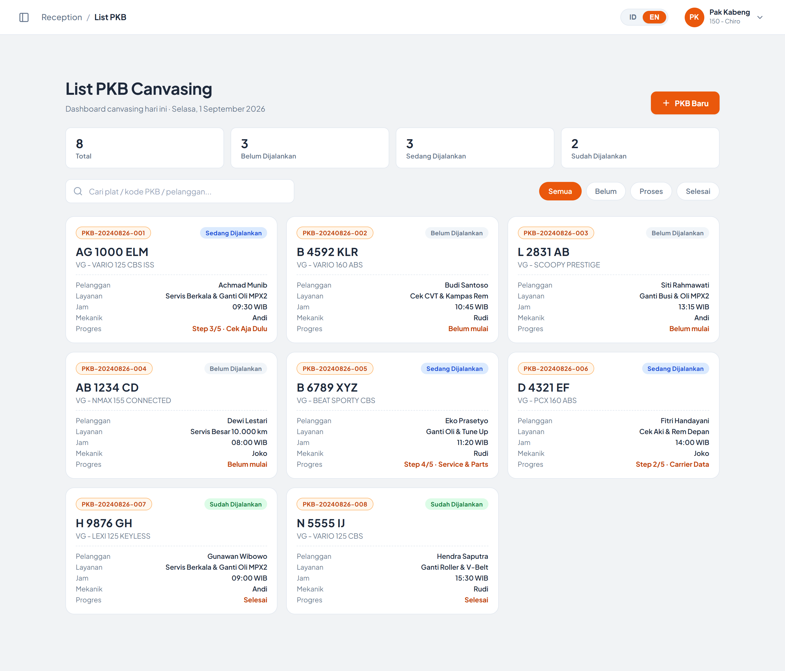

 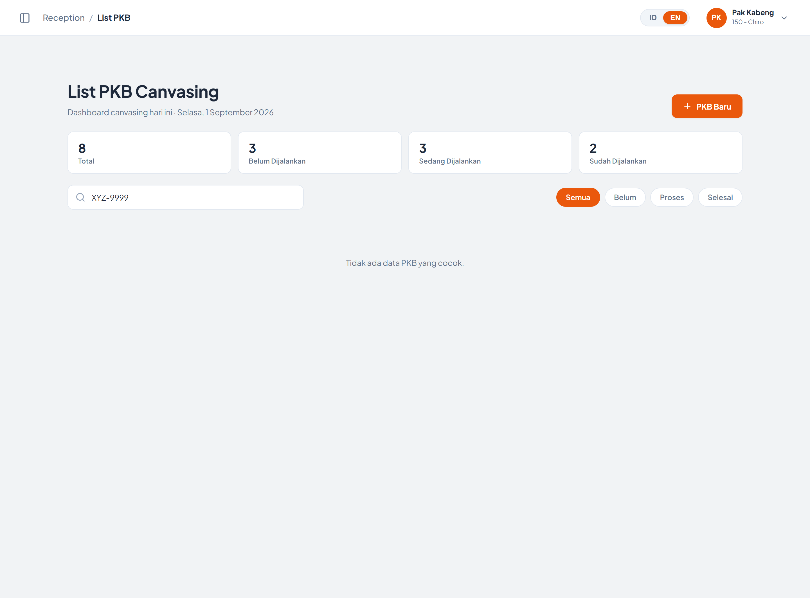

| Element Code | Component Type | Function | Behavior & Rule | Mandatory | API | Endpoint/Navigate | Method | Status QCC | Status Dev |
|--------------|----------------|----------|-----------------|-----------|-----|-------------------|--------|------------|------------|
|              |                |          |                 |           |     |                   |        |            |            |
| LABEL-Judul Halaman | LABEL | Menampilkan judul halaman "List PKB Canvasing" | Statis, tidak dapat diubah user | | | | | | |
| LABEL-Tanggal Dashboard | LABEL | Menampilkan tanggal hari ini pada subtitle "Dashboard canvasing hari ini" | Tanggal di-generate otomatis dari tanggal sistem client dengan locale **id-ID**, format: `<hari>, <tanggal> <bulan> <tahun>` (contoh: *Senin, 1 September 2026*)  **Catatan pengembangan:** tanggal diambil dari jam perangkat user, bukan dari server — perlu disinkronkan dengan tanggal operasional bengkel | | | | | | |
| BUTTON-PKB Baru | BUTTON | Membuka wizard PKB dalam mode **PKB Baru** (form kosong) | Menyembunyikan `pkbDashboardView` dan menampilkan `wizardContentView`  Field Scan Vehicle, data kendaraan, serta data Carrier (telepon, First Name, Last Name) **dikosongkan**, dan wizard direset ke **Step 1**  Mengirim `postMessage` `UPDATE_CRUMB` dengan sub-crumb **"PKB Baru"** ke parent shell  **Catatan pengembangan:** tombol ini memunculkan **dua toast berurutan** (*"Canvasing baru dimulai (form kosong)"* menimpa *"Mode PKB Baru dimulai"*) karena notifikasi dipanggil dua kali. Cukup gunakan satu pesan | | | Step 1 — Vehicle | | | |
| CHIP-Statistik Status | BUTTON / STAT CARD | Menampilkan jumlah PKB per status sekaligus sebagai filter status | Tersedia 4 chip: **Total**, **Belum Dijalankan**, **Sedang Dijalankan**, **Sudah Dijalankan**  Angka pada chip **selalu dihitung dari seluruh data** (tidak mengikuti hasil pencarian)  Chip bersifat **klik = filter**. Chip yang dipilih dan pill filter di toolbar selalu **tersinkronisasi** (memilih chip ikut mengaktifkan pill yang sama)  **Catatan pengembangan:** angka statistik masih dihitung dari data statis front-end; perlu diambil dari API agregasi status PKB | | | | | | |
| TXTBOX-Search PKB | TXTBOX | Input kata kunci pencarian data PKB | Placeholder: *"Cari plat / kode PKB / pelanggan..."*  Pencarian dijalankan **realtime** pada event `input` (tanpa tombol cari), bersifat **case-insensitive** dan **partial match**  Kolom yang dicari: **Plat Nomor**, **Kode PKB**, **Nama Pelanggan**, dan **Tipe Kendaraan**  Hasil pencarian digabungkan (AND) dengan filter status yang aktif  **Catatan pengembangan:** placeholder belum menyebut Tipe Kendaraan padahal kolom tersebut ikut dicari | No | | | | | |
| PILL-Filter Status | BUTTON | Filter data PKB berdasarkan status | Tersedia 4 pill: **Semua** (default aktif), **Belum**, **Proses**, **Selesai**  Hanya satu status yang dapat aktif dalam satu waktu (single select)  Selalu tersinkronisasi dengan CHIP-Statistik Status | No | | | | | |
| CARD-PKB (Grid) | CARD LIST | Menampilkan daftar PKB canvasing dalam bentuk kartu | Kartu di-render dinamis oleh `renderPkbGrid()` dari sumber data `samplePkbList`  Informasi tiap kartu: **Kode PKB**, **Badge Status**, **Plat Nomor**, **Tipe Kendaraan**, **Pelanggan**, **Layanan**, **Jam** (WIB), **Mekanik**, dan **Progres**  Warna kartu mengikuti status melalui class `status-pending`, `status-progress`, `status-done`  Format keterangan **Progres**:   * Status *Sudah Dijalankan* → **"Selesai"**   * Step lebih dari 0 → `Step <n>/5 · <Nama Step>`   * Step 0 → **"Belum mulai"**  **Catatan pengembangan:** data PKB masih hardcode di front-end dan perlu di-binding ke API daftar PKB canvasing | | | | | | |
| BUTTON-Buka Kartu PKB | BUTTON (CARD) | Membuka wizard PKB dengan data PKB pada kartu terpilih | Seluruh area kartu bersifat klik  Data yang diisi otomatis:   * **Scan Vehicle** dan detail kendaraan (dari nomor mesin PKB)   * **Phone Number** Carrier (kolom pencarian maupun form)   * **First Name** dan **Last Name** Carrier (hasil pemecahan nama pelanggan dengan pemisah spasi — kata pertama menjadi First Name, sisanya menjadi Last Name)  Muncul toast **"Data PKB `<kode>` dimuat (`<plat>`)"**  Mengirim `postMessage` `UPDATE_CRUMB` dengan sub-crumb berisi **plat nomor** PKB terpilih  Wizard **selalu dibuka pada Step 1**  **Catatan pengembangan:** nilai `step` pada data PKB (posisi progres) **tidak dipakai** untuk melanjutkan ke step terakhir yang dikerjakan — perlu dikonfirmasi apakah PKB berstatus *Sedang Dijalankan* harus langsung membuka step terkait | | | Step 1 — Vehicle | | | |
| LABEL-Empty State | LABEL | Menampilkan keterangan saat hasil filter kosong | Teks: **"Tidak ada data PKB yang cocok."**  Ditampilkan hanya jika kombinasi pencarian dan filter status tidak menghasilkan data | | | | | | |

---

# Tampilan Step 1 — Vehicle

 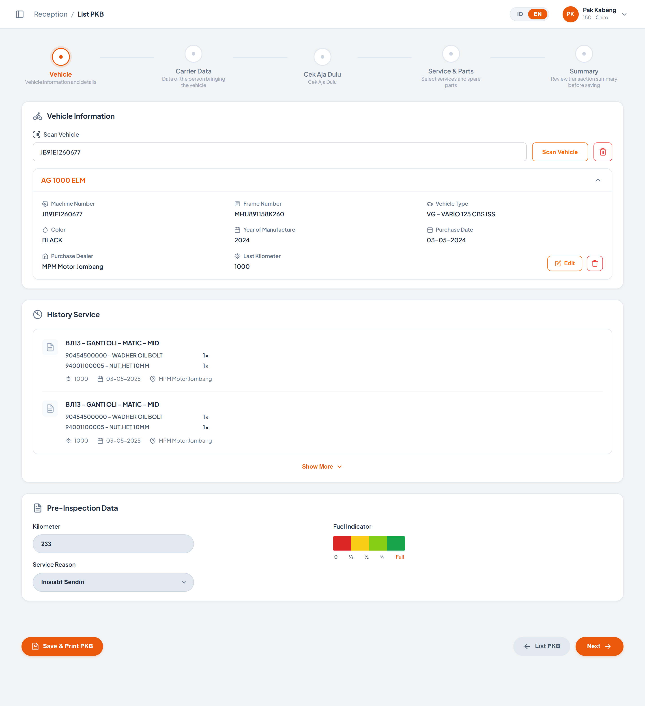

 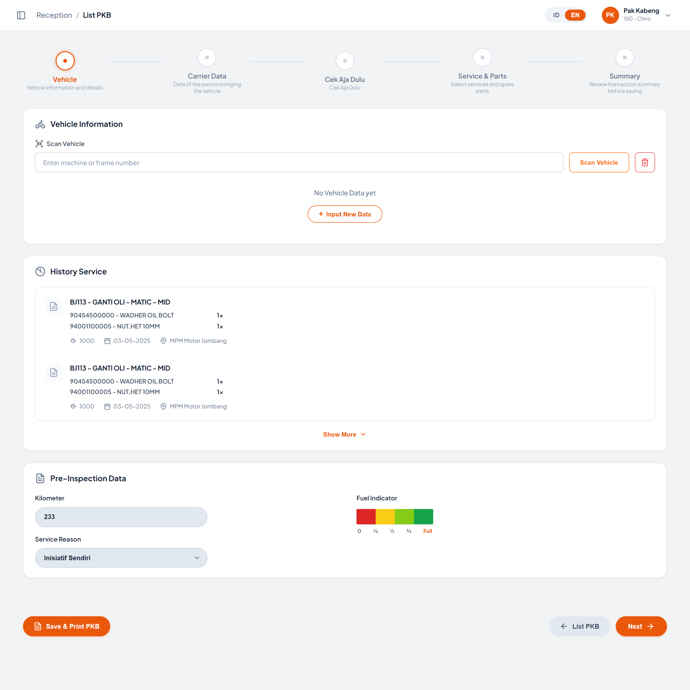

**Stepper Wizard** terdiri dari 5 step: **Vehicle** → **Carrier Data** → **Cek Aja Dulu** → **Service & Parts** → **Summary**.

| Element Code | Component Type | Function | Behavior & Rule | Mandatory | API | Endpoint/Navigate | Method | Status QCC | Status Dev |
|--------------|----------------|----------|-----------------|-----------|-----|-------------------|--------|------------|------------|
|              |                |          |                 |           |     |                   |        |            |            |
| STEPPER-Node | STEPPER | Menampilkan posisi step aktif dan progres pengisian wizard | Node step aktif ditandai class `active`, step yang sudah dilewati ditandai `completed`  Setiap node menampilkan **judul step** dan **deskripsi singkat**  Node step **dapat diklik langsung** untuk berpindah ke step manapun  **Catatan pengembangan:** perpindahan melalui klik node **tidak menjalankan validasi apapun** — user dapat melompat langsung ke Step 5 (Summary) tanpa mengisi data kendaraan maupun carrier. Perlu ditentukan aturan penguncian step | | | Step 1 / 2 / 3 / 4 / 5 | | | |
| TXTBOX-Scan Vehicle | TXTBOX | Input nomor mesin atau nomor rangka kendaraan untuk pencarian data kendaraan | Placeholder: *"Enter machine or frame number"*  Terisi nilai contoh `JB91E1260677` saat halaman dibuka  Menekan tombol **Enter** menjalankan aksi yang sama dengan tombol **Scan Vehicle**  **Catatan pengembangan:** field masih terisi contoh data pada mode standalone — perlu dikosongkan agar placeholder benar-benar terlihat | Yes | | | | | |
| BUTTON-Scan Vehicle | BUTTON | Mencari data kendaraan berdasarkan input Scan Vehicle | Pencocokan dilakukan terhadap **Plat Nomor** (mengabaikan spasi), **Nomor Mesin**, dan **Nomor Rangka** secara case-insensitive dan partial match  Jika data ditemukan, box detail kendaraan ditampilkan dan muncul toast **"Vehicle data loaded: `<plat>` (`<tipe>`)"**  **Catatan pengembangan / Bug:** jika data **tidak ditemukan** (atau input kosong), sistem **tidak menampilkan pesan tidak ditemukan** melainkan memuat kendaraan contoh pertama serta menimpa isi field Scan Vehicle. Perilaku ini menyesatkan — seharusnya muncul pesan *data tidak ditemukan* dan/atau membuka form input kendaraan baru | | | | | | |
| BUTTON-Clear Scan (Ikon Trash) | BUTTON | Mengosongkan input Scan Vehicle dan data kendaraan | Field Scan Vehicle dikosongkan, box detail kendaraan disembunyikan, dan empty state kendaraan ditampilkan  Muncul toast **"Vehicle input cleared"** | | | | | | |
| LABEL-Detail Kendaraan | LABEL | Menampilkan detail data kendaraan hasil scan | Field yang ditampilkan:   * **Machine Number**   * **Color**   * **Purchase Dealer**   * **Frame Number**   * **Year of Manufacture**   * **Last Kilometer**   * **Vehicle Type**   * **Purchase Date**  Judul box menampilkan **Plat Nomor** kendaraan  Seluruh field bersifat **read-only** (tampilan teks, bukan input) | | | | | | |
| BUTTON-Collapse Detail Kendaraan | BUTTON | Menyembunyikan / menampilkan isi box detail kendaraan | Bersifat toggle. Klik pada **seluruh area header box** (bukan hanya ikon chevron) ikut menjalankan toggle  Ikon chevron berputar mengikuti status collapse | | | | | | |
| BUTTON-Edit Kendaraan | BUTTON | Membuka pop-up untuk mengubah data kendaraan | Membuka modal `inputDataModal` dengan field terisi dari data yang sedang tampil: **Police Number**, **Vehicle Model**, **Engine Number**, **Frame Number**, **Year of Production**  **Catatan pengembangan:** field **Customer / Owner Name** tidak ikut terisi saat mode Edit, dan judul modal tetap **"Input New Vehicle Data"**. Perlu dibedakan judul & pemuatan data untuk mode Edit | | | Modal Input New Vehicle Data | | | |
| BUTTON-Hapus Kendaraan (Ikon Trash) | BUTTON | Menghapus data kendaraan yang sedang tampil | Box detail kendaraan disembunyikan, empty state ditampilkan, dan muncul toast **"Vehicle data removed"**  **Catatan pengembangan:** penghapusan langsung dieksekusi tanpa dialog konfirmasi | | | | | | |
| LABEL-Empty State Kendaraan | LABEL | Menampilkan keterangan saat belum ada data kendaraan | Teks: **"No Vehicle Data yet"** disertai tombol **Input New Data** | | | | | | |
| BUTTON-Input New Data | BUTTON | Membuka pop-up input data kendaraan baru | Membuka modal `inputDataModal` dalam kondisi kosong | | | Modal Input New Vehicle Data | | | |
| LIST-History Service | LIST | Menampilkan riwayat servis kendaraan terpilih | Tiap item menampilkan: **Nama Paket Servis**, **Daftar Part** beserta qty, serta badge **Kilometer**, **Tanggal Servis**, dan **Dealer/Bengkel**  **Catatan pengembangan:** isi riwayat masih **hardcode di HTML** (2 item identik) dan tidak berubah saat kendaraan lain di-scan. Perlu di-binding ke API riwayat servis per kendaraan | | | | | | |
| BUTTON-Show More History | BUTTON | Menampilkan seluruh riwayat servis | **Catatan pengembangan:** tombol baru menampilkan toast **"Showing all historical services (2 records displayed)"** tanpa benar-benar menambah data. Perlu implementasi paging / lazy load riwayat | | | | | | |
| TXTBOX-Kilometer | TXTBOX | Input kilometer kendaraan saat penerimaan | Terisi otomatis dari **Current KM** kendaraan hasil scan (contoh: `233`)  **Catatan pengembangan:** tipe input masih **text** (bukan number) sehingga menerima karakter non-angka, dan belum ada validasi bahwa kilometer saat ini tidak boleh lebih kecil dari **Last Kilometer** | Yes | | | | | |
| LOV-Service Reason | LIST OF VIEW | Menampilkan daftar alasan kedatangan / servis | Nilai default terpilih: **Inisiatif Sendiri**  Pilihan yang tersedia: Inisiatif Sendiri, Servis Berkala / Rutin, Keluhan Mesin, Ganti Oli Saja, Klaim Garansi  **Catatan pengembangan:** isi dropdown masih hardcode dan perlu di-binding ke master alasan servis | Yes | | | | | |
| GAUGE-Fuel Indicator | GAUGE / SEGMENTED SELECT | Menandai level bahan bakar kendaraan saat diterima | Terdiri dari 4 segmen warna (merah, kuning, lime, hijau) dan 5 label level: **0**, **¼**, **½**, **¾**, **Full**  Level dapat dipilih dengan mengklik **segmen** maupun **label**. Segmen di bawah/sama dengan level terpilih tampil penuh, sisanya diredupkan (opacity 0.25 + grayscale)  Setelah dipilih muncul toast **"Fuel indicator set to: `<level>`"**  **Catatan pengembangan:**   1. Level default disimpan sebagai **Full (4)** namun styling awal **tidak pernah dijalankan**, sehingga seluruh segmen tampil aktif dan label Full tidak tersorot — perlu inisialisasi tampilan saat halaman dibuka   2. Level **0** hanya dapat dipilih melalui label (tidak ada segmennya) | Yes | | | | | |

## Pop-up "Input New Vehicle Data"

 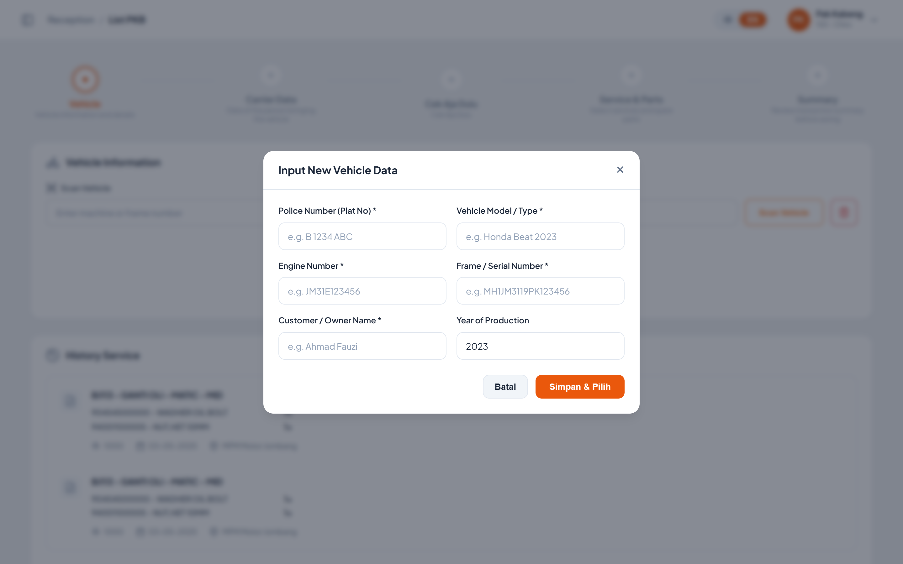

| Element Code | Component Type | Function | Behavior & Rule | Mandatory | API | Endpoint/Navigate | Method | Status QCC | Status Dev |
|--------------|----------------|----------|-----------------|-----------|-----|-------------------|--------|------------|------------|
|              |                |          |                 |           |     |                   |        |            |            |
| TXTBOX-Police Number | TXTBOX | Input plat nomor kendaraan | Placeholder: *"e.g. B 1234 ABC"*  Wajib diisi (atribut `required` HTML5) | Yes | | | | | |
| TXTBOX-Vehicle Model / Type | TXTBOX | Input tipe / model kendaraan | Placeholder: *"e.g. Honda Beat 2023"*  Wajib diisi | Yes | | | | | |
| TXTBOX-Engine Number | TXTBOX | Input nomor mesin kendaraan | Placeholder: *"e.g. JM31E123456"*  Wajib diisi | Yes | | | | | |
| TXTBOX-Frame / Serial Number | TXTBOX | Input nomor rangka kendaraan | Placeholder: *"e.g. MH1JM3119PK123456"*  Wajib diisi | Yes | | | | | |
| TXTBOX-Customer / Owner Name | TXTBOX | Input nama pemilik kendaraan | Placeholder: *"e.g. Ahmad Fauzi"*  Wajib diisi  **Catatan pengembangan:** nilai yang diinput **tidak ditampilkan** pada box detail kendaraan (tidak ada field pemilik di box tersebut) | Yes | | | | | |
| TXTBOX-Year of Production | TXTBOX (NUMBER) | Input tahun produksi kendaraan | Nilai default **2023**  Tidak wajib diisi | No | | | | | |
| BUTTON-Simpan & Pilih | BUTTON (SUBMIT) | Menyimpan data kendaraan baru dan memuatnya ke Step 1 | Validasi wajib dijalankan oleh atribut `required` bawaan browser  Setelah submit: box detail kendaraan diisi dengan data baru, field **Scan Vehicle** diisi Nomor Mesin, modal tertutup, form direset, dan muncul toast **"New vehicle registered successfully!"**  **Catatan pengembangan:** field yang tidak ada di form (**Color**, **Purchase Dealer**, **Purchase Date**, **Last Kilometer**) diisi **nilai default hardcode** (BLACK, MPM Motor Jombang, 03-05-2024, 1000) sehingga menampilkan data yang tidak benar. Perlu dilengkapi field-nya atau ditampilkan sebagai kosong | | | Step 1 — Vehicle | | | |
| BUTTON-Batal | BUTTON | Menutup pop-up tanpa menyimpan | Modal juga tertutup melalui tombol Close (X) atau klik pada area backdrop  **Catatan pengembangan:** isi form **tidak direset** saat dibatalkan, sehingga input sebelumnya masih tertinggal saat modal dibuka kembali | | | | | | |

---

# Tampilan Step 2 — Carrier Data

 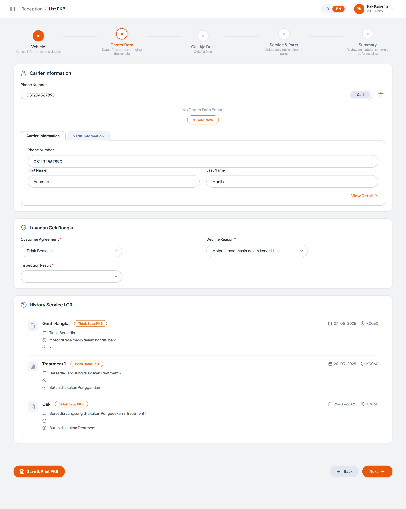

 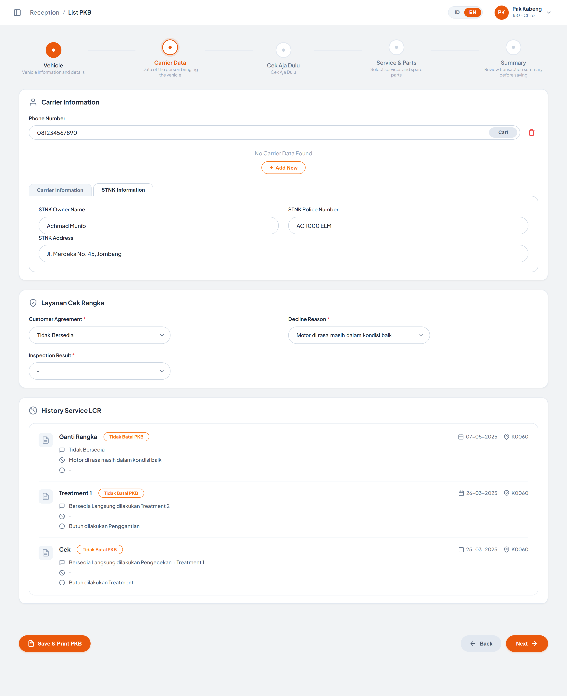

| Element Code | Component Type | Function | Behavior & Rule | Mandatory | API | Endpoint/Navigate | Method | Status QCC | Status Dev |
|--------------|----------------|----------|-----------------|-----------|-----|-------------------|--------|------------|------------|
|              |                |          |                 |           |     |                   |        |            |            |
| TXTBOX-Search Phone Number | TXTBOX | Input nomor telepon untuk mencari data pengantar (carrier) | Terisi nilai contoh `085732255998` saat halaman dibuka  Menekan tombol **Enter** menjalankan aksi yang sama dengan tombol **Cari** | Yes | | | | | |
| BUTTON-Cari Carrier | BUTTON | Mencari data carrier berdasarkan nomor telepon | Jika input kosong, muncul toast **"Please enter a phone number to search."** dan pencarian dibatalkan  Jika input terisi, form Carrier Information diisi dan muncul toast **"Carrier found for phone: `<nomor>`"**  **Catatan pengembangan / Bug:** pencarian **selalu dianggap berhasil** dan mengisi nama dengan data hardcode **"Achmad Munib"** untuk nomor apapun. Perlu dihubungkan ke API pencarian customer, beserta penanganan kondisi *data tidak ditemukan* | | | | | | |
| BUTTON-Clear Carrier (Ikon Trash) | BUTTON | Mengosongkan pencarian dan form carrier | Mengosongkan kolom pencarian, Phone Number, First Name, dan Last Name, lalu muncul toast **"Carrier search input cleared"** | | | | | | |
| LABEL-No Carrier Data Found | LABEL | Menampilkan keterangan bahwa data carrier belum ditemukan | **Catatan pengembangan / Bug:** kotak keterangan ini **selalu tampil**, termasuk saat data carrier sudah terisi. Seharusnya hanya muncul ketika hasil pencarian kosong | | | | | | |
| BUTTON-Add New Carrier | BUTTON | Menyiapkan form untuk input data carrier baru | Nomor telepon dari kolom pencarian dipindahkan ke form, field **First Name** dan **Last Name** dikosongkan, fokus otomatis ke First Name, dan muncul toast **"Ready to input new carrier data"** | | | | | | |
| TAB-Carrier / STNK | TAB | Memindah tampilan antara data pengantar dan data STNK | Tersedia 2 tab: **Carrier Information** (default aktif) dan **STNK Information**  Hanya satu tab yang tampil dalam satu waktu | | | | | | |
| TXTBOX-Phone Number (Carrier) | TXTBOX | Input nomor telepon pengantar kendaraan | Terisi otomatis dari hasil pencarian atau dari data PKB yang dibuka dari dashboard  **Catatan pengembangan:** belum ada validasi format nomor telepon (hanya angka, panjang minimal/maksimal) | Yes | | | | | |
| TXTBOX-First Name | TXTBOX | Input nama depan pengantar kendaraan | Placeholder: *"Enter first name"*  Terisi otomatis dari hasil pencarian atau dari nama pelanggan pada kartu PKB | Yes | | | | | |
| TXTBOX-Last Name | TXTBOX | Input nama belakang pengantar kendaraan | Placeholder: *"Enter last name"*  Terisi otomatis dari hasil pencarian atau dari nama pelanggan pada kartu PKB | No | | | | | |
| LINK-View Detail Carrier | LINK / BUTTON | Menampilkan detail lengkap data carrier | **Catatan pengembangan:** aksi baru menampilkan toast **"Viewing details for: `<nama>` (`<telepon>`)"** — belum ada halaman/modal detail carrier | | | | | | |
| TXTBOX-STNK Owner Name | TXTBOX | Input nama pemilik sesuai STNK | Terisi nilai contoh `Achmad Munib` | No | | | | | |
| TXTBOX-STNK Police Number | TXTBOX | Input plat nomor sesuai STNK | Terisi nilai contoh `AG 1000 ELM`  **Catatan pengembangan:** belum ada validasi kecocokan dengan **Police Number** kendaraan pada Step 1 | No | | | | | |
| TXTBOX-STNK Address | TXTBOX | Input alamat sesuai STNK | Terisi nilai contoh `Jl. Merdeka No. 45, Jombang`  **Catatan pengembangan:** seluruh field pada tab STNK belum tersimpan / tidak dipakai di step manapun | No | | | | | |
| LOV-Customer Agreement | LIST OF VIEW | Menampilkan pilihan kesediaan pelanggan terhadap Layanan Cek Rangka (LCR) | Ditandai wajib (`*`) pada label  Nilai default terpilih: **Tidak Bersedia**  Pilihan yang tersedia: Tidak Bersedia, Bersedia Langsung dilakukan Treatment 2, Bersedia Langsung dilakukan Pengecekan + Treatment 1, Bersedia Pengecekan Rangka  **Catatan pengembangan:** belum ada validasi mandatory di sisi script dan isi dropdown masih hardcode | Yes | | | | | |
| LOV-Decline Reason | LIST OF VIEW | Menampilkan alasan penolakan layanan cek rangka | Ditandai wajib (`*`) pada label  Nilai default terpilih: **Motor di rasa masih dalam kondisi baik**  Pilihan yang tersedia: -, Motor di rasa masih dalam kondisi baik, Tidak Memiliki Waktu, Biaya Tidak Memadai, Lainnya  **Catatan pengembangan:** field belum **ter-cascade** dengan Customer Agreement — seharusnya hanya wajib/aktif saat pelanggan memilih **Tidak Bersedia**. Untuk pilihan **Lainnya** juga belum ada field keterangan bebas | Yes | | | | | |
| LOV-Inspection Result | LIST OF VIEW | Menampilkan hasil pemeriksaan rangka | Ditandai wajib (`*`) pada label  Nilai default terpilih: **-**  Pilihan yang tersedia: -, Butuh dilakukan Treatment, Butuh dilakukan Penggantian, Kondisi Rangka Baik / Normal  **Catatan pengembangan:** field belum ter-cascade dengan Customer Agreement — seharusnya baru dapat diisi bila pelanggan bersedia dilakukan pengecekan | Yes | | | | | |
| LIST-History Service LCR | LIST | Menampilkan riwayat Layanan Cek Rangka kendaraan | Tiap item menampilkan: **Jenis Layanan** (Ganti Rangka / Treatment 1 / Cek), badge **"Tidak Batal PKB"**, **Tanggal**, **Kode Bengkel**, serta 3 baris detail (**Customer Agreement**, **Decline Reason**, **Inspection Result**)  **Catatan pengembangan:** isi riwayat masih **hardcode di HTML** (3 item) dan tidak berubah mengikuti kendaraan terpilih. Perlu di-binding ke API riwayat LCR | | | | | | |

---

# Tampilan Step 3 — Cek Aja Dulu

 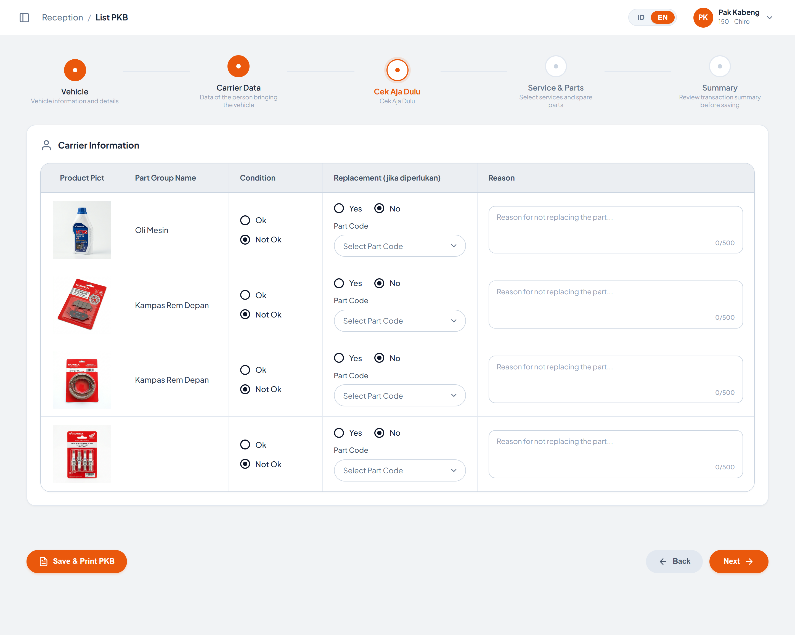

| Element Code | Component Type | Function | Behavior & Rule | Mandatory | API | Endpoint/Navigate | Method | Status QCC | Status Dev |
|--------------|----------------|----------|-----------------|-----------|-----|-------------------|--------|------------|------------|
|              |                |          |                 |           |     |                   |        |            |            |
| LABEL-Judul Card | LABEL | Menampilkan judul card pada Step 3 | **Catatan pengembangan / Bug:** judul card masih tertulis **"Carrier Information"** (sisa salin dari Step 2), padahal isinya adalah tabel pemeriksaan part **Cek Aja Dulu**. Judul perlu diperbaiki | | | | | | |
| TABLE-Cek Aja Dulu | TABLE | Menampilkan daftar part yang diperiksa beserta kondisi dan rekomendasi penggantian | Kolom yang ditampilkan berurutan: **Product Pict**, **Part Group Name**, **Condition**, **Replacement (jika diperlukan)**, **Reason**  Saat ini tersedia 4 baris pemeriksaan: **Oli Mesin**, **Kampas Rem Depan**, **Kampas Rem Depan** (gambar *brake shoe*), dan satu baris dengan gambar **Busi**  **Catatan pengembangan / Bug:**   1. Baris ke-3 menggunakan nama **"Kampas Rem Depan"** padahal gambarnya *brake shoe* — seharusnya **Kampas Rem Belakang**   2. Baris ke-4 (Busi) memiliki **Part Group Name kosong**   3. Seluruh baris masih hardcode di HTML; perlu di-binding ke master item pemeriksaan per tipe kendaraan | | | | | | |
| IMAGE-Product Pict | IMAGE | Menampilkan foto part yang diperiksa | Gambar diambil dari folder `assets/` modul (contoh: `oil_mpx2.jpg`, `brake_pad_front.jpg`, `brake_shoe.jpg`, `spark_plugs.jpg`)  **Catatan pengembangan:** gambar masih berupa asset statis lokal; perlu ditentukan sumber gambar dari master part | | | | | | |
| RADIO-Condition | RADIO BUTTON | Menandai kondisi part hasil pemeriksaan | Pilihan: **Ok** dan **Not Ok** (susunan vertikal)  **Catatan pengembangan:** nilai default seluruh baris adalah **Not Ok** — perlu dikonfirmasi apakah kondisi awal seharusnya kosong (belum diperiksa) agar hasil pemeriksaan tidak salah terekam | Yes | | | | | |
| RADIO-Replacement | RADIO BUTTON | Menandai apakah part perlu diganti | Pilihan: **Yes** dan **No** (susunan horizontal)  Nilai default seluruh baris adalah **No** | Yes | | | | | |
| LOV-Part Code | LIST OF VIEW | Menampilkan pilihan kode part pengganti | Nilai awal: **"Select Part Code"**  Format pilihan: `<Kode Part> - <Nama Part>`  Setelah dipilih, teks dropdown berubah menjadi lebih tegas (warna gelap dan **bold**) sebagai penanda sudah terisi  **Catatan pengembangan:**   1. Isi dropdown masih hardcode (3 opsi per baris) dan perlu di-binding ke master part per part group   2. Dropdown tetap **aktif meskipun Replacement = No** — perlu di-disable/dikosongkan otomatis   3. Belum ada validasi bahwa Part Code **wajib** dipilih saat Replacement = Yes | Yes | | | | | |
| TXTAREA-Reason | TXTAREA | Input alasan bila part tidak diganti | Placeholder: *"Reason for not replacing the part..."*  Panjang maksimal **500 karakter** (dibatasi atribut `maxlength`), dengan penghitung karakter format `<jumlah>/500` yang diperbarui **realtime** saat user mengetik  **Catatan pengembangan:** belum ada validasi bahwa alasan **wajib** diisi ketika Condition = *Not Ok* dan Replacement = *No* | No | | | | | |

---

# Tampilan Step 4 — Service & Parts

 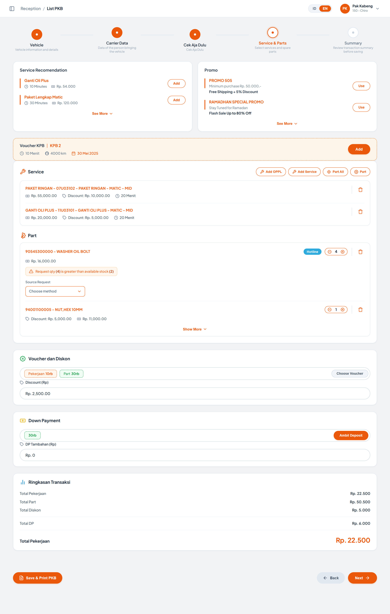

 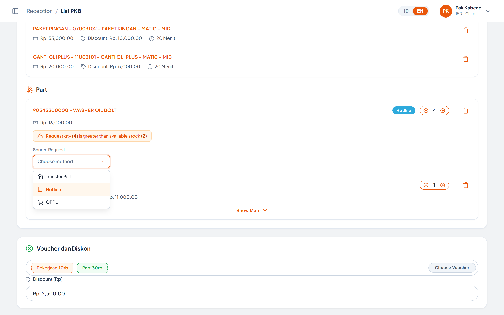

| Element Code | Component Type | Function | Behavior & Rule | Mandatory | API | Endpoint/Navigate | Method | Status QCC | Status Dev |
|--------------|----------------|----------|-----------------|-----------|-----|-------------------|--------|------------|------------|
|              |                |          |                 |           |     |                   |        |            |            |
| LIST-Service Recomendation | LIST / CARD | Menampilkan rekomendasi paket servis untuk kendaraan terpilih | Tiap item menampilkan **Nama Paket**, **Estimasi Durasi**, dan **Harga**  Saat ini tersedia 2 rekomendasi: **Ganti Oli Plus** (10 Minutes, Rp. 54.000) dan **Paket Lengkap Matic** (30 Minutes, Rp. 120.000)  **Catatan pengembangan:** rekomendasi masih hardcode dan tidak menyesuaikan tipe kendaraan / riwayat servis. Perlu di-binding ke API rekomendasi servis | | | | | | |
| BUTTON-Add Rekomendasi | BUTTON | Menambahkan paket rekomendasi ke daftar Service | **Catatan pengembangan:** aksi baru menampilkan toast **"`<nama paket>` berhasil ditambahkan ke daftar Service!"** — item **tidak benar-benar masuk** ke daftar Service dan tidak menambah Ringkasan Transaksi | | | | | | |
| LIST-Promo | LIST / CARD | Menampilkan daftar promo yang dapat digunakan | Tiap item menampilkan **Nama Promo**, **Syarat/Subteks**, dan **Benefit**  Saat ini tersedia 2 promo: **PROMO 505** dan **RAMADHAN SPECIAL PROMO**  **Catatan pengembangan:** daftar promo masih hardcode; perlu di-binding ke master promo beserta masa berlaku | | | | | | |
| BUTTON-Use Promo | BUTTON | Menggunakan promo terpilih pada transaksi | **Catatan pengembangan:** aksi baru menampilkan toast **"`<nama promo>` berhasil digunakan!"** — belum ada perhitungan diskon promo pada Ringkasan Transaksi | | | | | | |
| BUTTON-See More (Rekomendasi / Promo) | BUTTON | Menampilkan seluruh rekomendasi servis atau promo | **Catatan pengembangan:** kedua tombol baru menampilkan toast informatif tanpa menambah data yang tampil | | | | | | |
| BANNER-Voucher KPB | BANNER | Menampilkan voucher KPB (Kartu Perawatan Berkala) yang tersedia untuk kendaraan | Menampilkan jenis voucher (**KPB 2**), **Estimasi Durasi** (10 Menit), **Batas Kilometer** (4000 km), dan **Masa Berlaku** (30 Mei 2025)  **Catatan pengembangan:** data voucher masih hardcode dan masa berlakunya sudah lampau; perlu di-binding ke API KPB per kendaraan beserta validasi masa berlaku & kelipatan KPB | | | | | | |
| BUTTON-Add Voucher KPB | BUTTON | Menambahkan voucher KPB ke transaksi | **Catatan pengembangan:** aksi baru menampilkan toast **"Voucher KPB 2 berhasil ditambahkan ke transaksi!"** tanpa perubahan pada daftar Service maupun Ringkasan Transaksi | | | | | | |
| BUTTON-Add OPPL | BUTTON | Menambahkan pekerjaan luar (Order Pekerjaan Luar) | **Catatan pengembangan:** aksi baru menampilkan toast **"Membuka dialog Tambah OPPL (Order Pekerjaan Luar)..."** — modal/dialog belum tersedia | | | Modal Tambah OPPL (belum tersedia) | | | |
| BUTTON-Add Service | BUTTON | Menambahkan jasa / paket servis dari katalog | **Catatan pengembangan:** aksi baru menampilkan toast **"Membuka katalog Service & Jasa AHASS..."** — modal katalog servis belum tersedia | | | Modal Katalog Service (belum tersedia) | | | |
| BUTTON-Part All | BUTTON | Memilih seluruh spare part rekomendasi sekaligus | **Catatan pengembangan:** aksi baru menampilkan toast **"Memilih seluruh spare part rekomendasi..."** tanpa perubahan data | | | | | | |
| BUTTON-Part | BUTTON | Menambahkan spare part dari katalog | **Catatan pengembangan:** aksi baru menampilkan toast **"Membuka katalog Spare Part Honda Genuine Parts..."** — modal katalog part belum tersedia | | | Modal Katalog Part (belum tersedia) | | | |
| LIST-Service | LIST | Menampilkan daftar jasa / paket servis yang dipilih untuk PKB ini | Tiap item menampilkan **Nama Jasa** (format `<Nama Paket> - <Kode> - <Deskripsi>`), **Harga**, **Discount**, dan **Estimasi Durasi**  **Catatan pengembangan:** daftar masih hardcode 2 item di HTML dan tidak bertambah/berkurang mengikuti aksi user | | | | | | |
| LIST-Part | LIST | Menampilkan daftar spare part yang dipilih untuk PKB ini | Tiap item menampilkan **Kode & Nama Part**, **Qty**, **Harga**, dan **Discount** (bila ada)  Part yang sumber pemenuhannya bukan stok bengkel diberi badge sumber (contoh: **Hotline**)  **Catatan pengembangan:** daftar masih hardcode 2 item di HTML | | | | | | |
| BUTTON-Qty Plus / Minus | BUTTON | Mengubah jumlah spare part yang dipesan | Qty minimal **1** (tombol minus tidak menurunkan di bawah 1) dan **tidak memiliki batas atas**  Perubahan qty pada part pertama ikut memperbarui teks peringatan stok  **Catatan pengembangan:**   1. Perubahan qty **tidak memperbarui** Ringkasan Transaksi maupun tabel Summary di Step 5   2. Qty tidak divalidasi terhadap stok riil (hanya part pertama yang memiliki logika peringatan) | Yes | | | | | |
| ALERT-Peringatan Stok | ALERT | Memberi peringatan bahwa qty yang diminta melebihi stok tersedia | Format pesan: **"Request qty (`<qty>`) is greater than available stock (`<stok>`)"**  Peringatan tampil bila **qty lebih besar dari 2** dan otomatis disembunyikan bila qty kembali di bawah/sama dengan 2  **Catatan pengembangan:** ambang stok **hardcode = 2** dan hanya diterapkan pada part pertama. Perlu di-binding ke stok riil per part | | | | | | |
| LOV-Source Request | LIST OF VIEW (CUSTOM) | Menentukan sumber pemenuhan part yang stoknya kurang | Nilai awal: **"Choose method"**  Pilihan yang tersedia: **Transfer Part**, **Hotline** (default ditandai terpilih), **OPPL**  Setelah dipilih: badge pada baris part berubah teks dan warnanya (Hotline → biru, Transfer Part → ungu, OPPL → hijau), dropdown tertutup, dan muncul toast **"Source Request diubah ke: `<pilihan>`"**  Dropdown otomatis tertutup saat user klik di luar area dropdown  **Catatan pengembangan:**   1. Opsi **Hotline** sudah ditandai `selected` pada markup namun trigger masih menampilkan *"Choose method"* — kondisi awal perlu diselaraskan   2. Field ini hanya tersedia pada part pertama, seharusnya muncul pada setiap part yang stoknya kurang | Yes (jika stok kurang) | | | | | |
| BUTTON-Hapus Item (Ikon Trash) | BUTTON | Menghapus jasa atau part dari daftar | **Catatan pengembangan / Bug:** aksi hanya menampilkan toast **"Item berhasil dihapus dari daftar."** sementara barisnya **tetap tampil**. Selain itu penghapusan langsung dieksekusi tanpa dialog konfirmasi | | | | | | |
| BUTTON-Show More Part | BUTTON | Menampilkan seluruh spare part yang dipilih | **Catatan pengembangan:** aksi baru menampilkan toast **"Menampilkan seluruh suku cadang yang dipilih."** tanpa menambah data yang tampil | | | | | | |
| LABEL-Voucher Tersedia | LABEL / BADGE | Menampilkan voucher yang dimiliki pelanggan | Ditampilkan sebagai badge: **Pekerjaan 10rb** dan **Part 30rb**  **Catatan pengembangan:** nilai voucher masih hardcode; perlu di-binding ke saldo voucher pelanggan | | | | | | |
| BUTTON-Choose Voucher | BUTTON | Memilih voucher yang akan dipakai pada transaksi | **Catatan pengembangan:** aksi baru menampilkan toast **"Membuka modal pemilihan Voucher & Kupon Diskon..."** — modal pemilihan voucher belum tersedia | | | Modal Pilih Voucher (belum tersedia) | | | |
| TXTBOX-Discount (Rp) | TXTBOX | Input diskon tambahan dalam rupiah | Terisi nilai contoh `Rp. 2,500.00`  **Catatan pengembangan:** input bertipe **text** dengan prefix `Rp.` yang diketik manual — belum ada formatter mata uang, validasi angka, maupun batas maksimal diskon. Nilainya juga belum memengaruhi Ringkasan Transaksi | No | | | | | |
| LABEL-Deposit Tersedia | LABEL / BADGE | Menampilkan saldo deposit pelanggan yang dapat dipakai sebagai DP | Ditampilkan sebagai badge **30rb**  **Catatan pengembangan:** nilai masih hardcode; perlu di-binding ke saldo deposit pelanggan | | | | | | |
| BUTTON-Ambil Deposit | BUTTON | Menggunakan deposit pelanggan sebagai Down Payment | **Catatan pengembangan:** aksi baru menampilkan toast **"Deposit sebesar Rp 30.000 berhasil diaplikasikan ke DP!"** tanpa perubahan nilai **Total DP** pada Ringkasan Transaksi | | | | | | |
| TXTBOX-DP Tambahan (Rp) | TXTBOX | Input Down Payment tambahan dari pelanggan | Terisi nilai contoh `Rp. 0`  **Catatan pengembangan:** sama seperti field Discount — bertipe text tanpa formatter/validasi dan belum memengaruhi Ringkasan Transaksi | No | | | | | |
| LABEL-Ringkasan Transaksi | LABEL / SUMMARY | Menampilkan ringkasan nilai transaksi PKB | Baris yang ditampilkan: **Total Pekerjaan**, **Total Part**, **Total Diskon**, **Total DP**, dan baris total akhir  **Catatan pengembangan / Bug:**   1. Seluruh nilai masih **statis di HTML** dan tidak dihitung dari daftar Service, daftar Part, Discount, maupun DP   2. Label baris total akhir tertulis **"Total Pekerjaan"** (duplikat dengan baris pertama) — seharusnya **Total Bayar / Grand Total**   3. Nilai total akhir (Rp. 22.500) tidak konsisten dengan komponen di atasnya | | | | | | |

---

# Tampilan Step 5 — Summary

 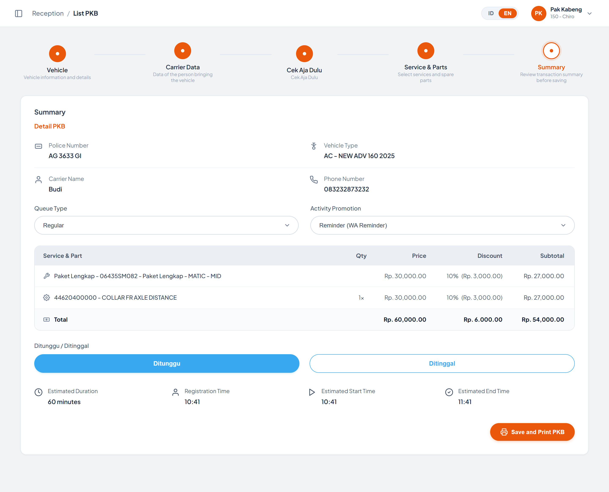

| Element Code | Component Type | Function | Behavior & Rule | Mandatory | API | Endpoint/Navigate | Method | Status QCC | Status Dev |
|--------------|----------------|----------|-----------------|-----------|-----|-------------------|--------|------------|------------|
|              |                |          |                 |           |     |                   |        |            |            |
| LABEL-Informasi PKB | LABEL | Menampilkan ringkasan data kendaraan dan pengantar | Field yang ditampilkan:   * **Police Number**   * **Vehicle Type**   * **Carrier Name**   * **Phone Number**  Seluruh field bersifat **read-only**  **Catatan pengembangan / Bug:** nilai yang tampil masih **statis** (`AG 3633 GI`, `AC - NEW ADV 160 2025`, `Budi`, `083232873232`) dan **tidak disinkronkan** dengan input Step 1 & Step 2. Perlu sinkronisasi data setiap kali user masuk ke Step 5 | | | | | | |
| LOV-Queue Type | LIST OF VIEW | Menentukan jenis antrean pengerjaan PKB | Nilai default terpilih: **Regular**  Pilihan yang tersedia: Regular, Fast Track, Pit Express  Saat diubah muncul toast **"Queue Type dipilih: `<pilihan>`"**  **Catatan pengembangan:** isi dropdown masih hardcode dan pilihan belum memengaruhi estimasi waktu pengerjaan | Yes | | | | | |
| LOV-Activity Promotion | LIST OF VIEW | Menentukan sumber aktivitas promosi yang membawa pelanggan | Nilai default terpilih: **Reminder (WA Reminder)**  Pilihan yang tersedia: Reminder (WA Reminder), Promo Merdeka, Service Berkala, Direct Mail  Saat diubah muncul toast **"Activity Promotion dipilih: `<pilihan>`"**  **Catatan pengembangan:** isi dropdown masih hardcode; perlu di-binding ke master aktivitas promosi | Yes | | | | | |
| TABLE-Service & Part (Summary) | TABLE | Menampilkan rincian jasa dan part beserta nilai transaksinya | Kolom: **Service & Part**, **Qty**, **Price**, **Discount**, **Subtotal**, ditutup baris **Total**  Ikon pada tiap baris membedakan jenis item (jasa atau part)  **Catatan pengembangan / Bug:**   1. Isi tabel masih **statis di HTML** dan tidak diambil dari daftar Service & Part pada Step 4   2. Nilai **Discount** pada baris Total tertulis `Rp. 6.000.00` (format pemisah desimal/ribuan tidak konsisten)   3. Format mata uang antar step belum seragam (`Rp. 30,000.00` di tabel ini vs `Rp. 22.500` di Ringkasan Transaksi Step 4) | | | | | | |
| BUTTON-Ditunggu / Ditinggal | BUTTON (SEGMENTED) | Menandai apakah pelanggan menunggu di bengkel atau meninggalkan kendaraan | Bersifat pilihan tunggal, default aktif: **Ditunggu**  Saat dipilih muncul toast **"Status penanganan PKB: `<pilihan>`"**  **Catatan pengembangan:** pilihan belum memengaruhi jenis antrean maupun estimasi waktu pengerjaan | Yes | | | | | |
| LABEL-Estimasi Waktu | LABEL | Menampilkan estimasi waktu pengerjaan PKB | Field yang ditampilkan:   * **Estimated Duration** (contoh: 60 minutes)   * **Registration Time** (contoh: 10:41)   * **Estimated Start Time** (contoh: 10:41)   * **Estimated End Time** (contoh: 11:41)  **Catatan pengembangan:** seluruh nilai masih **statis di HTML** — seharusnya Registration Time diambil dari jam pendaftaran, dan durasi dihitung dari akumulasi estimasi durasi jasa yang dipilih pada Step 4 | | | | | | |
| BUTTON-Save and Print PKB | BUTTON | Menyimpan data PKB dan mencetak dokumen PKB | Saat diklik muncul toast **"Menyimpan data dan mencetak PKB..."**, lalu setelah **1 detik** muncul toast **"PKB #PKB-2026-00892 berhasil disimpan & diteruskan ke mekanik!"**  **Catatan pengembangan / Bug:**   1. Nomor PKB pada notifikasi masih **hardcode** (`PKB-2026-00892`) dan tidak sesuai kode PKB yang dibuka   2. Data **tidak benar-benar tersimpan** — daftar PKB pada dashboard tidak diperbarui dan status PKB tidak berubah   3. Setelah simpan, tampilan **tidak kembali** ke dashboard List PKB   4. Belum ada proses cetak dokumen PKB yang sesungguhnya | | | Dashboard List PKB Canvasing | | | |

---

# Komponen Umum & Catatan Teknis

| Element Code | Component Type | Function | Behavior & Rule | Mandatory | API | Endpoint/Navigate | Method | Status QCC | Status Dev |
|--------------|----------------|----------|-----------------|-----------|-----|-------------------|--------|------------|------------|
|              |                |          |                 |           |     |                   |        |            |            |
| BUTTON-Next (Bottom Action) | BUTTON | Lanjut ke step berikutnya pada wizard | Berpindah dari step aktif ke step berikutnya **tanpa validasi apapun**  Label tombol berubah menjadi **"Save PKB"** saat berada di step terakhir  **Catatan pengembangan:**   1. Belum ada validasi mandatory antar step (data kendaraan, carrier, LCR, hasil pemeriksaan)   2. Baris tombol bawah **disembunyikan** saat Step 5, sehingga label *"Save PKB"* dan aksi simpan pada tombol Next **tidak pernah dapat diakses user** — kode tersebut menjadi *dead code* dan sebaiknya dirapikan | | | Step berikutnya | | | |
| BUTTON-Back (Bottom Action) | BUTTON | Kembali ke step sebelumnya atau ke dashboard | Pada **Step 1**, label tombol berubah menjadi **"List PKB"** dan mengembalikan tampilan ke dashboard List PKB Canvasing  Pada step lainnya, label tombol adalah **"Back"** dan kembali ke step sebelumnya  **Catatan pengembangan:** belum ada konfirmasi saat keluar dari wizard padahal sudah ada data yang diisi (risiko kehilangan input) | | | Step sebelumnya / Dashboard List PKB | | | |
| BUTTON-Save & Print PKB (Bottom Action) | BUTTON | Menyimpan dan mencetak PKB dari baris tombol bawah | Tampil pada **Step 1 sampai Step 4** (disembunyikan pada Step 5)  Saat diklik muncul toast **"Menyimpan data dan mencetak PKB..."**, lalu setelah **1 detik** muncul toast **"PKB #PKB-2026-00892 berhasil disimpan & diteruskan ke sistem!"**  **Catatan pengembangan / Bug:**   1. Tombol memungkinkan penyimpanan PKB **dari step manapun tanpa validasi** kelengkapan data — perlu dikonfirmasi apakah tombol ini memang harus tersedia sebelum Summary   2. Nomor PKB pada notifikasi masih hardcode, sama seperti tombol pada Step 5   3. Terdapat **dua tombol simpan** dengan pesan berbeda (*"diteruskan ke sistem"* pada bottom action vs *"diteruskan ke mekanik"* pada Step 5) — perlu disatukan | | | | | | |
| TOAST-Notifikasi | TOAST | Menampilkan notifikasi hasil aksi user | Notifikasi tampil pada satu elemen toast tunggal dan hilang otomatis setelah **3 detik**  **Catatan pengembangan:** karena hanya tersedia satu elemen, notifikasi baru **menimpa** notifikasi yang masih tampil (tidak ada antrean toast) sehingga pesan berurutan bisa terlewat oleh user | | | | | | |
| HEADER-Breadcrumb & User Profile | HEADER | Menampilkan breadcrumb `Reception / List PKB`, pengalih bahasa (ID / EN), dan informasi user yang login | Header standalone **disembunyikan** saat modul dijalankan di dalam iframe portal (class `in-iframe` dipasang pada elemen `<html>` oleh script inline di awal `<body>`)  **Catatan pengembangan:** tombol pengalih bahasa (ID/EN) dan data user masih statis — penggantian bahasa hanya memunculkan toast, belum mengubah teks halaman | | | | | | |
| BUTTON-Sidebar Toggle | BUTTON | Membuka / menutup sidebar | **Catatan pengembangan:** modul ini **tidak memiliki elemen sidebar** (sidebar berada di parent shell), sehingga tombol toggle pada header modul tidak melakukan apapun. Tombol sebaiknya dihapus dari modul | | | | | | |
| PROCESS-Sinkronisasi Breadcrumb Parent | PROCESS | Menyinkronkan sub-breadcrumb modul ke layout shell portal | Modul mengirim `postMessage` bertipe **`UPDATE_CRUMB`** (dengan `module: 'list'`) ke parent window dengan nilai `subCrumb`:   * **"List PKB"** saat menampilkan dashboard   * **`<plat nomor>`** saat membuka wizard dari kartu PKB   * **"PKB Baru"** saat membuka wizard mode PKB Baru | | | | | | |
| PROCESS-Reset View dari Parent | PROCESS | Mengembalikan modul ke tampilan dashboard atas perintah parent shell | Modul mendengarkan `postMessage` bertipe **`RESET_VIEW`** dari parent shell (dikirim saat user berpindah submenu) dan langsung menampilkan kembali dashboard List PKB Canvasing | | | Dashboard List PKB Canvasing | | | |
| PROCESS-Deep Link Wizard | PROCESS | Membuka wizard PKB Baru secara langsung melalui URL | Jika hash URL modul bernilai **`#new`** saat halaman dimuat, modul langsung membuka wizard dalam mode PKB Baru; selain itu modul menampilkan dashboard  **Catatan pengembangan:** parent shell hanya menggunakan hash **`#list-canvasing`** pada window utama dan tidak pernah menambahkan `#new` pada `src` iframe, sehingga deep link ini belum dapat dipakai dari portal | | | Step 1 — Vehicle | | | |
| PROCESS-Sumber Data Modul | PROCESS | Sumber data yang digunakan modul saat ini | Seluruh data modul masih berupa **data statis di sisi front-end**, terdiri dari:   * Daftar PKB canvasing (8 data contoh, in-memory)   * Katalog kendaraan untuk simulasi scan (3 data contoh, in-memory)   * Riwayat servis, riwayat LCR, item pemeriksaan Cek Aja Dulu, daftar Service & Part, voucher, promo, dan seluruh nilai transaksi (**hardcode langsung di HTML**)  Perubahan data **tidak persisten** dan akan hilang saat halaman di-refresh  **Catatan pengembangan:** perlu penentuan endpoint API dan struktur tabel untuk: Header PKB, Detail Kendaraan, Detail Carrier & STNK, Layanan Cek Rangka, Hasil Pemeriksaan Cek Aja Dulu, Detail Jasa, Detail Part, Voucher/Promo/Deposit, serta perhitungan nilai transaksi di sisi server | | | | | | |

---

# Ringkasan Temuan Prioritas

| No | Area | Temuan | Dampak |
|----|------|--------|--------|
| 1 | Step 5 — Summary | Data Police Number, Vehicle Type, Carrier Name, Phone Number, tabel Service & Part, dan estimasi waktu **tidak disinkronkan** dari Step 1–4 (masih statis) | PKB yang disimpan/dicetak berpotensi memuat data kendaraan & pelanggan yang salah |
| 2 | Save PKB | Nomor PKB pada notifikasi simpan masih hardcode, data tidak tersimpan, status PKB pada dashboard tidak berubah, dan tampilan tidak kembali ke dashboard | Proses inti modul (menyimpan PKB) belum berfungsi |
| 3 | Wizard Navigation | Tidak ada validasi antar step, baik melalui tombol **Next** maupun klik node stepper | PKB dapat disimpan tanpa data kendaraan, carrier, maupun hasil pemeriksaan |
| 4 | Step 1 — Scan Vehicle | Kendaraan yang tidak ditemukan **otomatis diganti** dengan kendaraan contoh pertama, tanpa pesan apapun | User dapat memproses PKB atas kendaraan yang salah |
| 5 | Step 4 — Service & Parts | Aksi Add / Use / Hapus item hanya menampilkan toast tanpa mengubah daftar, dan Ringkasan Transaksi tidak pernah dihitung ulang | Nilai transaksi tidak dapat dipertanggungjawabkan |
| 6 | Step 2 — Carrier | Pencarian carrier selalu "berhasil" dengan nama hardcode, dan kotak *No Carrier Data Found* selalu tampil | Data pengantar berpotensi salah dan tampilan membingungkan |
| 7 | Step 3 — Cek Aja Dulu | Judul card masih *"Carrier Information"*, satu baris tanpa Part Group Name, satu baris salah nama, dan seluruh Condition default **Not Ok** | Hasil pemeriksaan berpotensi terekam salah |
| 8 | Step 4 & 5 — Format Nilai | Input nominal bertipe text tanpa formatter serta format mata uang tidak seragam antar step | Risiko salah input dan salah baca nominal |
