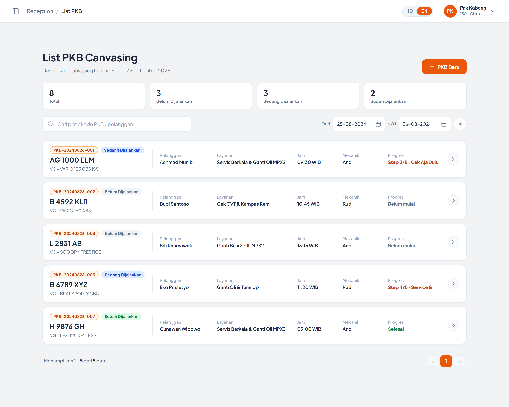
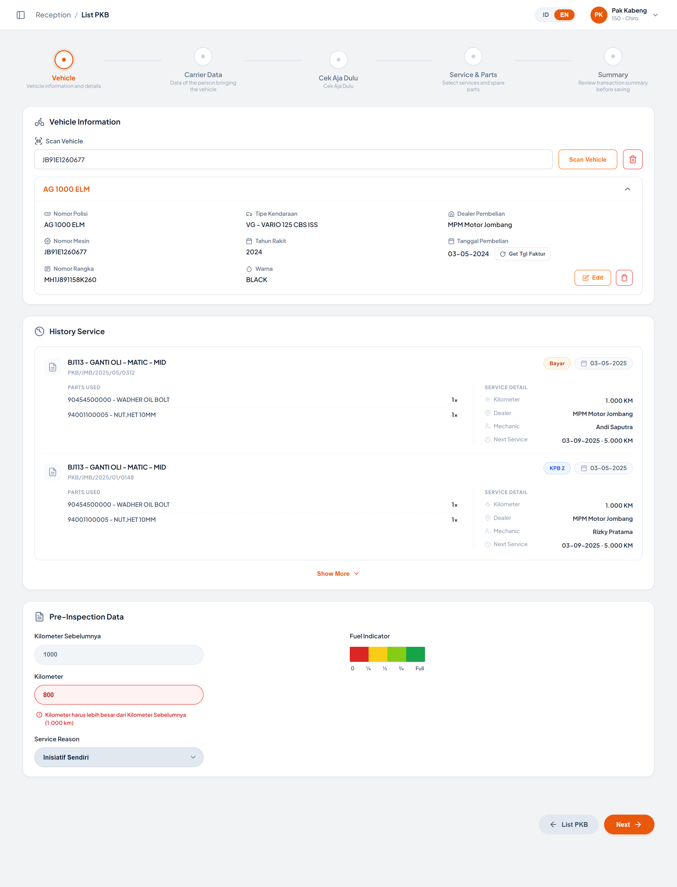
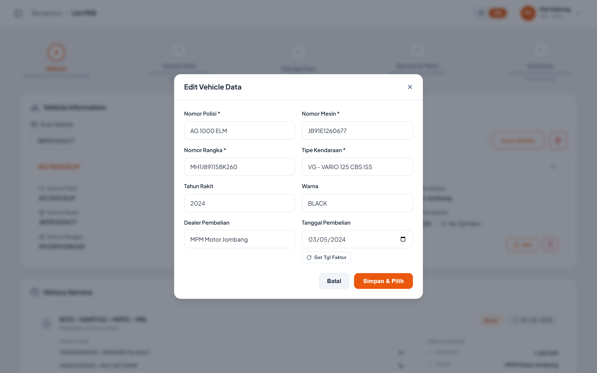
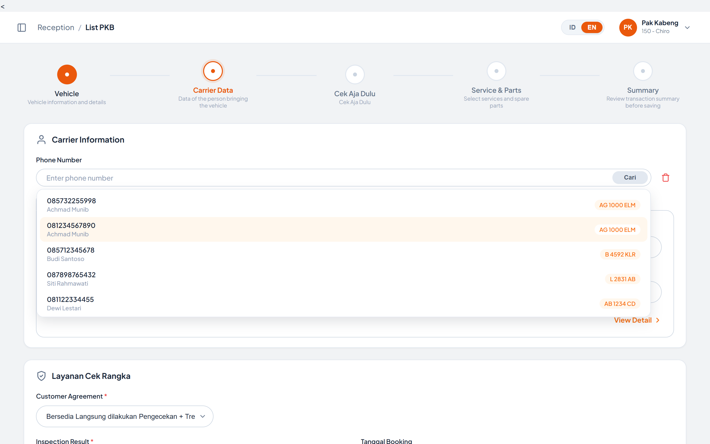
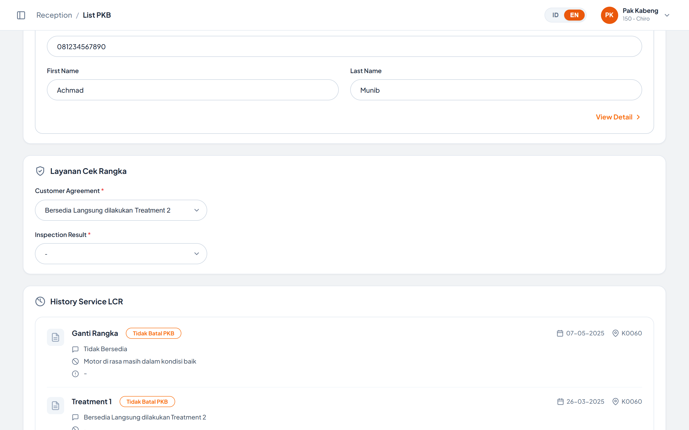
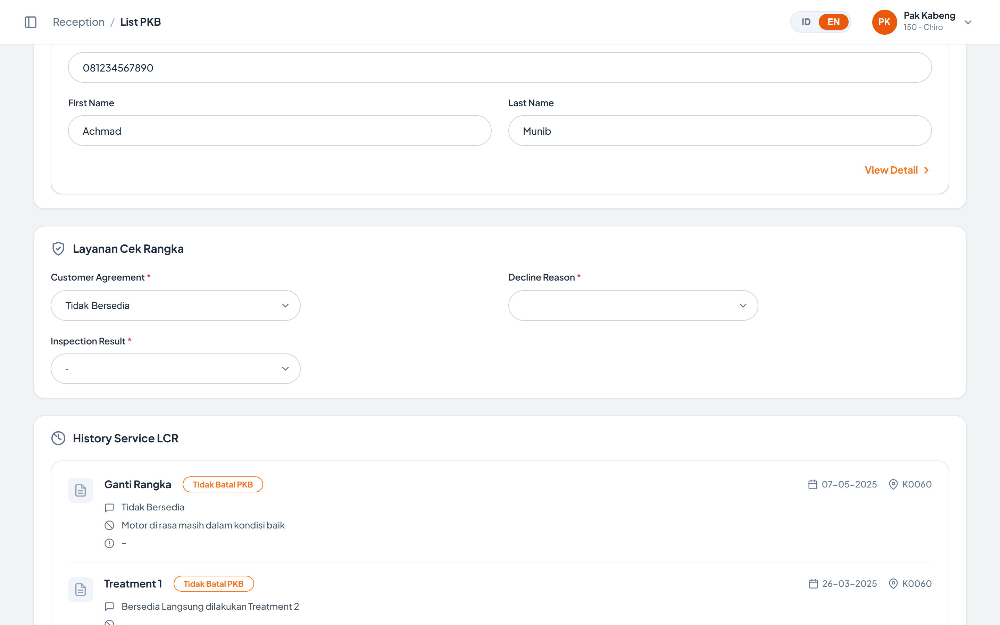
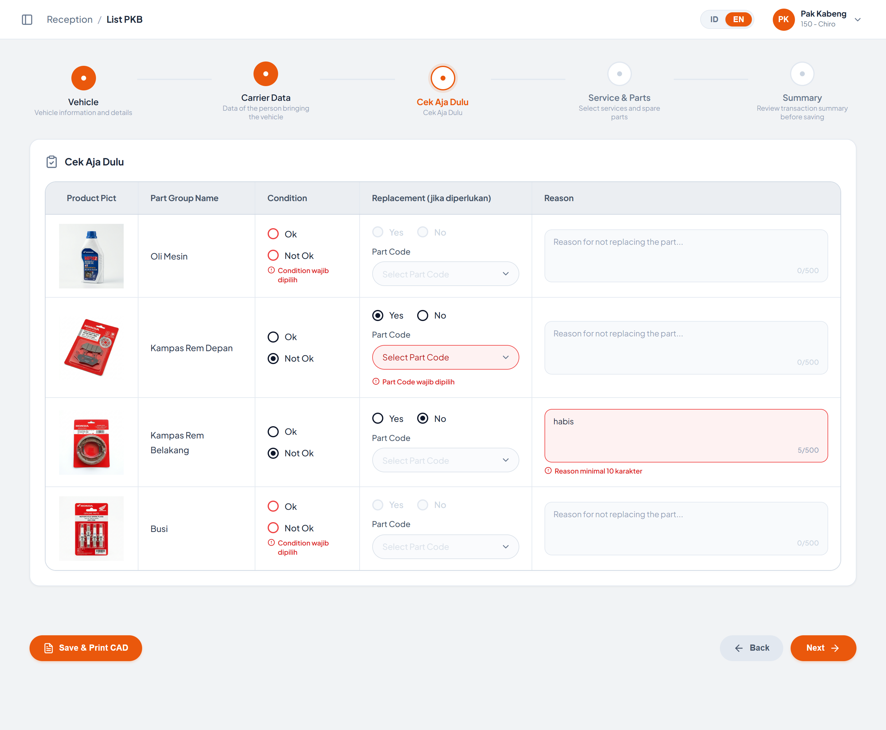
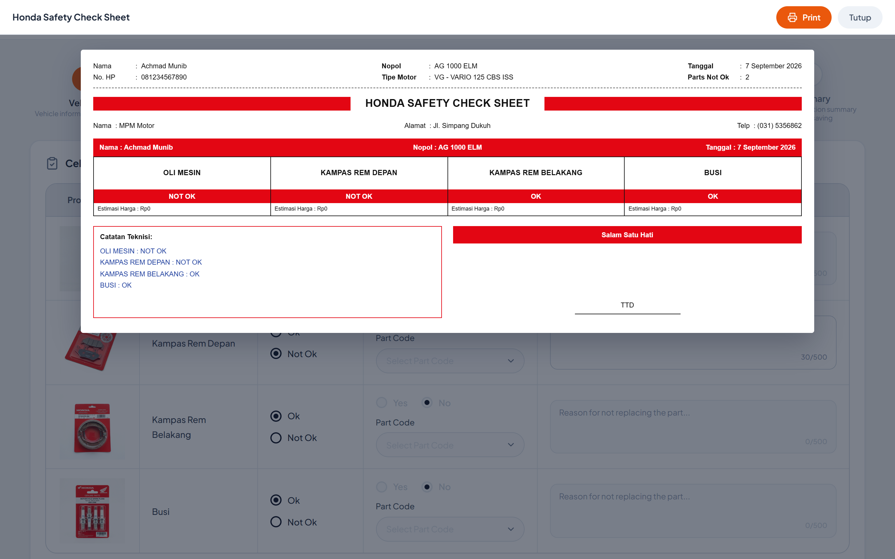

# 3️⃣ List Canvasing (List PKB)

Modul **List Canvasing** digunakan untuk memantau dan memproses PKB (Perintah Kerja Bengkel) hasil kegiatan canvasing, mulai dari dashboard daftar PKB hingga pengisian wizard penerimaan kendaraan (reception) sampai penyimpanan & cetak PKB.

Modul ini dijalankan di dalam **iframe** pada layout shell portal (`index.html`) dengan hash navigasi `#list-canvasing` dan sumber `List Canvasing/index.html`. Saat berjalan di dalam iframe, header standalone modul disembunyikan (class `in-iframe` yang dipasang pada elemen `<html>`) dan breadcrumb dikirim ke parent shell melalui `postMessage` bertipe `UPDATE_CRUMB`. Parent shell juga dapat mengirim `postMessage` bertipe `RESET_VIEW` untuk memaksa modul kembali ke tampilan dashboard.

**Alur besar modul:**

`Dashboard List PKB Canvasing` → `PKB Baru` / `Pilih Kartu PKB` → `Step 1 Vehicle` → `Step 2 Carrier Data` → `Step 3 Cek Aja Dulu` → `Step 4 Service & Parts` → `Step 5 Summary` → `Save and Print PKB`, atau berhenti di `Step 3` dengan `Save & Print CAD` → `CAD Report`

---

# Tampilan Awal — Dashboard List PKB Canvasing

 

 

 

| Element Code | Component Type | Function | Behavior & Rule | Mandatory | API | Endpoint/Navigate | Method | Status QCC | Status Dev |
|--------------|----------------|----------|-----------------|-----------|-----|-------------------|--------|------------|------------|
|              |                |          |                 |           |     |                   |        |            |            |
| LABEL-Judul Halaman | LABEL | Menampilkan judul halaman "List PKB Canvasing" | Statis, tidak dapat diubah user | | | | | | |
| LABEL-Tanggal Dashboard | LABEL | Menampilkan tanggal hari ini pada subtitle "Dashboard canvasing hari ini" | Tanggal di-generate otomatis dari tanggal sistem client dengan locale **id-ID**, format: `<hari>, <tanggal> <bulan> <tahun>` (contoh: *Jumat, 4 September 2026*)  **Catatan pengembangan:**   1. Tanggal diambil dari jam perangkat user, bukan dari server — perlu disinkronkan dengan tanggal operasional bengkel   2. Data dummy PKB bertanggal **23–26 Agustus 2024** sehingga tidak konsisten dengan label *"hari ini"*; daftar juga **tidak difilter** ke tanggal hari ini saat halaman dibuka | | | | | | |
| BUTTON-PKB Baru | BUTTON | Membuka wizard PKB dalam mode **PKB Baru** (form kosong) | Menyembunyikan `pkbDashboardView` dan menampilkan `wizardContentView`  Field Scan Vehicle **dikosongkan**, box detail kendaraan disembunyikan (empty state kendaraan tampil), dan wizard direset ke **Step 1**  Mengirim `postMessage` `UPDATE_CRUMB` dengan sub-crumb **"PKB Baru"** ke parent shell  **Catatan pengembangan:**   1. Tombol ini memunculkan **dua toast berurutan** (*"Canvasing baru dimulai (form kosong)"* menimpa *"Mode PKB Baru dimulai"*) karena notifikasi dipanggil dua kali. Cukup gunakan satu pesan   2. Data Carrier & STNK **tidak dikosongkan** melainkan diisi carrier dummy pertama (`085732255998` – Achmad Munib) agar kartu tidak kosong. Pada mode PKB Baru seharusnya form carrier bersih | | | Step 1 — Vehicle | | | |
| CHIP-Statistik Status | BUTTON / STAT CARD | Menampilkan jumlah PKB per status sekaligus sebagai **satu-satunya** filter status | Tersedia 4 chip: **Total**, **Belum Dijalankan**, **Sedang Dijalankan**, **Sudah Dijalankan**  Angka pada chip **selalu dihitung dari seluruh data** (tidak mengikuti hasil pencarian maupun filter tanggal)  Chip bersifat **klik = filter** (single select) dan mengembalikan paging ke halaman 1  **Catatan pengembangan:**   1. Saat halaman pertama dibuka **tidak ada chip yang bertanda aktif** padahal filter internal bernilai *all* — chip **Total** perlu diberi class `active` sebagai kondisi awal   2. Angka statistik masih dihitung dari data statis front-end; perlu diambil dari API agregasi status PKB  **Catatan perubahan:** pill filter status (Semua / Belum / Proses / Selesai) pada toolbar **sudah dihapus** — filter status kini sepenuhnya melalui chip ini | No | | | | | |
| TXTBOX-Search PKB | TXTBOX | Input kata kunci pencarian data PKB | Placeholder: *"Cari plat / kode PKB / pelanggan..."*  Pencarian dijalankan **realtime** pada event `input` (tanpa tombol cari), bersifat **case-insensitive** dan **partial match**, serta mengembalikan paging ke halaman 1  Kolom yang dicari: **Plat Nomor**, **Kode PKB**, **Nama Pelanggan**, dan **Tipe Kendaraan**  Hasil pencarian digabungkan (AND) dengan filter status (chip) dan filter rentang tanggal  **Catatan pengembangan:** placeholder belum menyebut Tipe Kendaraan padahal kolom tersebut ikut dicari | No | | | | | |
| FILTER-Rentang Tanggal | DATE RANGE | Memfilter data PKB berdasarkan tanggal PKB (**Dari** … **s/d**) | Terdiri dari 2 kotak tanggal dengan format tampilan **dd-mm-yyyy** dan tombol **Clear (X)**  Tanggal dapat diisi **manual dengan mengetik** (tanda `-` disisipkan otomatis setiap 2 digit, maksimal 10 karakter) atau dipilih melalui **date picker native** pada ikon kalender  Filter diterapkan begitu tanggal valid lengkap (10 karakter); input tidak valid dikembalikan ke nilai terakhir saat `blur`, dan tombol **Enter** memicu `blur`  Bila **Dari** melebihi **s/d** (atau sebaliknya), tanggal pasangannya **disamakan otomatis**  Tombol **Clear** menghapus kedua tanggal dan bersifat **disabled** saat kedua tanggal kosong  Setiap perubahan mengembalikan paging ke halaman 1  **Catatan pengembangan:** filter masih dijalankan terhadap field `date` pada data statis front-end; perlu di-binding ke parameter tanggal pada API daftar PKB | No | | | | | |
| CARD-PKB (List) | CARD LIST | Menampilkan daftar PKB canvasing dalam bentuk kartu per baris (1 card 1 row) | Kartu di-render dinamis oleh `renderPkbGrid()` dari sumber data `samplePkbList`  Format 1 card per baris menampilkan: **Kode PKB**, **Badge Status**, **Plat Nomor**, **Tipe Kendaraan**, **Pelanggan**, **Layanan**, **Jam** (WIB), **Mekanik**, **Progres**, dan ikon **chevron** di sisi kanan sebagai penanda kartu dapat dibuka  Warna kartu & badge mengikuti status melalui class `status-pending`, `status-progress`, `status-done`  Format keterangan **Progres**:   * Status *Sudah Dijalankan* → **"Selesai"**   * Step lebih dari 0 → `Step <n>/5 · <Nama Step>`   * Step 0 → **"Belum mulai"**  **Catatan pengembangan:** data PKB masih hardcode di front-end (8 data contoh) dan perlu di-binding ke API daftar PKB canvasing | | | | | | |
| BUTTON-Buka Kartu PKB | BUTTON (CARD) | Membuka wizard PKB dengan data PKB pada kartu terpilih | Seluruh area kartu bersifat klik  Data yang diisi otomatis:   * **Scan Vehicle** dan detail kendaraan (dari nomor mesin PKB)   * **Data Carrier** dicari pada dataset carrier (`sampleCarriers`) berdasarkan **nomor telepon** PKB → mengisi Phone Number, First Name, Last Name, sekaligus tab **STNK Information** (Owner Name, Police Number, Address)   * Bila nomor telepon tidak ada pada dataset carrier, data carrier dibentuk dari data kartu PKB (nama pelanggan dipecah dengan pemisah spasi — kata pertama menjadi First Name, sisanya Last Name; STNK Address diisi `-`)  Muncul toast **"Data PKB `<kode>` dimuat (`<plat>`)"**  Mengirim `postMessage` `UPDATE_CRUMB` dengan sub-crumb berisi **plat nomor** PKB terpilih  Wizard **selalu dibuka pada Step 1**  **Catatan pengembangan:** field **Kilometer** dan **Kilometer Sebelumnya** pada Step 1 terisi dari `currentKm` / `lastKm` katalog kendaraan (dicocokkan lewat nomor mesin), bukan dari data PKB — perlu ditentukan sumber datanya | | | Step 1 — Vehicle | | | |
| LABEL-Empty State | LABEL | Menampilkan keterangan saat hasil filter kosong | Teks: **"Tidak ada data PKB yang cocok."**  Ditampilkan hanya jika kombinasi pencarian, filter status, dan filter rentang tanggal tidak menghasilkan data | | | | | | |
| PAGINATION-PKB | PAGINATION | Navigasi halaman daftar kartu PKB | Menampilkan info paging (*"Menampilkan X - Y dari Z data"*) dan tombol navigasi: Prev `<`, **nomor halaman dinamis** (dibuat sesuai jumlah halaman hasil filter), dan Next `>`  Membatasi **5 kartu per halaman** untuk mencegah halaman memanjang ke bawah  Tombol Prev/Next otomatis **disabled** pada halaman pertama/terakhir, nomor halaman aktif ditandai class `active`, dan seluruh area pagination disembunyikan bila hasil filter kosong | | | | | | |

---

# Tampilan Step 1 — Vehicle

 

 

 

**Stepper Wizard** terdiri dari 5 step: **Vehicle** → **Carrier Data** → **Cek Aja Dulu** → **Service & Parts** → **Summary**.

| Element Code | Component Type | Function | Behavior & Rule | Mandatory | API | Endpoint/Navigate | Method | Status QCC | Status Dev |
|--------------|----------------|----------|-----------------|-----------|-----|-------------------|--------|------------|------------|
|              |                |          |                 |           |     |                   |        |            |            |
| STEPPER-Node | STEPPER | Menampilkan posisi step aktif dan progres pengisian wizard | Node step aktif ditandai class `active`, step yang sudah dilewati ditandai `completed`  Setiap node menampilkan **judul step** dan **deskripsi singkat**  Node step **dapat diklik langsung** untuk berpindah ke step manapun  **Catatan pengembangan:** perpindahan melalui klik node **tidak menjalankan validasi apapun** — user dapat melompat langsung ke Step 5 (Summary) tanpa mengisi data kendaraan maupun carrier. Perlu ditentukan aturan penguncian step | | | Step 1 / 2 / 3 / 4 / 5 | | | |
| TXTBOX-Scan Vehicle | TXTBOX | Input nomor mesin atau nomor rangka kendaraan untuk pencarian data kendaraan | Placeholder: *"Enter machine or frame number"*  Terisi nilai contoh `JB91E1260677` saat halaman dibuka standalone; saat wizard dibuka dari kartu PKB terisi **nomor mesin PKB**, dan pada mode **PKB Baru** dikosongkan  Menekan tombol **Enter** menjalankan aksi yang sama dengan tombol **Scan Vehicle**  **Catatan pengembangan:** field masih terisi contoh data pada mode standalone — perlu dikosongkan agar placeholder benar-benar terlihat | Yes | | | | | |
| BUTTON-Scan Vehicle | BUTTON | Mencari data kendaraan berdasarkan input Scan Vehicle | Pencocokan dilakukan terhadap **Plat Nomor** (mengabaikan spasi), **Nomor Mesin**, dan **Nomor Rangka** secara case-insensitive dan partial match  Jika data ditemukan, box detail kendaraan ditampilkan dan muncul toast **"Vehicle data loaded: `<plat>` (`<tipe>`)"**  **Catatan pengembangan / Bug:** jika data **tidak ditemukan** (atau input kosong), sistem **tidak menampilkan pesan tidak ditemukan** melainkan memuat kendaraan contoh pertama serta menimpa isi field Scan Vehicle. Perilaku ini menyesatkan — seharusnya muncul pesan *data tidak ditemukan* dan/atau membuka form input kendaraan baru | | | | | | |
| BUTTON-Clear Scan (Ikon Trash) | BUTTON | Mengosongkan input Scan Vehicle dan data kendaraan | Field Scan Vehicle dikosongkan, box detail kendaraan disembunyikan, dan empty state kendaraan ditampilkan  Muncul toast **"Vehicle input cleared"** | | | | | | |
| LABEL-Detail Kendaraan | LABEL | Menampilkan detail data kendaraan hasil scan | Judul box menampilkan **Plat Nomor** kendaraan  Detail disusun **3 kolom** mengikuti form PKB acuan:   * Kolom 1 — **Nomor Polisi**, **Nomor Mesin**, **Nomor Rangka**   * Kolom 2 — **Tipe Kendaraan**, **Tahun Rakit**, **Warna**   * Kolom 3 — **Dealer Pembelian**, **Tanggal Pembelian** (disertai tombol *Get Tgl Faktur*), dan baris tombol aksi **Edit** & **Hapus**  Seluruh field bersifat **read-only** (tampilan teks, bukan input)  **Catatan perubahan:** label field sudah diseragamkan ke Bahasa Indonesia, field **Nomor Polisi** ditambahkan, sedangkan field **Last Kilometer** dan **Nama Pemilik / Customer** dihapus dari box detail | | | | | | |
| BUTTON-Get Tgl Faktur | BUTTON | Mengambil tanggal pembelian kendaraan dari data faktur | Pencocokan dilakukan terhadap **Nomor Mesin** yang sedang tampil pada box detail kendaraan  Jika ditemukan: nilai **Tanggal Pembelian** diperbarui dan muncul toast **"Purchase date from invoice: `<tanggal>`"**  Jika tidak ditemukan: muncul toast **"Invoice date not found for this vehicle"**  **Catatan pengembangan:** sumber tanggal masih katalog kendaraan statis (`sampleVehicles`) — perlu di-binding ke API faktur / data penjualan unit | | | | | | |
| BUTTON-Collapse Detail Kendaraan | BUTTON | Menyembunyikan / menampilkan isi box detail kendaraan | Bersifat toggle. Klik pada **seluruh area header box** (bukan hanya ikon chevron) ikut menjalankan toggle  Ikon chevron berputar mengikuti status collapse | | | | | | |
| BUTTON-Edit Kendaraan | BUTTON | Membuka pop-up untuk mengubah data kendaraan | Membuka modal `inputDataModal` dalam **mode Edit**: judul modal berubah menjadi **"Edit Vehicle Data"** dan seluruh field diisi dari data yang sedang tampil — **Nomor Polisi**, **Nomor Mesin**, **Nomor Rangka**, **Tipe Kendaraan**, **Tahun Rakit**, **Warna**, **Dealer Pembelian**, serta **Tanggal Pembelian** (dikonversi dari `DD-MM-YYYY` ke format input `YYYY-MM-DD`)  **Catatan pengembangan:** data yang diambil berasal dari **teks yang tampil di layar**, bukan dari objek data kendaraan — perlu diarahkan ke sumber data / API detail kendaraan | | | Modal Input / Edit Vehicle Data | | | |
| BUTTON-Hapus Kendaraan (Ikon Trash) | BUTTON | Menghapus data kendaraan yang sedang tampil | Box detail kendaraan disembunyikan, empty state ditampilkan, dan muncul toast **"Vehicle data removed"**  **Catatan pengembangan:** penghapusan langsung dieksekusi tanpa dialog konfirmasi, dan isi field Scan Vehicle **tidak ikut dikosongkan** | | | | | | |
| LABEL-Empty State Kendaraan | LABEL | Menampilkan keterangan saat belum ada data kendaraan | Teks: **"No Vehicle Data yet"** disertai tombol **Input New Data** | | | | | | |
| BUTTON-Input New Data | BUTTON | Membuka pop-up input data kendaraan baru | Membuka modal `inputDataModal` dalam **mode Create**: judul modal **"Input New Vehicle Data"** dan seluruh field direset kosong | | | Modal Input / Edit Vehicle Data | | | |
| LIST-History Service | LIST | Menampilkan riwayat servis kendaraan terpilih | Tiap item disusun **2 kolom** agar sisi kanan card ikut terpakai:   * **Header item** — ikon dokumen, **Nama Paket Servis**, dan **Nomor PKB** di bawah judul; pada sisi kanan **tag jenis servis** (`Bayar` / `KPB 2`) dan **chip Tanggal Servis**   * **Kolom kiri — Parts Used** — daftar part beserta **qty** (qty rata kanan, antar baris dipisah garis putus-putus)   * **Kolom kanan — Service Detail** — **Kilometer**, **Dealer/Bengkel**, **Mekanik**, dan **Next Service** (tanggal + kilometer), format label kiri / nilai kanan dengan garis pemisah vertikal terhadap kolom kiri  Pada layar **≤1024px** kedua kolom ditumpuk vertikal dan garis pemisah berubah menjadi horizontal  **Catatan pengembangan:** isi riwayat masih **hardcode di HTML** (2 item) dan tidak berubah saat kendaraan lain di-scan. Field **Nomor PKB**, **Mekanik**, **Next Service**, dan **tag jenis servis** masih **data dummy** — seluruh isi perlu di-binding ke API riwayat servis per kendaraan | | | | | | |
| BUTTON-Show More History | BUTTON | Menampilkan seluruh riwayat servis | **Catatan pengembangan:** tombol baru menampilkan toast **"Showing all historical services (2 records displayed)"** tanpa benar-benar menambah data. Perlu implementasi paging / lazy load riwayat | | | | | | |
| TXTBOX-Kilometer Sebelumnya | TXTBOX (READ-ONLY) | Menampilkan kilometer kendaraan pada servis sebelumnya sebagai acuan input Kilometer | Berada pada card **Pre-Inspection Data**, tepat **di atas** field Kilometer  Bersifat **read-only** (tampil abu-abu, tidak dapat diketik maupun difokuskan untuk diubah)  Terisi otomatis dari **Last KM** kendaraan hasil scan (contoh: `1000`). Bila data PKB tidak membawa Last KM, nilai dicari pada katalog kendaraan (`sampleVehicles`) berdasarkan **nomor mesin**; bila tetap tidak ditemukan, field dikosongkan  Nilai field ini menjadi **batas bawah** validasi field Kilometer — bila kosong, validasi tidak dijalankan  **Catatan pengembangan:** nilai masih diambil dari data dummy `lastKm` — perlu di-binding ke API riwayat servis terakhir kendaraan | | | | | | |
| TXTBOX-Kilometer | TXTBOX | Input kilometer kendaraan saat penerimaan | Berada pada card **Pre-Inspection Data**  Terisi otomatis dari **Current KM** kendaraan hasil scan (contoh: `1233`)  **Hanya menerima angka** — seluruh karakter non-angka otomatis dibuang saat diketik atau di-paste (posisi kursor dipertahankan)  **Validasi:** nilai yang diinput **harus lebih besar** dari nilai field **Kilometer Sebelumnya** — nilai yang **lebih kecil atau sama dengan** Kilometer Sebelumnya ditolak. Saat dilanggar: field berubah ke state error (latar merah muda, border merah) dan muncul pesan **"Kilometer harus lebih besar dari Kilometer Sebelumnya (`<nilai>` km)"** di bawah field  Validasi dijalankan **saat mengetik**, **saat kendaraan di-scan / PKB dibuka**, dan **saat tombol Next ditekan** pada Step 1  **Catatan pengembangan:** tipe input masih **text** (bukan number) dengan `inputmode="numeric"`, dan field ini belum divalidasi sebagai mandatory (masih boleh kosong) | Yes | | | | | |
| LOV-Service Reason | LIST OF VIEW | Menampilkan daftar alasan kedatangan / servis | Nilai default terpilih: **Inisiatif Sendiri**  Pilihan yang tersedia: Inisiatif Sendiri, Servis Berkala / Rutin, Keluhan Mesin, Ganti Oli Saja, Klaim Garansi  **Catatan pengembangan:** isi dropdown masih hardcode dan perlu di-binding ke master alasan servis | Yes | | | | | |
| GAUGE-Fuel Indicator | GAUGE / SEGMENTED SELECT | Menandai level bahan bakar kendaraan saat diterima | Terdiri dari 4 segmen warna (merah, kuning, lime, hijau) dan 5 label level: **0**, **¼**, **½**, **¾**, **Full**  Level dapat dipilih dengan mengklik **segmen** maupun **label**. Segmen di bawah/sama dengan level terpilih tampil penuh, sisanya diredupkan (opacity 0.25 + grayscale)  Setelah dipilih muncul toast **"Fuel indicator set to: `<level>`"**  **Catatan pengembangan:**   1. Level default disimpan sebagai **Full (4)** namun styling awal **tidak pernah dijalankan**, sehingga seluruh segmen tampil aktif dan label Full tidak tersorot — perlu inisialisasi tampilan saat halaman dibuka   2. Level **0** hanya dapat dipilih melalui label (tidak ada segmennya) | Yes | | | | | |

## Pop-up "Input New Vehicle Data" / "Edit Vehicle Data"

 

 

Modal menggunakan satu markup yang sama (`inputDataModal`) dengan dua mode:

* **Create** — dibuka dari tombol **Input New Data**, judul **"Input New Vehicle Data"**, form direset kosong.
* **Edit** — dibuka dari tombol **Edit** pada box detail kendaraan, judul **"Edit Vehicle Data"**, form terisi data kendaraan yang sedang tampil.

| Element Code | Component Type | Function | Behavior & Rule | Mandatory | API | Endpoint/Navigate | Method | Status QCC | Status Dev |
|--------------|----------------|----------|-----------------|-----------|-----|-------------------|--------|------------|------------|
|              |                |          |                 |           |     |                   |        |            |            |
| LABEL-Judul Modal | LABEL | Menampilkan judul pop-up sesuai mode | Bernilai **"Input New Vehicle Data"** pada mode Create dan **"Edit Vehicle Data"** pada mode Edit | | | | | | |
| TXTBOX-Nomor Polisi | TXTBOX | Input plat nomor kendaraan | Placeholder: *"Contoh: B 1234 ABC"*  Wajib diisi (atribut `required` HTML5) | Yes | | | | | |
| TXTBOX-Nomor Mesin | TXTBOX | Input nomor mesin kendaraan | Placeholder: *"Contoh: JM31E123456"*  Wajib diisi | Yes | | | | | |
| TXTBOX-Nomor Rangka | TXTBOX | Input nomor rangka kendaraan | Placeholder: *"Contoh: MH1JM3119PK123456"*  Wajib diisi | Yes | | | | | |
| TXTBOX-Tipe Kendaraan | TXTBOX | Input tipe / model kendaraan | Placeholder: *"Contoh: VG - VARIO 125 CBS ISS"*  Wajib diisi | Yes | | | | | |
| TXTBOX-Tahun Rakit | TXTBOX (NUMBER) | Input tahun rakit kendaraan | Placeholder *2024*, rentang nilai `min=1900` dan `max=2100`, tanpa nilai default  Tidak wajib diisi | No | | | | | |
| TXTBOX-Warna | TXTBOX | Input warna kendaraan | Placeholder: *"Contoh: BLACK"*  Tidak wajib diisi | No | | | | | |
| TXTBOX-Dealer Pembelian | TXTBOX | Input dealer tempat pembelian kendaraan | Placeholder: *"Contoh: MPM Motor Jombang"*  Tidak wajib diisi | No | | | | | |
| DATE-Tanggal Pembelian | DATE PICKER | Input tanggal pembelian kendaraan | Menggunakan input bertipe **date**; nilainya dikonversi ke format **DD-MM-YYYY** saat ditampilkan pada box detail kendaraan | No | | | | | |
| BUTTON-Get Tgl Faktur (Modal) | BUTTON | Mengambil tanggal pembelian dari data faktur | Pencocokan dilakukan terhadap isi field **Nomor Mesin** pada modal  Jika ditemukan: field Tanggal Pembelian terisi dan muncul toast **"Tanggal faktur: `<tanggal>`"**  Jika tidak ditemukan: muncul toast **"Tanggal faktur tidak ditemukan untuk nomor mesin ini"** | | | | | | |
| BUTTON-Simpan & Pilih | BUTTON (SUBMIT) | Menyimpan data kendaraan dan memuatnya ke Step 1 | Validasi wajib dijalankan oleh atribut `required` bawaan browser  Setelah submit: box detail kendaraan diisi dengan data pada form, field **Scan Vehicle** diisi Nomor Mesin, modal tertutup, dan form direset  Toast mengikuti mode: **"Vehicle data updated successfully!"** (Edit) atau **"New vehicle registered successfully!"** (Create)  **Catatan pengembangan:**   1. Data hanya diterapkan ke tampilan (tidak disimpan ke katalog kendaraan), sehingga hasil edit **hilang** begitu tombol **Scan Vehicle** dijalankan kembali   2. Field **Kilometer** pada Pre-Inspection Data **tidak ikut diperbarui** (nilai `km` yang dibentuk saat submit tidak dipakai oleh tampilan)   3. Field **Kilometer Sebelumnya** diisi ulang dari katalog kendaraan berdasarkan **Nomor Mesin** hasil submit — bila nomor mesin tidak dikenali, field **dikosongkan** sehingga validasi Kilometer ikut nonaktif | | | Step 1 — Vehicle | | | |
| BUTTON-Batal | BUTTON | Menutup pop-up tanpa menyimpan | Modal juga tertutup melalui tombol Close (X) atau klik pada area backdrop  Isi form yang tertinggal **direset otomatis** saat modal dibuka kembali pada mode Create, dan **ditimpa data kendaraan** saat dibuka pada mode Edit | | | | | | |

---

# Tampilan Step 2 — Carrier Data

 

 

 

 

 

| Element Code | Component Type | Function | Behavior & Rule | Mandatory | API | Endpoint/Navigate | Method | Status QCC | Status Dev |
|--------------|----------------|----------|-----------------|-----------|-----|-------------------|--------|------------|------------|
|              |                |          |                 |           |     |                   |        |            |            |
| TXTBOX-Search Phone Number | TXTBOX | Input nomor telepon untuk mencari data pengantar (carrier) | Placeholder: *"Enter phone number"*  Saat halaman dibuka terisi nomor carrier dummy pertama (`085732255998`); saat wizard dibuka dari kartu PKB terisi nomor telepon PKB tersebut  Menekan tombol **Enter** menjalankan aksi yang sama dengan tombol **Cari**  Klik / fokus pada field membuka **dropdown nomor telepon tersimpan**, dan pengetikan memfilter isi dropdown secara realtime | Yes | | | | | |
| LOV-Saved Phone Number | LIST OF VIEW (DROPDOWN) | Menampilkan daftar nomor telepon carrier yang sudah tersimpan | Dropdown muncul di bawah kolom pencarian saat field diklik / difokus, dan tertutup saat menekan **Esc** atau klik di luar area kolom pencarian  Tiap opsi menampilkan **Nomor Telepon**, **Nama Carrier**, dan badge **Plat Nomor STNK**; opsi yang sedang dipakai ditandai class `active`  Isi dropdown difilter oleh kata kunci pada kolom pencarian (partial match terhadap **nomor telepon**, **nama depan + nama belakang**, dan **plat STNK**, mengabaikan spasi & tanda hubung)  Bila tidak ada yang cocok tampil keterangan **"No saved phone number matched"**  Memilih salah satu opsi akan mengisi **tab Carrier Information dan tab STNK Information sekaligus**, menutup dropdown, dan memunculkan toast **"Carrier selected: `<nama>` (`<telepon>`)"**  **Catatan pengembangan:** daftar masih diambil dari dataset dummy `sampleCarriers` (9 data) — perlu di-binding ke API master customer / carrier beserta paging & pembatasan jumlah hasil | No | | | | | |
| BUTTON-Cari Carrier | BUTTON | Mencari data carrier berdasarkan nomor telepon | Jika input kosong, muncul toast **"Please enter a phone number to search."** dan pencarian dibatalkan  Jika data ditemukan: form **Carrier Information** dan **STNK Information** diisi, kotak *No Carrier Data Found* disembunyikan, dan muncul toast **"Carrier found: `<nama>` (`<telepon>`)"**  Jika data **tidak ditemukan**: form carrier & STNK dikosongkan (kata kunci tetap dipindahkan ke field Phone Number), kotak *No Carrier Data Found* ditampilkan, dan muncul toast **"No carrier data found for: `<kata kunci>`"**  **Catatan pengembangan:**   1. Pencarian dijalankan terhadap dataset dummy `sampleCarriers` — perlu dihubungkan ke API pencarian customer   2. Pencocokan masih bersifat **partial match** pada nomor telepon, nama, dan plat STNK, sehingga kata kunci pendek (contoh `08`) langsung mengembalikan data pertama. Untuk pencarian by phone sebaiknya **exact match** | | | | | | |
| BUTTON-Clear Carrier (Ikon Trash) | BUTTON | Mengosongkan pencarian dan form carrier | Menutup dropdown nomor telepon, mengosongkan kolom pencarian beserta seluruh field Carrier (Phone Number, First Name, Last Name) dan STNK (Owner Name, Police Number, Address), menampilkan kembali kotak *No Carrier Data Found*, lalu muncul toast **"Carrier search input cleared"** | | | | | | |
| LABEL-No Carrier Data Found | LABEL | Menampilkan keterangan bahwa data carrier belum ditemukan | Kotak keterangan bersifat **kondisional**: disembunyikan saat data carrier berhasil dimuat, dan ditampilkan saat hasil pencarian kosong atau data carrier dikosongkan  **Catatan perubahan:** sebelumnya kotak ini selalu tampil termasuk ketika data carrier sudah terisi — perilaku tersebut sudah diperbaiki | | | | | | |
| BUTTON-Add New Carrier | BUTTON | Menyiapkan form untuk input data carrier baru | Nomor telepon dari kolom pencarian dipindahkan ke form, field lain (First Name, Last Name, dan data STNK) dikosongkan, kotak *No Carrier Data Found* disembunyikan, fokus otomatis ke First Name, dan muncul toast **"Ready to input new carrier data"**  **Catatan pengembangan:** belum ada aksi simpan carrier baru — data yang diinput belum tersimpan ke dataset / API manapun | | | | | | |
| TAB-Carrier / STNK | TAB | Memindah tampilan antara data pengantar dan data STNK | Tersedia 2 tab: **Carrier Information** (default aktif) dan **STNK Information**  Hanya satu tab yang tampil dalam satu waktu | | | | | | |
| TXTBOX-Phone Number (Carrier) | TXTBOX | Input nomor telepon pengantar kendaraan | Terisi otomatis dari hasil pencarian, pemilihan nomor tersimpan, atau dari data PKB yang dibuka dari dashboard  **Catatan pengembangan:** belum ada validasi format nomor telepon (hanya angka, panjang minimal/maksimal) | Yes | | | | | |
| TXTBOX-First Name | TXTBOX | Input nama depan pengantar kendaraan | Placeholder: *"Enter first name"*  Terisi otomatis dari data carrier terpilih atau dari nama pelanggan pada kartu PKB | Yes | | | | | |
| TXTBOX-Last Name | TXTBOX | Input nama belakang pengantar kendaraan | Placeholder: *"Enter last name"*  Terisi otomatis dari data carrier terpilih atau dari nama pelanggan pada kartu PKB | No | | | | | |
| LINK-View Detail Carrier | LINK / BUTTON | Menampilkan detail lengkap data carrier | **Catatan pengembangan:** aksi baru menampilkan toast **"Detail carrier: `<nama>` - `<telepon>` - STNK `<plat>`"** — belum ada halaman/modal detail carrier | | | | | | |
| TXTBOX-STNK Owner Name | TXTBOX | Input nama pemilik sesuai STNK | Terisi otomatis dari data carrier terpilih (contoh: `Achmad Munib`) | No | | | | | |
| TXTBOX-STNK Police Number | TXTBOX | Input plat nomor sesuai STNK | Terisi otomatis dari data carrier terpilih (contoh: `AG 1000 ELM`)  **Catatan pengembangan:** belum ada validasi kecocokan dengan **Nomor Polisi** kendaraan pada Step 1 | No | | | | | |
| TXTBOX-STNK Address | TXTBOX | Input alamat sesuai STNK | Terisi otomatis dari data carrier terpilih (contoh: `Jl. Merdeka No. 45, Jombang`)  **Catatan pengembangan:** seluruh field pada tab STNK sudah ikut terisi dari dataset carrier, namun **belum tersimpan / tidak dipakai** di step manapun (termasuk Summary) | No | | | | | |
| LOV-Customer Agreement | LIST OF VIEW | Menampilkan pilihan kesediaan pelanggan terhadap Layanan Cek Rangka (LCR) | Ditandai wajib (`*`) pada label  Nilai default terpilih: **Bersedia Langsung dilakukan Pengecekan + Treatment 1**  Pilihan yang tersedia: Bersedia Langsung dilakukan Pengecekan + Treatment 1, Bersedia Langsung dilakukan Treatment 2, Bersedia Langsung dilakukan Penggantian, Bersedia Di Cek di Lain Waktu, Tidak Bersedia  Ter-cascade ke **Tanggal Booking**: field **DATE-Tanggal Booking** beserta tombol **BUTTON-Cek Alokasi** hanya ditampilkan bila nilai terpilih **Bersedia Langsung dilakukan Pengecekan + Treatment 1**; memilih nilai lain menyembunyikan sekaligus **mengosongkan** field tersebut  Ter-cascade ke **Decline Reason**: field **LOV-Decline Reason** hanya ditampilkan bila nilai terpilih **Tidak Bersedia**; memilih nilai lain menyembunyikan sekaligus **mengosongkan** field tersebut  **Catatan pengembangan:** belum ada validasi mandatory di sisi script dan isi dropdown masih hardcode | Yes | | | | | |
| LOV-Decline Reason | LIST OF VIEW | Menampilkan alasan penolakan layanan cek rangka | Field bersifat **kondisional** — hanya tampil saat **Customer Agreement** bernilai **Tidak Bersedia**, dan otomatis disembunyikan + dikosongkan saat pilihan diganti ke nilai lain  Ditandai wajib (`*`) pada label  Saat pertama tampil belum ada nilai terpilih (kosong)  Pilihan yang tersedia: -, Motor di rasa masih dalam kondisi baik, Tidak Memiliki Waktu, Biaya Tidak Memadai, Lainnya  **Catatan pengembangan:** belum ada validasi mandatory di sisi script saat field tampil, dan untuk pilihan **Lainnya** belum ada field keterangan bebas | Yes | | | | | |
| LOV-Inspection Result | LIST OF VIEW | Menampilkan hasil pemeriksaan rangka | Ditandai wajib (`*`) pada label  Nilai default terpilih: **-**  Pilihan yang tersedia: -, Butuh dilakukan Treatment, Butuh dilakukan Penggantian, Kondisi Rangka Baik / Normal  **Catatan pengembangan:** field belum ter-cascade dengan Customer Agreement — seharusnya baru dapat diisi bila pelanggan bersedia dilakukan pengecekan | Yes | | | | | |
| DATE-Tanggal Booking | DATE PICKER | Input tanggal booking pengecekan rangka | Field bersifat **kondisional** — hanya tampil saat **Customer Agreement** bernilai **Bersedia Langsung dilakukan Pengecekan + Treatment 1**, dan otomatis disembunyikan + dikosongkan saat pilihan diganti  Placeholder: *"dd-mm-yyyy"*  Terdiri dari input teks berformat **DD-MM-YYYY** (hanya menerima angka, tanda hubung ditambahkan otomatis) dan ikon kalender yang membuka **date picker** native browser; kedua input saling disinkronkan  Saat field kehilangan fokus: format tidak lengkap memunculkan pesan **"Format Tanggal Booking harus dd-mm-yyyy"**, dan tanggal yang tidak ada di kalender (contoh `31-02-2026`) memunculkan pesan **"Tanggal Booking tidak valid"** — pada kedua kondisi border field berubah merah  Mengosongkan field akan menghapus pesan error beserta nilai date picker  **Catatan pengembangan:** belum ada pembatasan tanggal minimal (masih bisa memilih tanggal lampau) dan nilainya **belum dipakai** pada step manapun (termasuk Summary) | No | | | | | |
| BUTTON-Cek Alokasi | BUTTON | Mengecek ketersediaan slot booking pada tanggal terpilih | Tombol tampil bersamaan dengan field **Tanggal Booking** (kondisional dari Customer Agreement)  Bila Tanggal Booking belum diisi: muncul pesan **"Tanggal Booking wajib diisi sebelum cek alokasi"**, border field berubah merah, dan fokus dipindah ke field tersebut  Bila isi field belum lengkap / bukan tanggal yang valid: aksi dibatalkan dengan pesan **"Format Tanggal Booking harus dd-mm-yyyy"** atau **"Tanggal Booking tidak valid"**  Bila sudah terisi: muncul toast **"Mengecek alokasi slot untuk `<tanggal>`..."** lalu toast **"Alokasi tersedia pada `<tanggal>` — 3 slot pengecekan rangka"**  **Catatan pengembangan:** hasil cek alokasi masih **dummy** (jumlah slot hardcode) — perlu di-binding ke API alokasi/kuota booking bengkel | | | | | | |
| LIST-History Service LCR | LIST | Menampilkan riwayat Layanan Cek Rangka kendaraan | Tiap item menampilkan: **Jenis Layanan** (Ganti Rangka / Treatment 1 / Cek), badge **"Tidak Batal PKB"**, **Tanggal**, **Kode Bengkel**, serta 3 baris detail (**Customer Agreement**, **Decline Reason**, **Inspection Result**)  **Catatan pengembangan:** isi riwayat masih **hardcode di HTML** (3 item) dan tidak berubah mengikuti kendaraan terpilih. Perlu di-binding ke API riwayat LCR | | | | | | |

---

# Tampilan Step 3 — Cek Aja Dulu

 

 

| Element Code | Component Type | Function | Behavior & Rule | Mandatory | API | Endpoint/Navigate | Method | Status QCC | Status Dev |
|--------------|----------------|----------|-----------------|-----------|-----|-------------------|--------|------------|------------|
|              |                |          |                 |           |     |                   |        |            |            |
| LABEL-Judul Card | LABEL | Menampilkan judul card pada Step 3 | Judul card: **"Cek Aja Dulu"**, dengan ikon *clipboard-check* yang mewakili isi card (sebelumnya keliru memakai judul **"Carrier Information"** beserta ikon orang, sisa salin dari Step 2) | | | | | | |
| TABLE-Cek Aja Dulu | TABLE | Menampilkan daftar part yang diperiksa beserta kondisi dan rekomendasi penggantian | Kolom yang ditampilkan berurutan: **Product Pict**, **Part Group Name**, **Condition**, **Replacement (jika diperlukan)**, **Reason**  Saat ini tersedia 4 baris pemeriksaan: **Oli Mesin**, **Kampas Rem Depan**, **Kampas Rem Belakang** (gambar *brake shoe*), dan **Busi**  Setiap baris memiliki penanda nomor (`data-row`) yang dipakai pada pesan validasi, contoh: *"Baris 1 — Oli Mesin: Condition wajib dipilih"*  **Catatan pengembangan:** seluruh baris masih hardcode di HTML; perlu di-binding ke master item pemeriksaan per tipe kendaraan | | | | | | |
| IMAGE-Product Pict | IMAGE | Menampilkan foto part yang diperiksa | Gambar diambil dari folder `assets/` modul (contoh: `oil_mpx2.jpg`, `brake_pad_front.jpg`, `brake_shoe.jpg`, `spark_plugs.jpg`)  **Catatan pengembangan:** gambar masih berupa asset statis lokal; perlu ditentukan sumber gambar dari master part | | | | | | |
| RADIO-Condition | RADIO BUTTON | Menandai kondisi part hasil pemeriksaan | Pilihan: **Ok** dan **Not Ok** (susunan vertikal)  Nilai awal **kosong** (tidak ada yang terpilih) agar hasil pemeriksaan hanya terekam bila surveyor benar-benar menilai  Wajib dipilih pada **setiap baris**; bila kosong muncul pesan **"Condition wajib dipilih"** di bawah grup radio  Mengubah Condition akan **mereset pilihan Replacement** pada baris tersebut, karena jalur isian sebelumnya tidak lagi berlaku  * **Ok** → Replacement dikunci pada **No** (radio di-disable), Part Code & Reason ikut di-disable dan dikosongkan   * **Not Ok** → Replacement dibuka untuk dipilih | Yes | | | | | |
| RADIO-Replacement | RADIO BUTTON | Menandai apakah part perlu diganti | Pilihan: **Yes** dan **No** (susunan horizontal)  Nilai awal **kosong** dan radio dalam kondisi **disabled** selama **Condition** belum dipilih  Saat **Condition = Ok**, radio otomatis diarahkan ke **No** dan dikunci (disabled)  Saat **Condition = Not Ok**, radio menjadi aktif dan **wajib dipilih**; bila kosong muncul pesan **"Replacement wajib dipilih"**  * **Yes** → kolom **Part Code** aktif, **Reason** di-disable dan dikosongkan   * **No** → kolom **Reason** aktif, **Part Code** di-disable dan dikosongkan | Yes | | | | | |
| LOV-Part Code | LIST OF VIEW | Menampilkan pilihan kode part pengganti | Nilai awal: **"Select Part Code"**  Format pilihan: `<Kode Part> - <Nama Part>`  Dropdown hanya **aktif** pada jalur **Condition = Not Ok** dan **Replacement = Yes**; di luar jalur tersebut dropdown di-disable (tampil abu-abu) dan nilainya otomatis dikosongkan  Setelah dipilih, teks dropdown berubah menjadi lebih tegas (warna gelap dan **bold**) sebagai penanda sudah terisi  Validasi saat aktif:   1. Wajib dipilih — bila masih *"Select Part Code"* muncul pesan **"Part Code wajib dipilih"** dan border dropdown berubah merah   2. Tidak boleh sama dengan Part Code baris lain — bila sama, seluruh baris yang bentrok diberi pesan **"Part Code sudah dipilih pada baris lain"**  **Catatan pengembangan:** isi dropdown masih hardcode (3 opsi per baris) dan perlu di-binding ke master part per part group (dikirim dengan parameter part group agar tidak mungkin memilih kode di luar grupnya) | Yes | | | | | |
| TXTAREA-Reason | TXTAREA | Input alasan bila part tidak diganti | Placeholder: *"Reason for not replacing the part..."*  Field hanya **aktif** pada jalur **Condition = Not Ok** dan **Replacement = No**; di luar jalur tersebut field di-disable (tampil abu-abu), isinya dikosongkan, dan penghitung karakter dikembalikan ke `0/500`  Panjang maksimal **500 karakter** (dibatasi atribut `maxlength`), dengan penghitung karakter format `<jumlah>/500` yang diperbarui **realtime** saat user mengetik  Validasi saat aktif (dicek setelah `trim`, sehingga isian berupa spasi/enter saja ditolak):   1. Kosong → pesan **"Reason wajib diisi"**   2. Kurang dari **10 karakter** → pesan **"Reason minimal 10 karakter"**  Saat tidak valid, latar box Reason berubah merah dan pesan tampil di bawah box | Yes | | | | | |
| PROCESS-Validasi Cek Aja Dulu | PROCESS | Memvalidasi seluruh baris pemeriksaan sebelum data diteruskan | Validasi dijalankan pada **seluruh baris** saat user menekan **Next**, **klik node stepper ke step berikutnya**, atau **Save & Print PKB**  Sebelum percobaan pertama tersebut, form **tidak menampilkan error** sama sekali (tidak merah saat halaman baru dibuka). Setelah percobaan pertama, validasi ikut dijalankan ulang **setiap kali** user mengubah radio, dropdown, atau mengetik pada Reason, sehingga pesan hilang begitu isian dibetulkan  Bila ada yang tidak valid: perpindahan step / penyimpanan **dibatalkan**, muncul toast berisi baris pertama yang bermasalah dengan format **"Baris `<no>` — `<Part Group Name>`: `<pesan>`"**, lalu fokus dan scroll diarahkan ke elemen tersebut  Pesan error ditampilkan **di dalam sel** masing-masing kolom (bukan di bawah tabel) agar tetap terbaca saat tabel di-scroll horizontal  **Catatan pengembangan:** validasi masih di sisi front-end; aturan yang sama perlu diterapkan ulang di sisi server saat endpoint Hasil Pemeriksaan Cek Aja Dulu tersedia | | | | | | |

---

# Tampilan CAD Report — Honda Safety Check Sheet

 

| Element Code | Component Type | Function | Behavior & Rule | Mandatory | API | Endpoint/Navigate | Method | Status QCC | Status Dev |
|--------------|----------------|----------|-----------------|-----------|-----|-------------------|--------|------------|------------|
|              |                |          |                 |           |     |                   |        |            |            |
| POPUP-CAD Report | POP UP | Menampilkan lembar **Honda Safety Check Sheet** hasil pemeriksaan Cek Aja Dulu | Dibuka dari tombol **Save & Print CAD** pada Step 3, tampil sebagai overlay penuh di atas halaman  Wizard **tidak berpindah halaman** karena lembar ini: baik selama overlay terbuka maupun setelah ditutup, user tetap berada di **Step 3 (Cek Aja Dulu)** dengan seluruh isian masih utuh  Ditutup dengan tombol **Tutup** atau tombol **Esc**  Isi lembar **dibangun ulang setiap kali dibuka** dari baris tabel Cek Aja Dulu, sehingga jumlah item pada lembar selalu mengikuti jumlah item pemeriksaan | | | | | | |
| LABEL-Kop Identitas | LABEL | Menampilkan identitas pelanggan, kendaraan, dan tanggal pada bagian paling atas lembar | Tiga kolom:   * Kiri — **Nama** (gabungan First Name + Last Name dari Step 2) dan **No. HP** (Phone Number Step 2)   * Tengah — **Nopol** dan **Tipe Motor** (dari kartu kendaraan Step 1; diisi `-` bila kartu kendaraan masih *empty state*)   * Kanan — **Tanggal** (tanggal hari ini, format `d MMMM yyyy` gaya lembar Honda, contoh *7 September 2026*) dan **Parts Not Ok** (jumlah baris dengan Condition = **Not Ok**) | | | | | | |
| LABEL-Identitas Dealer | LABEL | Menampilkan identitas bengkel pada kop lembar | Menampilkan **Nama**, **Alamat**, dan **Telp** dealer  **Catatan pengembangan:** nilainya masih **statis** (MPM Motor — Jl. Simpang Dukuh — (031) 5356862); perlu di-binding ke master dealer / bengkel yang sedang login | | | | | | |
| TABLE-Item Pemeriksaan | TABLE | Menampilkan status tiap item pemeriksaan dalam bentuk grid | Grid **4 kolom**; tiap sel berisi **nama part** (huruf kapital), **bar status** (**OK** / **NOT OK**), dan baris **Estimasi Harga**  Bila jumlah item bukan kelipatan 4, baris terakhir dilengkapi **sel kosong** agar tabel tetap rata  **Catatan pengembangan / Bug:**   1. **Estimasi Harga** masih selalu **Rp0** karena master part belum menyimpan harga — perlu diambil dari Part Code yang dipilih pada Step 3   2. Lembar Honda Safety Check Sheet standar memuat **11 item** (Oli Mesin, Kampas Rem Depan, Kampas Rem Belakang, Rantai, Busi, Aki dan Baterai, Kelistrikan dan Lampu, Seal Fork Depan, Kabel Kopling dan Gas, Minyak dan Sistem Rem, Ban), sedangkan tabel Cek Aja Dulu saat ini baru memiliki **4 item** — jumlah item pada lembar akan otomatis mengikuti setelah master item pemeriksaan dilengkapi | | | | | | |
| LABEL-Catatan Teknisi | LABEL | Menampilkan ringkasan hasil pemeriksaan dalam bentuk daftar | Setiap baris berformat **`<NAMA PART> : <STATUS>`**, mengikuti urutan baris pada tabel Cek Aja Dulu  **Catatan pengembangan:** isi catatan masih murni hasil Condition; catatan bebas dari teknisi belum tersedia sebagai input di Step 3 | | | | | | |
| LABEL-Salam Satu Hati & TTD | LABEL | Blok tanda tangan pada sisi kanan bawah lembar | Menampilkan bar **"Salam Satu Hati"** beserta area **TTD** dan garis tanda tangan  **Catatan pengembangan:** belum menampilkan nama teknisi / service advisor di bawah garis tanda tangan | | | | | | |
| BUTTON-Print | BUTTON | Mencetak lembar CAD Report | Memanggil dialog cetak browser (`window.print()`)  Mode cetak diatur agar **hanya lembar report** yang tercetak — toolbar, wizard, dashboard, dan toast disembunyikan; ukuran halaman diatur **A4 landscape** dengan margin 8mm, dan grid item maupun blok catatan diberi `break-inside: avoid` agar tidak terpotong antar halaman  Seluruh elemen lembar dipaksa `print-color-adjust: exact`, karena opsi **"Background graphics"** pada dialog cetak Chrome **mati secara default** — tanpa aturan ini seluruh bar merah (judul, identitas pelanggan, status OK/NOT OK, Salam Satu Hati) hilang dan teks putih di atasnya menjadi tidak terbaca  **Catatan pengembangan:** belum menghasilkan file PDF/arsip; masih mengandalkan dialog cetak browser | | | | | | |
| BUTTON-Tutup | BUTTON | Menutup lembar CAD Report | Menutup overlay dan mengembalikan tampilan ke **Step 3 (Cek Aja Dulu)** dengan seluruh isian tetap seperti sebelumnya — tidak berpindah ke dashboard  Tombol **Esc** memberi efek yang sama | | | Step 3 — Cek Aja Dulu | | | |

---

# Tampilan Step 4 — Service & Parts

 

 

| Element Code | Component Type | Function | Behavior & Rule | Mandatory | API | Endpoint/Navigate | Method | Status QCC | Status Dev |
|--------------|----------------|----------|-----------------|-----------|-----|-------------------|--------|------------|------------|
|              |                |          |                 |           |     |                   |        |            |            |
| LIST-Service Recomendation | LIST / CARD | Menampilkan rekomendasi paket servis untuk kendaraan terpilih | Tiap item menampilkan **Nama Paket**, **Estimasi Durasi**, dan **Harga**  Saat ini tersedia 2 rekomendasi: **Ganti Oli Plus** (10 Minutes, Rp. 54.000) dan **Paket Lengkap Matic** (30 Minutes, Rp. 120.000)  **Catatan pengembangan:** rekomendasi masih hardcode dan tidak menyesuaikan tipe kendaraan / riwayat servis. Perlu di-binding ke API rekomendasi servis | | | | | | |
| BUTTON-Add Rekomendasi | BUTTON | Menambahkan paket rekomendasi ke daftar Service | **Catatan pengembangan:** aksi baru menampilkan toast **"`<nama paket>` berhasil ditambahkan ke daftar Service!"** — item **tidak benar-benar masuk** ke daftar Service dan tidak menambah Ringkasan Transaksi | | | | | | |
| LIST-Promo | LIST / CARD | Menampilkan daftar promo yang dapat digunakan | Tiap item menampilkan **Nama Promo**, **Syarat/Subteks**, dan **Benefit**  Saat ini tersedia 2 promo: **PROMO 505** dan **RAMADHAN SPECIAL PROMO**  **Catatan pengembangan:** daftar promo masih hardcode; perlu di-binding ke master promo beserta masa berlaku | | | | | | |
| BUTTON-Use Promo | BUTTON | Menggunakan promo terpilih pada transaksi | **Catatan pengembangan:** aksi baru menampilkan toast **"`<nama promo>` berhasil digunakan!"** — belum ada perhitungan diskon promo pada Ringkasan Transaksi | | | | | | |
| BUTTON-See More (Rekomendasi / Promo) | BUTTON | Menampilkan seluruh rekomendasi servis atau promo | **Catatan pengembangan:** kedua tombol baru menampilkan toast informatif tanpa menambah data yang tampil | | | | | | |
| BANNER-Voucher KPB | BANNER | Menampilkan voucher KPB (Kartu Perawatan Berkala) yang tersedia untuk kendaraan | Menampilkan jenis voucher (**KPB 2**), **Estimasi Durasi** (10 Menit), **Batas Kilometer** (4000 km), dan **Masa Berlaku** (30 Mei 2025)  Banner memiliki jarak vertikal **24px** ke card **Service Recomendation / Promo** di atasnya dan ke card **Service & Part** di bawahnya, sehingga tidak menempel dengan kedua card tersebut  **Catatan pengembangan:** data voucher masih hardcode dan masa berlakunya sudah lampau; perlu di-binding ke API KPB per kendaraan beserta validasi masa berlaku & kelipatan KPB | | | | | | |
| BUTTON-Add Voucher KPB | BUTTON | Menambahkan voucher KPB ke transaksi | **Catatan pengembangan:** aksi baru menampilkan toast **"Voucher KPB 2 berhasil ditambahkan ke transaksi!"** tanpa perubahan pada daftar Service maupun Ringkasan Transaksi | | | | | | |
| BUTTON-Add OPPL | BUTTON | Menambahkan pekerjaan luar (Order Pekerjaan Luar) | **Catatan pengembangan:** aksi baru menampilkan toast **"Membuka dialog Tambah OPPL (Order Pekerjaan Luar)..."** — modal/dialog belum tersedia | | | Modal Tambah OPPL (belum tersedia) | | | |
| BUTTON-Add Service | BUTTON | Menambahkan jasa / paket servis dari katalog | **Catatan pengembangan:** aksi baru menampilkan toast **"Membuka katalog Service & Jasa AHASS..."** — modal katalog servis belum tersedia | | | Modal Katalog Service (belum tersedia) | | | |
| BUTTON-Part All | BUTTON | Memilih seluruh spare part rekomendasi sekaligus | **Catatan pengembangan:** aksi baru menampilkan toast **"Memilih seluruh spare part rekomendasi..."** tanpa perubahan data | | | | | | |
| BUTTON-Part | BUTTON | Menambahkan spare part dari katalog | **Catatan pengembangan:** aksi baru menampilkan toast **"Membuka katalog Spare Part Honda Genuine Parts..."** — modal katalog part belum tersedia | | | Modal Katalog Part (belum tersedia) | | | |
| LIST-Service | LIST | Menampilkan daftar jasa / paket servis yang dipilih untuk PKB ini | Tiap item menampilkan **Nama Jasa** (format `<Nama Paket> - <Kode> - <Deskripsi>`), **Harga**, **Discount**, dan **Estimasi Durasi**  **Catatan pengembangan:** daftar masih hardcode 2 item di HTML dan tidak bertambah/berkurang mengikuti aksi user | | | | | | |
| LIST-Part | LIST | Menampilkan daftar spare part yang dipilih untuk PKB ini | Tiap item menampilkan **Kode & Nama Part**, **Qty**, **Harga**, dan **Discount** (bila ada)  Part yang sumber pemenuhannya bukan stok bengkel diberi badge sumber (contoh: **Hotline**)  **Catatan pengembangan:** daftar masih hardcode 2 item di HTML | | | | | | |
| BUTTON-Qty Plus / Minus | BUTTON | Mengubah jumlah spare part yang dipesan | Qty minimal **1** (tombol minus tidak menurunkan di bawah 1) dan **tidak memiliki batas atas**  Perubahan qty pada part pertama ikut memperbarui teks peringatan stok  **Catatan pengembangan:**   1. Perubahan qty **tidak memperbarui** Ringkasan Transaksi maupun tabel Summary di Step 5   2. Qty tidak divalidasi terhadap stok riil (hanya part pertama yang memiliki logika peringatan) | Yes | | | | | |
| ALERT-Peringatan Stok | ALERT | Memberi peringatan bahwa qty yang diminta melebihi stok tersedia | Format pesan: **"Request qty (`<qty>`) is greater than available stock (`<stok>`)"**  Peringatan tampil bila **qty lebih besar dari 2** dan otomatis disembunyikan bila qty kembali di bawah/sama dengan 2  **Catatan pengembangan:** ambang stok **hardcode = 2** dan hanya diterapkan pada part pertama. Perlu di-binding ke stok riil per part | | | | | | |
| LOV-Source Request | LIST OF VIEW (CUSTOM) | Menentukan sumber pemenuhan part yang stoknya kurang | Nilai awal: **"Choose method"**  Pilihan yang tersedia: **Transfer Part**, **Hotline** (default ditandai terpilih), **OPPL**  Setelah dipilih: badge pada baris part berubah teks dan warnanya (Hotline → biru, Transfer Part → ungu, OPPL → hijau), dropdown tertutup, dan muncul toast **"Source Request diubah ke: `<pilihan>`"**  Dropdown otomatis tertutup saat user klik di luar area dropdown  **Catatan pengembangan:**   1. Opsi **Hotline** sudah ditandai `selected` pada markup namun trigger masih menampilkan *"Choose method"* — kondisi awal perlu diselaraskan   2. Field ini hanya tersedia pada part pertama, seharusnya muncul pada setiap part yang stoknya kurang | Yes (jika stok kurang) | | | | | |
| BUTTON-Hapus Item (Ikon Trash) | BUTTON | Menghapus jasa atau part dari daftar | **Catatan pengembangan / Bug:** aksi hanya menampilkan toast **"Item berhasil dihapus dari daftar."** sementara barisnya **tetap tampil**. Selain itu penghapusan langsung dieksekusi tanpa dialog konfirmasi | | | | | | |
| BUTTON-Show More Part | BUTTON | Menampilkan seluruh spare part yang dipilih | **Catatan pengembangan:** aksi baru menampilkan toast **"Menampilkan seluruh suku cadang yang dipilih."** tanpa menambah data yang tampil | | | | | | |
| LABEL-Voucher Tersedia | LABEL / BADGE | Menampilkan voucher yang dimiliki pelanggan | Ditampilkan sebagai badge: **Pekerjaan 10rb** dan **Part 30rb**  **Catatan pengembangan:** nilai voucher masih hardcode; perlu di-binding ke saldo voucher pelanggan | | | | | | |
| BUTTON-Choose Voucher | BUTTON | Memilih voucher yang akan dipakai pada transaksi | **Catatan pengembangan:** aksi baru menampilkan toast **"Membuka modal pemilihan Voucher & Kupon Diskon..."** — modal pemilihan voucher belum tersedia | | | Modal Pilih Voucher (belum tersedia) | | | |
| TXTBOX-Discount (Rp) | TXTBOX | Input diskon tambahan dalam rupiah | Terisi nilai contoh `Rp. 2,500.00`  **Catatan pengembangan:** input bertipe **text** dengan prefix `Rp.` yang diketik manual — belum ada formatter mata uang, validasi angka, maupun batas maksimal diskon. Nilainya juga belum memengaruhi Ringkasan Transaksi | No | | | | | |
| LABEL-Deposit Tersedia | LABEL / BADGE | Menampilkan saldo deposit pelanggan yang dapat dipakai sebagai DP | Ditampilkan sebagai badge **30rb**  **Catatan pengembangan:** nilai masih hardcode; perlu di-binding ke saldo deposit pelanggan | | | | | | |
| BUTTON-Ambil Deposit | BUTTON | Menggunakan deposit pelanggan sebagai Down Payment | **Catatan pengembangan:** aksi baru menampilkan toast **"Deposit sebesar Rp 30.000 berhasil diaplikasikan ke DP!"** tanpa perubahan nilai **Total DP** pada Ringkasan Transaksi | | | | | | |
| TXTBOX-DP Tambahan (Rp) | TXTBOX | Input Down Payment tambahan dari pelanggan | Terisi nilai contoh `Rp. 0`  **Catatan pengembangan:** sama seperti field Discount — bertipe text tanpa formatter/validasi dan belum memengaruhi Ringkasan Transaksi | No | | | | | |
| LABEL-Ringkasan Transaksi | LABEL / SUMMARY | Menampilkan ringkasan nilai transaksi PKB | Baris yang ditampilkan: **Total Pekerjaan**, **Total Part**, **Total Diskon**, **Total DP**, dan baris total akhir  **Catatan pengembangan / Bug:**   1. Seluruh nilai masih **statis di HTML** dan tidak dihitung dari daftar Service, daftar Part, Discount, maupun DP   2. Label baris total akhir tertulis **"Total Pekerjaan"** (duplikat dengan baris pertama) — seharusnya **Total Bayar / Grand Total**   3. Nilai total akhir (Rp. 22.500) tidak konsisten dengan komponen di atasnya | | | | | | |

---

# Tampilan Step 5 — Summary

 

| Element Code | Component Type | Function | Behavior & Rule | Mandatory | API | Endpoint/Navigate | Method | Status QCC | Status Dev |
|--------------|----------------|----------|-----------------|-----------|-----|-------------------|--------|------------|------------|
|              |                |          |                 |           |     |                   |        |            |            |
| LABEL-Informasi PKB | LABEL | Menampilkan ringkasan data kendaraan dan pengantar | Field yang ditampilkan:   * **Police Number**   * **Vehicle Type**   * **Carrier Name**   * **Phone Number**  Seluruh field bersifat **read-only**  **Catatan pengembangan / Bug:** nilai yang tampil masih **statis** (`AG 3633 GI`, `AC - NEW ADV 160 2025`, `Budi`, `083232873232`) dan **tidak disinkronkan** dengan input Step 1 & Step 2. Perlu sinkronisasi data setiap kali user masuk ke Step 5 | | | | | | |
| LOV-Queue Type | LIST OF VIEW | Menentukan jenis antrean pengerjaan PKB | Nilai default terpilih: **Regular**  Pilihan yang tersedia: Regular, Fast Track, Pit Express  Saat diubah muncul toast **"Queue Type dipilih: `<pilihan>`"**  **Catatan pengembangan:** isi dropdown masih hardcode dan pilihan belum memengaruhi estimasi waktu pengerjaan | Yes | | | | | |
| LOV-Activity Promotion | LIST OF VIEW | Menentukan sumber aktivitas promosi yang membawa pelanggan | Nilai default terpilih: **Reminder (WA Reminder)**  Pilihan yang tersedia: Reminder (WA Reminder), Promo Merdeka, Service Berkala, Direct Mail  Saat diubah muncul toast **"Activity Promotion dipilih: `<pilihan>`"**  **Catatan pengembangan:** isi dropdown masih hardcode; perlu di-binding ke master aktivitas promosi | Yes | | | | | |
| TABLE-Service & Part (Summary) | TABLE | Menampilkan rincian jasa dan part beserta nilai transaksinya | Kolom: **Service & Part**, **Qty**, **Price**, **Discount**, **Subtotal**, ditutup baris **Total**  Ikon pada tiap baris membedakan jenis item (jasa atau part)  **Catatan pengembangan / Bug:**   1. Isi tabel masih **statis di HTML** dan tidak diambil dari daftar Service & Part pada Step 4   2. Nilai **Discount** pada baris Total tertulis `Rp. 6.000.00` (format pemisah desimal/ribuan tidak konsisten)   3. Format mata uang antar step belum seragam (`Rp. 30,000.00` di tabel ini vs `Rp. 22.500` di Ringkasan Transaksi Step 4) | | | | | | |
| BUTTON-Ditunggu / Ditinggal | BUTTON (SEGMENTED) | Menandai apakah pelanggan menunggu di bengkel atau meninggalkan kendaraan | Bersifat pilihan tunggal, default aktif: **Ditunggu**  Saat dipilih muncul toast **"Status penanganan PKB: `<pilihan>`"**  **Catatan pengembangan:** pilihan belum memengaruhi jenis antrean maupun estimasi waktu pengerjaan | Yes | | | | | |
| LABEL-Estimasi Waktu | LABEL | Menampilkan estimasi waktu pengerjaan PKB | Field yang ditampilkan: **Estimated Duration** (contoh: 60 minutes)  **Catatan pengembangan:** nilai masih **statis di HTML** — seharusnya durasi dihitung dari akumulasi estimasi durasi jasa yang dipilih pada Step 4 | | | | | | |
| BUTTON-Save and Print PKB | BUTTON | Menyimpan data PKB dan mencetak dokumen PKB | Memakai jalur simpan bersama `savePkbFromWizard(5)` — sama dengan tombol **Save & Print PKB** pada Step 3, sehingga nomor PKB dan pesan notifikasi selalu konsisten  Saat diklik muncul toast **"Menyimpan data dan mencetak PKB..."**, lalu setelah **1 detik** muncul toast **"PKB #`<nomor PKB>` berhasil disimpan & diteruskan ke mekanik!"** dan tampilan **kembali ke dashboard** List PKB Canvasing  Progres yang tercatat pada entri PKB adalah **step 5**  **Catatan pengembangan:** belum ada proses cetak dokumen PKB yang sesungguhnya | | | Dashboard List PKB Canvasing | | | |

---

# Komponen Umum & Catatan Teknis

| Element Code | Component Type | Function | Behavior & Rule | Mandatory | API | Endpoint/Navigate | Method | Status QCC | Status Dev |
|--------------|----------------|----------|-----------------|-----------|-----|-------------------|--------|------------|------------|
|              |                |          |                 |           |     |                   |        |            |            |
| BUTTON-Next (Bottom Action) | BUTTON | Lanjut ke step berikutnya pada wizard | Berpindah dari step aktif ke step berikutnya  **Step 1** — perpindahan **diblokir** bila field **Kilometer** tidak lebih besar dari **Kilometer Sebelumnya**: muncul toast **"Kilometer harus lebih besar dari Kilometer Sebelumnya (`<nilai>` km)"** dan fokus dikembalikan ke field Kilometer  **Step 3** — perpindahan **diblokir** bila ada baris **Cek Aja Dulu** yang belum lengkap (lihat *PROCESS-Validasi Cek Aja Dulu*). Validasi ini dipasang pada fungsi perpindahan step, sehingga **klik node stepper** ke step berikutnya ikut terblokir; kembali ke step sebelumnya tetap diizinkan  Label tombol berubah menjadi **"Save PKB"** saat berada di step terakhir  **Catatan pengembangan:**   1. Step 2 (data carrier & LCR) dan Step 4 (Service & Parts) belum memiliki validasi mandatory antar step   2. Validasi Kilometer Step 1 masih dipasang pada listener tombol Next saja, sehingga **klik node stepper** dari Step 1 masih melewati validasi tersebut — sebaiknya dipindahkan ke fungsi perpindahan step seperti validasi Step 3   3. Baris tombol bawah **disembunyikan** saat Step 5, sehingga label *"Save PKB"* dan aksi simpan pada tombol Next **tidak pernah dapat diakses user** — kode tersebut menjadi *dead code* dan sebaiknya dirapikan | | | Step berikutnya | | | |
| BUTTON-Back (Bottom Action) | BUTTON | Kembali ke step sebelumnya atau ke dashboard | Pada **Step 1**, label tombol berubah menjadi **"List PKB"** dan mengembalikan tampilan ke dashboard List PKB Canvasing  Pada step lainnya, label tombol adalah **"Back"** dan kembali ke step sebelumnya  **Catatan pengembangan:** belum ada konfirmasi saat keluar dari wizard padahal sudah ada data yang diisi (risiko kehilangan input) | | | Step sebelumnya / Dashboard List PKB | | | |
| BUTTON-Save & Print CAD (Bottom Action) | BUTTON | Menampilkan lembar CAD Report lalu menyimpan hasil pengecekan | Tampil hanya pada **Step 3 (Cek Aja Dulu)** — tombol disembunyikan sejak markup (`display: none`) serta pada Step 1, Step 2, Step 4, dan Step 5. Ditujukan untuk kasus user **hanya melakukan pengecekan** (CAD = *Cek Aja Dulu*)  Aksi **diblokir** bila ada baris Cek Aja Dulu yang belum lengkap (lihat *PROCESS-Validasi Cek Aja Dulu*): yang muncul hanya toast pesan validasi, tanpa report maupun penyimpanan  Bila seluruh baris valid:   1. Membuka **CAD Report — Honda Safety Check Sheet** (lihat section *Tampilan CAD Report*)   2. Menjalankan jalur simpan bersama `savePkbFromWizard(3, { keepOnStep: true })` — progres tercatat **step 3** dan `service` entri baru diisi **"Cek Aja Dulu"**  Wizard **tetap berada di Step 3** sepanjang proses ini; menekan tombol lagi setelah report ditutup akan **memperbarui entri PKB yang sama**, bukan membuat entri baru | | | Step 3 — Cek Aja Dulu | | | |
| PROCESS-Simpan PKB (Simulasi Front-End) | PROCESS | Menyimpan PKB dari wizard ke daftar PKB dashboard | Seluruh tombol simpan (**Save & Print CAD** Step 3 dan **Save and Print PKB** Step 5) melewati satu fungsi `savePkbFromWizard(step, options)` sehingga nomor PKB, pesan notifikasi, dan efeknya ke dashboard selalu sama  Alur simpan:   1. **PKB yang dibuka dari kartu dashboard** diperbarui **di tempat** — `status` menjadi *Sedang Dijalankan* dan `step` mengikuti step saat disimpan; jumlah PKB tidak bertambah   2. **Mode PKB Baru** menambah entri baru di **urutan teratas** daftar, dengan nomor PKB yang di-generate berformat **`PKB-YYYYMMDD-NNN`** (tanggal hari ini, urutan mengikuti nomor terakhir pada tanggal yang sama). Entri itu menjadi PKB aktif, sehingga penyimpanan berikutnya memperbarui entri yang sama   3. Data yang diambil: plat, model, nomor mesin, dan nomor rangka dari **Step 1** (diisi `-` bila kartu kendaraan masih *empty state*), serta nama dan nomor telepon carrier dari **Step 2**   4. Setelah **1 detik**, muncul toast **"PKB #`<nomor>` berhasil disimpan & diteruskan ke mekanik!"** dan grid PKB dirender ulang dari halaman pertama   5. Perpindahan ke **dashboard** hanya dilakukan pada simpan dari **Step 5**. Simpan dari **Step 3** memakai opsi `keepOnStep` sehingga wizard tetap di Step 3 — opsi ini berupa flag, bukan pengecekan overlay, agar menutup lembar report lebih cepat dari jeda 1 detik tidak membuat halaman ikut berpindah  **Catatan pengembangan:** penyimpanan masih **in-memory** dan hilang saat halaman di-refresh; filter status/tanggal yang sedang aktif tidak direset, sehingga PKB yang baru disimpan bisa tidak terlihat bila filter dashboard sedang mempersempit daftar. Perlu diganti dengan endpoint simpan PKB di sisi server | | | Dashboard List PKB Canvasing (khusus simpan dari Step 5) | | | |
| TOAST-Notifikasi | TOAST | Menampilkan notifikasi hasil aksi user | Notifikasi tampil pada satu elemen toast tunggal dan hilang otomatis setelah **3 detik**  **Catatan pengembangan:** karena hanya tersedia satu elemen, notifikasi baru **menimpa** notifikasi yang masih tampil (tidak ada antrean toast) sehingga pesan berurutan bisa terlewat oleh user | | | | | | |
| HEADER-Breadcrumb & User Profile | HEADER | Menampilkan breadcrumb `Reception / List PKB`, pengalih bahasa (ID / EN), dan informasi user yang login | Header standalone **disembunyikan** saat modul dijalankan di dalam iframe portal (class `in-iframe` dipasang pada elemen `<html>` oleh script inline di awal `<body>`)  **Catatan pengembangan:** tombol pengalih bahasa (ID/EN) dan data user masih statis — penggantian bahasa hanya memunculkan toast, belum mengubah teks halaman | | | | | | |
| BUTTON-Sidebar Toggle | BUTTON | Membuka / menutup sidebar | **Catatan pengembangan:** modul ini **tidak memiliki elemen sidebar** (sidebar berada di parent shell), sehingga tombol toggle pada header modul tidak melakukan apapun. Tombol sebaiknya dihapus dari modul | | | | | | |
| PROCESS-Sinkronisasi Breadcrumb Parent | PROCESS | Menyinkronkan sub-breadcrumb modul ke layout shell portal | Modul mengirim `postMessage` bertipe **`UPDATE_CRUMB`** (dengan `module: 'list'`) ke parent window dengan nilai `subCrumb`:   * **"List PKB"** saat menampilkan dashboard   * **`<plat nomor>`** saat membuka wizard dari kartu PKB   * **"PKB Baru"** saat membuka wizard mode PKB Baru | | | | | | |
| PROCESS-Reset View dari Parent | PROCESS | Mengembalikan modul ke tampilan dashboard atas perintah parent shell | Modul mendengarkan `postMessage` bertipe **`RESET_VIEW`** dari parent shell (dikirim saat user berpindah submenu) dan langsung menampilkan kembali dashboard List PKB Canvasing | | | Dashboard List PKB Canvasing | | | |
| PROCESS-Deep Link Wizard | PROCESS | Membuka wizard PKB Baru secara langsung melalui URL | Jika hash URL modul bernilai **`#new`** saat halaman dimuat, modul langsung membuka wizard dalam mode PKB Baru; selain itu modul menampilkan dashboard  **Catatan pengembangan:** parent shell hanya menggunakan hash **`#list-canvasing`** pada window utama dan tidak pernah menambahkan `#new` pada `src` iframe, sehingga deep link ini belum dapat dipakai dari portal | | | Step 1 — Vehicle | | | |
| PROCESS-Struktur Dokumen HTML | PROCESS | Kerangka dokumen halaman modul | Halaman memakai `<html lang="id">`, konsisten dengan shell portal dan modul Master Canvasing  **Catatan pengembangan:** sebelumnya tag pembuka `<html>` rusak dan hanya tersisa karakter `<`, sehingga karakter tersebut **ter-render sebagai teks** di pojok kiri atas setiap halaman (menambah ±24px tinggi halaman pada seluruh screenshot dokumentasi) dan ikut tercetak pada lembar CAD Report. Sudah diperbaiki | | | | | | |
| PROCESS-Sumber Data Modul | PROCESS | Sumber data yang digunakan modul saat ini | Seluruh data modul masih berupa **data statis di sisi front-end**, terdiri dari:   * Daftar PKB canvasing (8 data contoh, in-memory — termasuk field `date` sebagai dasar filter rentang tanggal; daftar ini **ikut berubah** saat PKB disimpan dari wizard, lihat *PROCESS-Simpan PKB*)   * Katalog kendaraan untuk simulasi scan & tanggal faktur (3 data contoh, in-memory)   * Dataset carrier untuk pencarian, dropdown nomor tersimpan, dan data STNK (9 data contoh, in-memory)   * Riwayat servis, riwayat LCR, item pemeriksaan Cek Aja Dulu, daftar Service & Part, voucher, promo, dan seluruh nilai transaksi (**hardcode langsung di HTML**)  Perubahan data **tidak persisten** dan akan hilang saat halaman di-refresh  **Catatan pengembangan:** perlu penentuan endpoint API dan struktur tabel untuk: Header PKB, Detail Kendaraan, Detail Carrier & STNK, Layanan Cek Rangka, Hasil Pemeriksaan Cek Aja Dulu, Detail Jasa, Detail Part, Voucher/Promo/Deposit, serta perhitungan nilai transaksi di sisi server | | | | | | |
| PROCESS-Regenerate Screenshot Dokumentasi | PROCESS | Menghasilkan ulang seluruh screenshot pada dokumen ini | Dijalankan dengan perintah `node "List Canvasing/docs/capture-screenshots.mjs"` (butuh Node.js 18+ serta Chrome/Edge terpasang)  Script membuka modul secara headless lalu menelusuri dashboard, tiap step wizard, pop-up, dan dropdown, kemudian menyimpan hasilnya ke `docs/attachments`  Ukuran gambar yang tercetak di terminal dipakai sebagai acuan atribut ` =LEBARxTINGGI` pada dokumen ini | | | | | | |

---

# Ringkasan Temuan Prioritas

| No | Area | Temuan | Dampak |
|----|------|--------|--------|
| 1 | Step 5 — Summary | Data Police Number, Vehicle Type, Carrier Name, Phone Number, tabel Service & Part, dan estimasi waktu **tidak disinkronkan** dari Step 1–4 (masih statis) | PKB yang disimpan/dicetak berpotensi memuat data kendaraan & pelanggan yang salah |
| 2 | Save PKB | Nomor PKB kini di-generate (`PKB-YYYYMMDD-NNN`), data tersimpan ke daftar PKB in-memory, status kartu dashboard ikut berubah, dan tampilan kembali ke dashboard setelah simpan. Yang tersisa: penyimpanan **belum persisten** (hilang saat refresh) dan **belum ada proses cetak** dokumen PKB | Alur simpan sudah dapat didemokan utuh; persistensi & cetak menunggu endpoint API |
| 3 | Wizard Navigation | Validasi antar step tersedia untuk field **Kilometer** pada Step 1 (via tombol **Next**) dan seluruh baris pemeriksaan pada Step 3 (via tombol Next, node stepper, maupun Save & Print PKB); **Step 2 dan Step 4 belum tervalidasi**, dan validasi Kilometer masih dapat dilewati lewat klik node stepper | PKB masih dapat disimpan tanpa data kendaraan maupun carrier yang lengkap |
| 4 | Step 1 — Scan Vehicle | Kendaraan yang tidak ditemukan **otomatis diganti** dengan kendaraan contoh pertama, tanpa pesan apapun | User dapat memproses PKB atas kendaraan yang salah |
| 5 | Step 4 — Service & Parts | Aksi Add / Use / Hapus item hanya menampilkan toast tanpa mengubah daftar, dan Ringkasan Transaksi tidak pernah dihitung ulang | Nilai transaksi tidak dapat dipertanggungjawabkan |
| 6 | Step 2 — Carrier | Pencarian carrier sudah memakai dataset dummy dan sudah menangani kondisi *tidak ditemukan*, namun pencocokan masih **partial match** pada nomor telepon / nama / plat sehingga kata kunci pendek langsung mengembalikan data pertama | Data pengantar berpotensi salah pilih; pencarian by phone sebaiknya exact match |
| 7 | Step 2 — Mode PKB Baru | Mode **PKB Baru** tetap memuat carrier dummy pertama (Achmad Munib) alih-alih form carrier kosong | Data pengantar pada PKB baru berpotensi terisi milik orang lain |
| 8 | Step 3 — Cek Aja Dulu | Seluruh temuan sudah diperbaiki: judul card & ikon, nama part baris 3, Part Group Name baris 4, default Condition, dan validasi antar kolom | — |
| 9 | Step 4 & 5 — Format Nilai | Input nominal bertipe text tanpa formatter serta format mata uang tidak seragam antar step | Risiko salah input dan salah baca nominal |
| 10 | Dashboard | Belum ada chip statistik yang bertanda aktif saat halaman dibuka, dan data dummy bertanggal Agustus 2024 sementara subtitle menyebut tanggal hari ini | Filter status yang sedang berlaku tidak terlihat dan konteks tanggal dashboard membingungkan |
