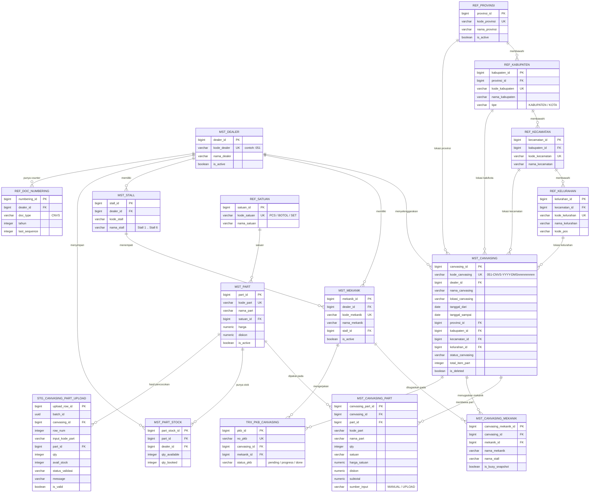

# 2️⃣ Master Canvasing — ERD & Desain Tabel Referensi

Dokumen ini berisi **rancangan struktur basis data** untuk modul **Master Canvasing** (`Master Canvasing/index.html`), diturunkan dari elemen UI, data dummy in-memory (`app.js`, `wilayah-data.js`), dan aturan validasi yang sudah berjalan di halaman.

Tujuan dokumen:

1. Menjawab **"Catatan pengembangan"** pada `master-canvasing.md` → *"perlu penentuan endpoint API dan struktur tabel untuk: Master Canvasing (header), Detail Part Canvasing, dan Detail Mekanik Canvasing"*.
2. Menjadi acuan tunggal penamaan tabel/kolom bagi tim Back End sebelum implementasi API.

> **Status dokumen:** rancangan (belum diimplementasikan). Seluruh data modul saat ini masih statis di sisi front-end dan tidak persisten.

**Konvensi penamaan:**

| Prefix | Arti | Contoh |
|--------|------|--------|
| `mst_` | Master data yang dikelola user/dealer | `mst_canvasing`, `mst_part` |
| `ref_` | Data referensi/lookup yang jarang berubah | `ref_provinsi`, `ref_satuan` |
| `trx_` | Data transaksi | `trx_pkb_canvasing` |
| `stg_` | Tabel staging/sementara (hasil upload) | `stg_canvasing_part_upload` |

Kolom audit standar dipakai di semua tabel `mst_`/`trx_`: `created_by`, `created_at`, `updated_by`, `updated_at`, `is_deleted` (soft delete).

---

# Diagram ERD



---

# Ringkasan Entitas

| Tabel | Jenis | Sumber di Halaman | Fungsi |
|-------|-------|-------------------|--------|
| `mst_canvasing` | Header | Tabel Master Canvasing + Step 1 | Data utama kegiatan canvasing: kode, nama, lokasi, periode, wilayah |
| `mst_canvasing_part` | Detail | Step 2 — Part Dibawa | Daftar part yang dibawa pada kegiatan canvasing |
| `mst_canvasing_mekanik` | Detail | Step 3 — Pilih Mekanik | Daftar mekanik yang ditugaskan (kolom **Petugas** pada tabel) |
| `mst_part` | Master | `partCatalog` (pop-up Tambah Part) | Katalog part: kode, nama, satuan, harga, diskon |
| `mst_part_stock` | Master | field **Available Stock** | Stok tersedia per part per dealer, dasar validasi qty |
| `ref_satuan` | Referensi | field **Satuan** (PCS/BOTOL/SET) | Master satuan part |
| `mst_mekanik` | Master | `mechanicCatalog` (dropdown Mekanik) | Data mekanik beserta stall |
| `mst_stall` | Master | teks *"Stall 1 … Stall 6"* | Master stall kerja |
| `ref_provinsi` | Referensi | dropdown **Provinsi** | Level 1 wilayah |
| `ref_kabupaten` | Referensi | dropdown **Kabupaten/Kota** | Level 2 wilayah |
| `ref_kecamatan` | Referensi | dropdown **Kecamatan** | Level 3 wilayah |
| `ref_kelurahan` | Referensi | dropdown **Kelurahan** | Level 4 wilayah |
| `mst_dealer` | Master | prefix kode `051` | Data AHASS/dealer penyelenggara |
| `ref_doc_numbering` | Referensi | `generateNextKodeCanvasing()` | Counter penomoran kode canvasing per dealer per tahun |
| `stg_canvasing_part_upload` | Staging | Pop-up **Upload Part Canvasing** | Menampung baris hasil parsing file Excel beserta status validasinya |
| `trx_pkb_canvasing` | Transaksi (modul lain) | List Canvasing (`canvasingId`) | PKB yang dibuat dari sebuah Master Canvasing — referensi lintas modul |

---

# Detail Tabel

## `mst_canvasing` — Header Master Canvasing

| Kolom | Tipe | Null | Key | Keterangan |
|-------|------|------|-----|------------|
| `canvasing_id` | BIGSERIAL | N | PK | Surrogate key (menggantikan `id` pada data dummy) |
| `kode_canvasing` | VARCHAR(30) | N | UK | Format `051-CNVS-{YYYY}-DMS{sequence 10 digit}`. Di-generate sistem, field UI **read-only** |
| `dealer_id` | BIGINT | N | FK → `mst_dealer` | Diambil dari dealer user yang login (segmen `051` pada kode) |
| `nama_canvasing` | VARCHAR(150) | N | | Wajib diisi (Step 1) |
| `lokasi_canvasing` | VARCHAR(255) | N | | Alamat/titik kegiatan, wajib diisi |
| `tanggal_dari` | DATE | N | | UI memakai format tampilan `DD-MM-YYYY` |
| `tanggal_sampai` | DATE | N | | Harus `>= tanggal_dari` |
| `provinsi_id` | BIGINT | N | FK → `ref_provinsi` | Level 1 cascade wilayah |
| `kabupaten_id` | BIGINT | N | FK → `ref_kabupaten` | Level 2, harus milik `provinsi_id` |
| `kecamatan_id` | BIGINT | N | FK → `ref_kecamatan` | Level 3, harus milik `kabupaten_id` |
| `kelurahan_id` | BIGINT | Y | FK → `ref_kelurahan` | Level 4. Nullable karena ada kecamatan yang datanya belum lengkap (lihat **Catatan Pengembangan** no. 3) |
| `status_canvasing` | VARCHAR(20) | N | | Default `ACTIVE`. **Kolom usulan** — belum ada di UI (lihat **Catatan Pengembangan** no. 1) |
| `total_item_part` | INTEGER | N | | Denormalisasi jumlah baris part; dipakai kolom `jumlahPart` pada pop-up *Pilih Data Canvasing* di List Canvasing |
| `created_by` / `created_at` | VARCHAR(50) / TIMESTAMP | N | | Audit |
| `updated_by` / `updated_at` | VARCHAR(50) / TIMESTAMP | Y | | Audit |
| `is_deleted` | BOOLEAN | N | | Soft delete, default `false` |

**Index yang disarankan:** `UNIQUE(kode_canvasing)`, `INDEX(dealer_id, tanggal_dari)`, `INDEX(provinsi_id, kabupaten_id, kecamatan_id, kelurahan_id)` untuk filter kolom pada tabel, serta index pencarian pada `nama_canvasing` dan `lokasi_canvasing` untuk *Search* global.

## `mst_canvasing_part` — Detail Part Dibawa

| Kolom | Tipe | Null | Key | Keterangan |
|-------|------|------|-----|------------|
| `canvasing_part_id` | BIGSERIAL | N | PK | |
| `canvasing_id` | BIGINT | N | FK → `mst_canvasing` | `ON DELETE CASCADE` |
| `part_id` | BIGINT | N | FK → `mst_part` | |
| `kode_part` | VARCHAR(30) | N | | **Snapshot** kode part saat disimpan |
| `nama_part` | VARCHAR(150) | N | | **Snapshot** nama part saat disimpan |
| `qty` | INTEGER | N | | Wajib `> 0` (validasi UI: `min="1"`) |
| `satuan` | VARCHAR(20) | N | | Snapshot satuan (`PCS`, `BOTOL`, `SET`) — terisi otomatis dari part, field UI **read-only** |
| `harga_satuan` | NUMERIC(15,2) | N | | Snapshot harga; UI menampilkan format `Rp 54.000` |
| `diskon` | NUMERIC(15,2) | N | | Default `0`, snapshot dari master part |
| `subtotal` | NUMERIC(15,2) | N | | `qty * harga_satuan - diskon` |
| `sumber_input` | VARCHAR(10) | N | | `MANUAL` (pop-up Tambah Part) atau `UPLOAD` (import Excel) |
| `urutan` | INTEGER | N | | Urutan tampil pada tabel Step 2 & Summary |
| kolom audit | | | | `created_by`, `created_at`, `updated_by`, `updated_at` |

**Constraint:** `UNIQUE(canvasing_id, part_id)` — satu part hanya boleh muncul sekali per canvasing (qty digabung bila part yang sama ditambahkan ulang). `CHECK(qty > 0)`.

Kolom snapshot (`kode_part`, `nama_part`, `satuan`, `harga_satuan`, `diskon`) sengaja disimpan ulang agar dokumen historis tidak berubah ketika master part diperbarui.

## `mst_canvasing_mekanik` — Detail Mekanik Ditugaskan

| Kolom | Tipe | Null | Key | Keterangan |
|-------|------|------|-----|------------|
| `canvasing_mekanik_id` | BIGSERIAL | N | PK | |
| `canvasing_id` | BIGINT | N | FK → `mst_canvasing` | `ON DELETE CASCADE` |
| `mekanik_id` | BIGINT | N | FK → `mst_mekanik` | |
| `nama_mekanik` | VARCHAR(100) | N | | Snapshot nama; gabungan kolom ini membentuk kolom **Petugas** |
| `nama_stall` | VARCHAR(30) | Y | | Snapshot stall mekanik saat ditugaskan |
| `is_busy_snapshot` | BOOLEAN | N | | Kondisi mekanik saat dipilih (`true` = sedang mengerjakan PKB lain). Dipakai sebagai audit atas validasi Step 3 |
| `urutan` | INTEGER | N | | Urutan tampil pada tabel Step 3 & Summary |
| kolom audit | | | | `created_by`, `created_at` |

**Constraint:** `UNIQUE(canvasing_id, mekanik_id)` — mekanik tidak boleh dobel dalam satu canvasing (sudah divalidasi di UI dengan toast peringatan).

## `mst_part` — Katalog Part

| Kolom | Tipe | Null | Key | Keterangan |
|-------|------|------|-----|------------|
| `part_id` | BIGSERIAL | N | PK | |
| `kode_part` | VARCHAR(30) | N | UK | Contoh `08232-2MB-K0LN1` |
| `nama_part` | VARCHAR(150) | N | | Contoh `AHM OIL MPX2 0.8L` |
| `satuan_id` | BIGINT | N | FK → `ref_satuan` | |
| `harga` | NUMERIC(15,2) | N | | Padanan `rawPrice` pada data dummy |
| `diskon` | NUMERIC(15,2) | N | | Default `0` |
| `is_active` | BOOLEAN | N | | Part non-aktif tidak muncul pada sugesti pencarian |
| kolom audit | | | | |

**Index:** `UNIQUE(kode_part)` dan index pencarian pada `nama_part` untuk dropdown sugesti part.

## `mst_part_stock` — Stok Part per Dealer

| Kolom | Tipe | Null | Key | Keterangan |
|-------|------|------|-----|------------|
| `part_stock_id` | BIGSERIAL | N | PK | |
| `part_id` | BIGINT | N | FK → `mst_part` | |
| `dealer_id` | BIGINT | N | FK → `mst_dealer` | |
| `qty_available` | INTEGER | N | | Nilai field **Available Stock**, dasar validasi qty & upload |
| `qty_booked` | INTEGER | N | | Qty yang sudah dialokasikan ke canvasing/PKB berjalan |
| `updated_at` | TIMESTAMP | N | | |

**Constraint:** `UNIQUE(part_id, dealer_id)`, `CHECK(qty_available >= 0)`.

## `ref_satuan` — Master Satuan

| Kolom | Tipe | Null | Key | Keterangan |
|-------|------|------|-----|------------|
| `satuan_id` | BIGSERIAL | N | PK | |
| `kode_satuan` | VARCHAR(10) | N | UK | `PCS`, `BOTOL`, `SET` |
| `nama_satuan` | VARCHAR(50) | N | | |
| `is_active` | BOOLEAN | N | | |

## `mst_mekanik` — Master Mekanik

| Kolom | Tipe | Null | Key | Keterangan |
|-------|------|------|-----|------------|
| `mekanik_id` | BIGSERIAL | N | PK | |
| `dealer_id` | BIGINT | N | FK → `mst_dealer` | |
| `kode_mekanik` | VARCHAR(20) | N | UK | |
| `nama_mekanik` | VARCHAR(100) | N | | Contoh `Kalvin`, `Rizal` |
| `stall_id` | BIGINT | Y | FK → `mst_stall` | Stall tempat mekanik bertugas |
| `is_active` | BOOLEAN | N | | Dipakai tombol **Refresh Daftar Mekanik** |
| kolom audit | | | | |

Status **busy/available** pada dropdown Step 3 **tidak disimpan sebagai kolom**, melainkan diturunkan dari `trx_pkb_canvasing` (lihat *View Turunan* di bawah).

## `mst_stall` — Master Stall

| Kolom | Tipe | Null | Key | Keterangan |
|-------|------|------|-----|------------|
| `stall_id` | BIGSERIAL | N | PK | |
| `dealer_id` | BIGINT | N | FK → `mst_dealer` | |
| `kode_stall` | VARCHAR(20) | N | | |
| `nama_stall` | VARCHAR(30) | N | | `Stall 1` … `Stall 6` |
| `is_active` | BOOLEAN | N | | |

## Tabel Wilayah — `ref_provinsi`, `ref_kabupaten`, `ref_kecamatan`, `ref_kelurahan`

Struktur bertingkat 4 level, padanan hasil normalisasi objek `WILAYAH_INDONESIA` pada `wilayah-data.js`.

### `ref_provinsi`

| Kolom | Tipe | Null | Key | Keterangan |
|-------|------|------|-----|------------|
| `provinsi_id` | BIGSERIAL | N | PK | |
| `kode_provinsi` | VARCHAR(10) | N | UK | Disarankan memakai **kode wilayah BPS/Kemendagri** |
| `nama_provinsi` | VARCHAR(100) | N | | Contoh `JAWA TIMUR` |
| `is_active` | BOOLEAN | N | | |

### `ref_kabupaten`

| Kolom | Tipe | Null | Key | Keterangan |
|-------|------|------|-----|------------|
| `kabupaten_id` | BIGSERIAL | N | PK | |
| `provinsi_id` | BIGINT | N | FK → `ref_provinsi` | |
| `kode_kabupaten` | VARCHAR(10) | N | UK | |
| `nama_kabupaten` | VARCHAR(100) | N | | Contoh `KAB. SIDOARJO`, `KOTA SURABAYA` |
| `tipe` | VARCHAR(10) | N | | `KABUPATEN` / `KOTA` |
| `is_active` | BOOLEAN | N | | |

### `ref_kecamatan`

| Kolom | Tipe | Null | Key | Keterangan |
|-------|------|------|-----|------------|
| `kecamatan_id` | BIGSERIAL | N | PK | |
| `kabupaten_id` | BIGINT | N | FK → `ref_kabupaten` | |
| `kode_kecamatan` | VARCHAR(10) | N | UK | |
| `nama_kecamatan` | VARCHAR(100) | N | | Contoh `GEDANGAN` |
| `is_active` | BOOLEAN | N | | |

### `ref_kelurahan`

| Kolom | Tipe | Null | Key | Keterangan |
|-------|------|------|-----|------------|
| `kelurahan_id` | BIGSERIAL | N | PK | |
| `kecamatan_id` | BIGINT | N | FK → `ref_kecamatan` | |
| `kode_kelurahan` | VARCHAR(15) | N | UK | |
| `nama_kelurahan` | VARCHAR(100) | N | | Contoh `WAGE`, `NGAGEL` |
| `kode_pos` | VARCHAR(5) | Y | | |
| `is_active` | BOOLEAN | N | | |

## `mst_dealer` — Master Dealer/AHASS

| Kolom | Tipe | Null | Key | Keterangan |
|-------|------|------|-----|------------|
| `dealer_id` | BIGSERIAL | N | PK | |
| `kode_dealer` | VARCHAR(10) | N | UK | Contoh `051` — segmen pertama kode canvasing |
| `nama_dealer` | VARCHAR(150) | N | | |
| `alamat` | VARCHAR(255) | Y | | |
| `provinsi_id` / `kabupaten_id` / `kecamatan_id` / `kelurahan_id` | BIGINT | Y | FK wilayah | Alamat dealer |
| `is_active` | BOOLEAN | N | | |

## `ref_doc_numbering` — Counter Penomoran Dokumen

| Kolom | Tipe | Null | Key | Keterangan |
|-------|------|------|-----|------------|
| `numbering_id` | BIGSERIAL | N | PK | |
| `dealer_id` | BIGINT | N | FK → `mst_dealer` | |
| `doc_type` | VARCHAR(10) | N | | `CNVS` untuk Master Canvasing |
| `tahun` | INTEGER | N | | Tahun berjalan |
| `last_sequence` | INTEGER | N | | Nomor terakhir yang sudah dipakai |
| `updated_at` | TIMESTAMP | N | | |

**Constraint:** `UNIQUE(dealer_id, doc_type, tahun)`. Pengambilan nomor wajib memakai **row lock** (`SELECT … FOR UPDATE`) agar tidak terjadi duplikasi kode saat penyimpanan bersamaan.

## `stg_canvasing_part_upload` — Staging Upload Part (Excel)

Menampung hasil parsing file upload beserta status validasinya sebelum user menekan **Import Semua** / **Import Valid Saja**.

| Kolom | Tipe | Null | Key | Keterangan |
|-------|------|------|-----|------------|
| `upload_row_id` | BIGSERIAL | N | PK | |
| `batch_id` | UUID | N | | Satu batch = satu file yang diunggah |
| `dealer_id` | BIGINT | N | FK → `mst_dealer` | Penentu stok pembanding |
| `canvasing_id` | BIGINT | Y | FK → `mst_canvasing` | Kosong bila canvasing belum tersimpan (upload di tengah wizard) |
| `row_num` | INTEGER | N | | Nomor baris pada file, padanan `rowNum` |
| `input_kode_part` | VARCHAR(50) | N | | Kode part apa adanya dari file |
| `part_id` | BIGINT | Y | FK → `mst_part` | `NULL` bila part tidak ditemukan |
| `qty` | INTEGER | N | | Qty request dari file |
| `avail_stock` | INTEGER | N | | Stok saat validasi dijalankan |
| `status_validasi` | VARCHAR(20) | N | | `VALID` / `NOTFOUND` / `INVALIDQTY` / `OVERSTOCK` |
| `message` | VARCHAR(255) | N | | Pesan yang ditampilkan pada kolom *Status / Validasi* |
| `is_valid` | BOOLEAN | N | | Penentu baris ikut diimpor atau tidak |
| `file_name` | VARCHAR(255) | N | | Nama file yang diunggah |
| `created_by` / `created_at` | VARCHAR(50) / TIMESTAMP | N | | |

**Index:** `INDEX(batch_id)`. Data staging dapat dibersihkan berkala (mis. retensi 7 hari).

## `trx_pkb_canvasing` — Referensi Lintas Modul

Tabel milik modul **List Canvasing**, dicantumkan karena menjadi tujuan relasi dari Master Canvasing.

| Kolom | Tipe | Null | Key | Keterangan |
|-------|------|------|-----|------------|
| `pkb_id` | BIGSERIAL | N | PK | |
| `no_pkb` | VARCHAR(40) | N | UK | Contoh `051-PKB-CNVS-2026-DMS000001` |
| `canvasing_id` | BIGINT | Y | FK → `mst_canvasing` | Padanan `canvasingId` pada `samplePkbList`. `NULL` = PKB non-canvasing |
| `mekanik_id` | BIGINT | Y | FK → `mst_mekanik` | Mekanik yang mengerjakan |
| `status_pkb` | VARCHAR(20) | N | | `pending` / `progress` / `done` |

> Struktur lengkap tabel ini di luar cakupan dokumen ini — lihat dokumentasi modul List Canvasing.

---

# Relasi & Kardinalitas

| No | Relasi | Kardinalitas | Aturan |
|----|--------|--------------|--------|
| 1 | `mst_dealer` → `mst_canvasing` | 1 : N | Setiap canvasing dimiliki satu dealer |
| 2 | `mst_canvasing` → `mst_canvasing_part` | 1 : N | `ON DELETE CASCADE`. Boleh 0 baris (Step 2 dapat dilewati) |
| 3 | `mst_canvasing` → `mst_canvasing_mekanik` | 1 : N | `ON DELETE CASCADE`. Minimal 1 baris disarankan (kolom **Petugas** tidak boleh kosong) |
| 4 | `mst_part` → `mst_canvasing_part` | 1 : N | `ON DELETE RESTRICT` — part yang sudah terpakai tidak boleh dihapus |
| 5 | `mst_mekanik` → `mst_canvasing_mekanik` | 1 : N | `ON DELETE RESTRICT` |
| 6 | `mst_part` ↔ `mst_dealer` via `mst_part_stock` | N : N | Tabel penghubung dengan atribut stok |
| 7 | `ref_provinsi` → `ref_kabupaten` → `ref_kecamatan` → `ref_kelurahan` | 1 : N berjenjang | Hierarki wilayah 4 level, dasar cascade dropdown Step 1 |
| 8 | `ref_*` wilayah → `mst_canvasing` | 1 : N (4 relasi) | Keempat FK disimpan agar filter kolom per level tidak perlu join berjenjang |
| 9 | `mst_stall` → `mst_mekanik` | 1 : N | Satu stall dapat diisi lebih dari satu mekanik |
| 10 | `mst_canvasing` → `trx_pkb_canvasing` | 1 : N | Satu canvasing menghasilkan banyak PKB |
| 11 | `mst_dealer` → `ref_doc_numbering` | 1 : N | Counter dipisah per `doc_type` dan `tahun` |

**Catatan denormalisasi wilayah:** menyimpan keempat `*_id` sekaligus (bukan hanya `kelurahan_id`) bersifat redundan secara teori normalisasi, tetapi dipilih karena tabel Master Canvasing menampilkan **dan memfilter** keempat level sebagai kolom terpisah, serta karena `kelurahan_id` dapat kosong pada kecamatan yang datanya belum lengkap. Konsistensi antar level dijaga di sisi aplikasi atau melalui trigger.

---

# View Turunan (Derived)

## `v_mekanik_availability` — Status Busy Mekanik (dropdown Step 3)

Nilai `isBusy` dan `currentPkb` pada `mechanicCatalog` **bukan kolom master**, melainkan hasil kalkulasi PKB berjalan:

```sql
CREATE VIEW v_mekanik_availability AS
SELECT m.mekanik_id,
       m.nama_mekanik,
       s.nama_stall,
       (p.pkb_id IS NOT NULL) AS is_busy,
       p.no_pkb               AS current_pkb
FROM   mst_mekanik m
LEFT   JOIN mst_stall s ON s.stall_id = m.stall_id
LEFT   JOIN trx_pkb_canvasing p
       ON  p.mekanik_id = m.mekanik_id
       AND p.status_pkb IN ('pending', 'progress')
       AND p.is_deleted = FALSE
WHERE  m.is_active  = TRUE
  AND  m.is_deleted = FALSE;
```

## `v_canvasing_list` — Sumber Tabel Master Canvasing

Kolom **Petugas** pada tabel adalah hasil agregasi nama mekanik:

```sql
CREATE VIEW v_canvasing_list AS
SELECT c.canvasing_id,
       c.kode_canvasing,
       c.nama_canvasing,
       c.lokasi_canvasing,
       pv.nama_provinsi  AS provinsi,
       kb.nama_kabupaten AS kota,
       kc.nama_kecamatan AS kecamatan,
       kl.nama_kelurahan AS kelurahan,
       c.tanggal_dari,
       c.tanggal_sampai,
       (SELECT STRING_AGG(cm.nama_mekanik, ', ' ORDER BY cm.urutan)
          FROM mst_canvasing_mekanik cm
         WHERE cm.canvasing_id = c.canvasing_id) AS petugas,
       c.total_item_part AS jumlah_part
FROM   mst_canvasing c
       JOIN ref_provinsi  pv ON pv.provinsi_id  = c.provinsi_id
       JOIN ref_kabupaten kb ON kb.kabupaten_id = c.kabupaten_id
       JOIN ref_kecamatan kc ON kc.kecamatan_id = c.kecamatan_id
  LEFT JOIN ref_kelurahan kl ON kl.kelurahan_id = c.kelurahan_id
WHERE  c.is_deleted = FALSE;
```

---

# Mapping Field UI → Kolom Tabel

## Tabel Master Canvasing (tampilan awal)

| Kolom Tabel UI | `data-col` | Kolom Tabel Database |
|----------------|------------|----------------------|
| Kode Canvasing | `kodeCanvasing` | `mst_canvasing.kode_canvasing` |
| Nama Canvasing | `namaCanvasing` | `mst_canvasing.nama_canvasing` |
| Lokasi | `lokasi` | `mst_canvasing.lokasi_canvasing` |
| Provinsi | `provinsi` | `ref_provinsi.nama_provinsi` (via `provinsi_id`) |
| Kabupaten/Kota | `kota` | `ref_kabupaten.nama_kabupaten` (via `kabupaten_id`) |
| Kecamatan | `kecamatan` | `ref_kecamatan.nama_kecamatan` (via `kecamatan_id`) |
| Kelurahan | `kelurahan` | `ref_kelurahan.nama_kelurahan` (via `kelurahan_id`) |

## Step 1 — Informasi Canvasing

| Field UI | ID Elemen | Kolom Tabel Database |
|----------|-----------|----------------------|
| Kode Canvasing | `wizKodeCanvasing` | `mst_canvasing.kode_canvasing` (generate, read-only) |
| Nama Canvasing | `wizNamaCanvasing` | `mst_canvasing.nama_canvasing` |
| Lokasi Canvasing | `wizLokasiCanvasing` | `mst_canvasing.lokasi_canvasing` |
| Dari | `wizDari` | `mst_canvasing.tanggal_dari` |
| Sampai | `wizSampai` | `mst_canvasing.tanggal_sampai` |
| Provinsi | `wizProvinsi` | `mst_canvasing.provinsi_id` |
| Kabupaten/Kota | `wizKabupaten` | `mst_canvasing.kabupaten_id` |
| Kecamatan | `wizKecamatan` | `mst_canvasing.kecamatan_id` |
| Kelurahan | `wizKelurahan` | `mst_canvasing.kelurahan_id` |

## Step 2 — Part Dibawa & Pop-up Tambah Part

| Field UI | ID Elemen | Kolom Tabel Database |
|----------|-----------|----------------------|
| Part (pencarian) | `modalPartSearch` | `mst_part.kode_part` / `mst_part.nama_part` → `mst_canvasing_part.part_id` |
| Qty | `modalPartQty` | `mst_canvasing_part.qty` |
| Satuan (read-only) | `modalPartSatuan` | `ref_satuan.kode_satuan` → snapshot `mst_canvasing_part.satuan` |
| Harga (read-only) | `modalPartHarga` | `mst_part.harga` → snapshot `mst_canvasing_part.harga_satuan` |
| Diskon (read-only) | `modalPartDiskon` | `mst_part.diskon` → snapshot `mst_canvasing_part.diskon` |
| Available Stock (read-only) | `modalPartStock` | `mst_part_stock.qty_available` (tidak disimpan di tabel detail) |

## Pop-up Upload Part Canvasing

| Kolom Preview UI | Kolom Tabel Database |
|------------------|----------------------|
| No | `stg_canvasing_part_upload.row_num` |
| Kode Part | `stg_canvasing_part_upload.input_kode_part` |
| Nama Part | hasil join `mst_part.nama_part` via `part_id` |
| Qty Req | `stg_canvasing_part_upload.qty` |
| Avail Stock | `stg_canvasing_part_upload.avail_stock` |
| Status / Validasi | `stg_canvasing_part_upload.status_validasi` + `message` |

## Step 3 — Pilih Mekanik

| Field UI | ID / Atribut Elemen | Kolom Tabel Database |
|----------|---------------------|----------------------|
| Dropdown Mekanik | `selectMekanikCanvasing` | `mst_mekanik.mekanik_id` (label dari `v_mekanik_availability`) |
| Keterangan Stall | `data-stall` | `mst_stall.nama_stall` |
| Keterangan "Sedang Mengerjakan PKB …" | `data-busy`, `data-pkb` | `v_mekanik_availability.is_busy`, `current_pkb` |
| List Mekanik | `bodyMekanikCanvasing` | `mst_canvasing_mekanik` |

## Step 4 — Summary

| Field UI | ID Elemen | Sumber Data |
|----------|-----------|-------------|
| Nama Canvasing | `sumNamaCanvasing` | `mst_canvasing.nama_canvasing` |
| Lokasi Canvasing | `sumLokasiCanvasing` | `mst_canvasing.lokasi_canvasing` |
| Periode Canvasing | `sumPeriodeCanvasing` | `tanggal_dari` + `tanggal_sampai` (gabungan `s/d`) |
| Wilayah Canvasing | `sumWilayahCanvasing` | Gabungan `kelurahan, kecamatan, kabupaten, provinsi` |
| Tabel Part | `sumPartsTableBody` | `mst_canvasing_part` |
| List Mekanik | `sumMechanicsListContainer` | `mst_canvasing_mekanik` |

---

# Aturan Bisnis & Validasi

| No | Aturan | Implementasi Database |
|----|--------|-----------------------|
| 1 | Kode canvasing unik dan di-generate sistem | `UNIQUE(kode_canvasing)` + `ref_doc_numbering` dengan row lock |
| 2 | Nama, lokasi, periode, dan wilayah (Provinsi s/d Kecamatan) wajib diisi | `NOT NULL` pada kolom terkait |
| 3 | `tanggal_sampai >= tanggal_dari` | `CHECK (tanggal_sampai >= tanggal_dari)` |
| 4 | Wilayah harus konsisten antar level (cascade) | Validasi aplikasi atau trigger; opsional FK komposit `(provinsi_id, kabupaten_id)` |
| 5 | Qty part harus `> 0` | `CHECK (qty > 0)` |
| 6 | Qty part tidak boleh melebihi stok tersedia | Validasi aplikasi terhadap `mst_part_stock.qty_available` (status `OVERSTOCK` pada upload) |
| 7 | Part tidak boleh dobel dalam satu canvasing | `UNIQUE(canvasing_id, part_id)` |
| 8 | Part yang diunggah harus terdaftar di master | FK `part_id`; baris tanpa pasangan bernilai `NOTFOUND` dan tidak diimpor |
| 9 | Mekanik tidak boleh dobel dalam satu canvasing | `UNIQUE(canvasing_id, mekanik_id)` |
| 10 | Mekanik yang sedang mengerjakan PKB tidak boleh ditugaskan | Validasi aplikasi via `v_mekanik_availability.is_busy` |
| 11 | Data historis tidak berubah saat master diperbarui | Kolom snapshot pada tabel detail |
| 12 | Penghapusan data bersifat soft delete | `is_deleted` + filter pada semua query/view |

---

# Format Kode Canvasing

```
051 - CNVS - 2026 - DMS0000000021
 |      |      |         |
 |      |      |         └── DMS + sequence 10 digit (ref_doc_numbering.last_sequence)
 |      |      └──────────── tahun berjalan (ref_doc_numbering.tahun)
 |      └─────────────────── jenis dokumen: CNVS = Canvasing (ref_doc_numbering.doc_type)
 └────────────────────────── kode dealer/AHASS (mst_dealer.kode_dealer)
```

Nomor PKB pada modul List Canvasing memakai pola sejenis dengan jenis dokumen `PKB-CNVS`, contoh `051-PKB-CNVS-2026-DMS000001`.

---

# Contoh DDL (PostgreSQL)

```sql
-- ============================================================
-- Referensi Wilayah
-- ============================================================
CREATE TABLE ref_provinsi (
    provinsi_id    BIGSERIAL    PRIMARY KEY,
    kode_provinsi  VARCHAR(10)  NOT NULL UNIQUE,
    nama_provinsi  VARCHAR(100) NOT NULL,
    is_active      BOOLEAN      NOT NULL DEFAULT TRUE
);

CREATE TABLE ref_kabupaten (
    kabupaten_id   BIGSERIAL    PRIMARY KEY,
    provinsi_id    BIGINT       NOT NULL REFERENCES ref_provinsi (provinsi_id),
    kode_kabupaten VARCHAR(10)  NOT NULL UNIQUE,
    nama_kabupaten VARCHAR(100) NOT NULL,
    tipe           VARCHAR(10)  NOT NULL CHECK (tipe IN ('KABUPATEN', 'KOTA')),
    is_active      BOOLEAN      NOT NULL DEFAULT TRUE
);

CREATE TABLE ref_kecamatan (
    kecamatan_id   BIGSERIAL    PRIMARY KEY,
    kabupaten_id   BIGINT       NOT NULL REFERENCES ref_kabupaten (kabupaten_id),
    kode_kecamatan VARCHAR(10)  NOT NULL UNIQUE,
    nama_kecamatan VARCHAR(100) NOT NULL,
    is_active      BOOLEAN      NOT NULL DEFAULT TRUE
);

CREATE TABLE ref_kelurahan (
    kelurahan_id   BIGSERIAL    PRIMARY KEY,
    kecamatan_id   BIGINT       NOT NULL REFERENCES ref_kecamatan (kecamatan_id),
    kode_kelurahan VARCHAR(15)  NOT NULL UNIQUE,
    nama_kelurahan VARCHAR(100) NOT NULL,
    kode_pos       VARCHAR(5),
    is_active      BOOLEAN      NOT NULL DEFAULT TRUE
);

-- ============================================================
-- Header Master Canvasing
-- ============================================================
CREATE TABLE mst_canvasing (
    canvasing_id     BIGSERIAL    PRIMARY KEY,
    kode_canvasing   VARCHAR(30)  NOT NULL UNIQUE,
    dealer_id        BIGINT       NOT NULL REFERENCES mst_dealer (dealer_id),
    nama_canvasing   VARCHAR(150) NOT NULL,
    lokasi_canvasing VARCHAR(255) NOT NULL,
    tanggal_dari     DATE         NOT NULL,
    tanggal_sampai   DATE         NOT NULL,
    provinsi_id      BIGINT       NOT NULL REFERENCES ref_provinsi  (provinsi_id),
    kabupaten_id     BIGINT       NOT NULL REFERENCES ref_kabupaten (kabupaten_id),
    kecamatan_id     BIGINT       NOT NULL REFERENCES ref_kecamatan (kecamatan_id),
    kelurahan_id     BIGINT           NULL REFERENCES ref_kelurahan (kelurahan_id),
    status_canvasing VARCHAR(20)  NOT NULL DEFAULT 'ACTIVE',
    total_item_part  INTEGER      NOT NULL DEFAULT 0,
    created_by       VARCHAR(50)  NOT NULL,
    created_at       TIMESTAMP    NOT NULL DEFAULT CURRENT_TIMESTAMP,
    updated_by       VARCHAR(50),
    updated_at       TIMESTAMP,
    is_deleted       BOOLEAN      NOT NULL DEFAULT FALSE,
    CONSTRAINT ck_canvasing_periode CHECK (tanggal_sampai >= tanggal_dari)
);

CREATE INDEX ix_canvasing_dealer_periode ON mst_canvasing (dealer_id, tanggal_dari DESC);
CREATE INDEX ix_canvasing_wilayah        ON mst_canvasing (provinsi_id, kabupaten_id, kecamatan_id, kelurahan_id);

-- ============================================================
-- Detail Part Dibawa
-- ============================================================
CREATE TABLE mst_canvasing_part (
    canvasing_part_id BIGSERIAL     PRIMARY KEY,
    canvasing_id      BIGINT        NOT NULL REFERENCES mst_canvasing (canvasing_id) ON DELETE CASCADE,
    part_id           BIGINT        NOT NULL REFERENCES mst_part (part_id),
    kode_part         VARCHAR(30)   NOT NULL,
    nama_part         VARCHAR(150)  NOT NULL,
    qty               INTEGER       NOT NULL,
    satuan            VARCHAR(20)   NOT NULL,
    harga_satuan      NUMERIC(15,2) NOT NULL,
    diskon            NUMERIC(15,2) NOT NULL DEFAULT 0,
    subtotal          NUMERIC(15,2) NOT NULL,
    sumber_input      VARCHAR(10)   NOT NULL DEFAULT 'MANUAL'
                        CHECK (sumber_input IN ('MANUAL', 'UPLOAD')),
    urutan            INTEGER       NOT NULL DEFAULT 1,
    created_by        VARCHAR(50)   NOT NULL,
    created_at        TIMESTAMP     NOT NULL DEFAULT CURRENT_TIMESTAMP,
    CONSTRAINT uq_canvasing_part     UNIQUE (canvasing_id, part_id),
    CONSTRAINT ck_canvasing_part_qty CHECK (qty > 0)
);

-- ============================================================
-- Detail Mekanik Ditugaskan
-- ============================================================
CREATE TABLE mst_canvasing_mekanik (
    canvasing_mekanik_id BIGSERIAL    PRIMARY KEY,
    canvasing_id         BIGINT       NOT NULL REFERENCES mst_canvasing (canvasing_id) ON DELETE CASCADE,
    mekanik_id           BIGINT       NOT NULL REFERENCES mst_mekanik (mekanik_id),
    nama_mekanik         VARCHAR(100) NOT NULL,
    nama_stall           VARCHAR(30),
    is_busy_snapshot     BOOLEAN      NOT NULL DEFAULT FALSE,
    urutan               INTEGER      NOT NULL DEFAULT 1,
    created_by           VARCHAR(50)  NOT NULL,
    created_at           TIMESTAMP    NOT NULL DEFAULT CURRENT_TIMESTAMP,
    CONSTRAINT uq_canvasing_mekanik UNIQUE (canvasing_id, mekanik_id)
);
```

---

# Usulan Endpoint API

| Kebutuhan Halaman | Method | Endpoint | Tabel Terkait |
|-------------------|--------|----------|---------------|
| Tabel Master Canvasing (list, search, filter kolom, sort, paging) | GET | `/canvasing` | `v_canvasing_list` |
| Detail satu canvasing (modal Lihat Detail & Summary) | GET | `/canvasing/{id}` | `mst_canvasing` + kedua tabel detail |
| Generate kode canvasing baru | GET | `/canvasing/next-code` | `ref_doc_numbering` |
| Simpan canvasing baru (header + detail sekaligus) | POST | `/canvasing` | `mst_canvasing`, `mst_canvasing_part`, `mst_canvasing_mekanik` |
| Cascade dropdown wilayah | GET | `/wilayah/provinsi`<br>`/wilayah/kabupaten?provinsi_id=`<br>`/wilayah/kecamatan?kabupaten_id=`<br>`/wilayah/kelurahan?kecamatan_id=` | `ref_provinsi` … `ref_kelurahan` |
| Sugesti pencarian part (pop-up Tambah Part) | GET | `/part?q=` | `mst_part` + `mst_part_stock` |
| Daftar mekanik beserta status busy (tombol Refresh) | GET | `/mekanik/availability` | `v_mekanik_availability` |
| Validasi file upload part | POST | `/canvasing/part/upload-validate` | `stg_canvasing_part_upload` |
| Import baris valid hasil upload | POST | `/canvasing/part/upload-import` | `stg_canvasing_part_upload` → `mst_canvasing_part` |
| Unduh template Excel part | GET | `/canvasing/part/template` | — |

---

# Catatan Pengembangan

1. **Kolom `status_canvasing` belum ada di UI.** Menu kebab pada halaman masih memakai istilah PKB (*Waiting Mechanic / In Progress / Pause*) dan belum memiliki handler. Perlu konfirmasi apakah Master Canvasing memerlukan siklus status tersendiri (mis. `DRAFT` / `ACTIVE` / `CLOSED` / `CANCELLED`) sebelum kolom ini difinalkan.
2. **Dropdown wilayah masih memakai nama sebagai `value`,** bukan kode/ID wilayah. Saat integrasi API, `value` dropdown perlu diganti menjadi `*_id` (atau kode wilayah) dan payload penyimpanan mengirim ID, bukan nama.
3. **`kelurahan_id` dibuat nullable** karena dataset `wilayah-data.js` belum lengkap untuk seluruh kecamatan — pada kondisi tersebut UI memakai *fallback* berupa nama kecamatan sebagai nilai kelurahan. Setelah master wilayah resmi tersedia, kolom ini sebaiknya dijadikan `NOT NULL`.
4. **Nilai harga/diskon di front-end masih berupa string terformat** (`'Rp 54.000'`). Kolom database memakai `NUMERIC` — pemformatan menjadi tanggung jawab lapisan tampilan; `rawPrice` pada `partCatalog` adalah padanan nilai numeriknya.
5. **Tanggal di front-end berformat `DD-MM-YYYY`** (string). Payload API disarankan memakai `YYYY-MM-DD` (ISO 8601) dengan konversi di sisi front-end.
6. **Pengurangan stok belum ditentukan.** Perlu keputusan apakah penyimpanan Master Canvasing langsung memotong `mst_part_stock.qty_available`, hanya menaikkan `qty_booked` (booking), atau tidak menyentuh stok sama sekali sampai PKB dibuat.
7. **Modal "Create PKB (Legacy)"** pada halaman (field Transaction No, Customer Name, Police Number, dsb.) sudah tidak dipakai dan **tidak dimodelkan** dalam ERD ini.
8. **Filter kolom & pengurutan tabel** saat ini berjalan di sisi front-end atas data in-memory. Saat memakai API, seluruh parameter search/filter/sort/paging perlu dipindahkan menjadi query parameter agar tetap konsisten pada data berjumlah besar.
