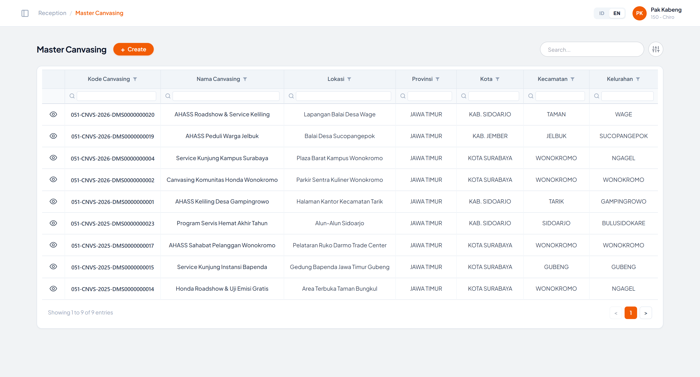
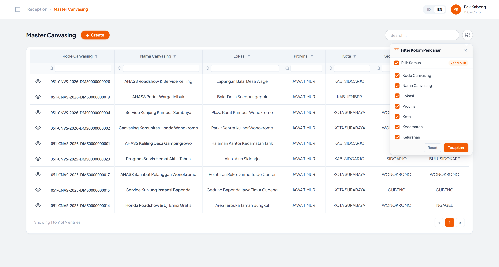
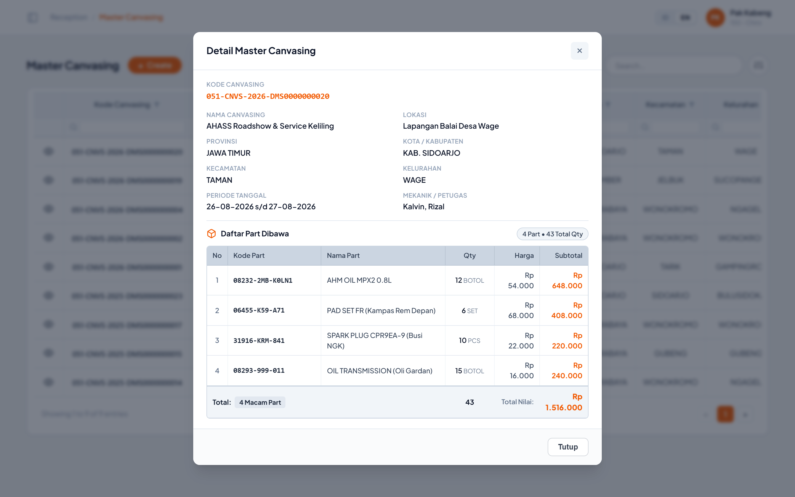
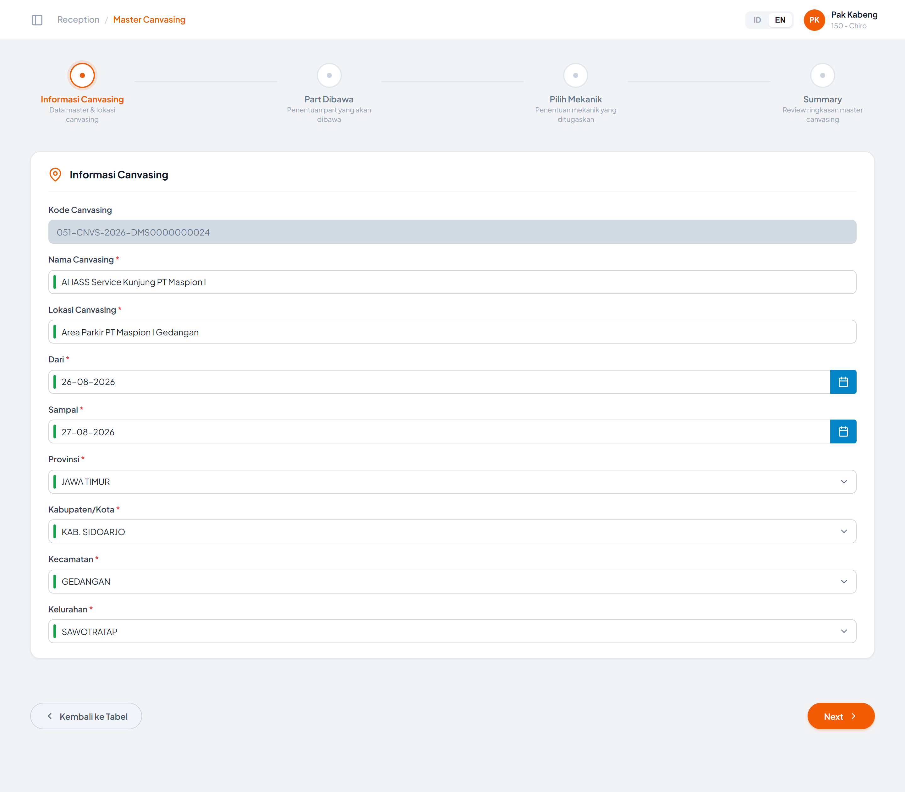
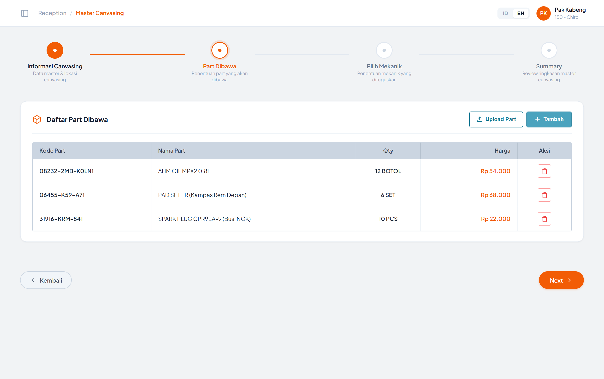
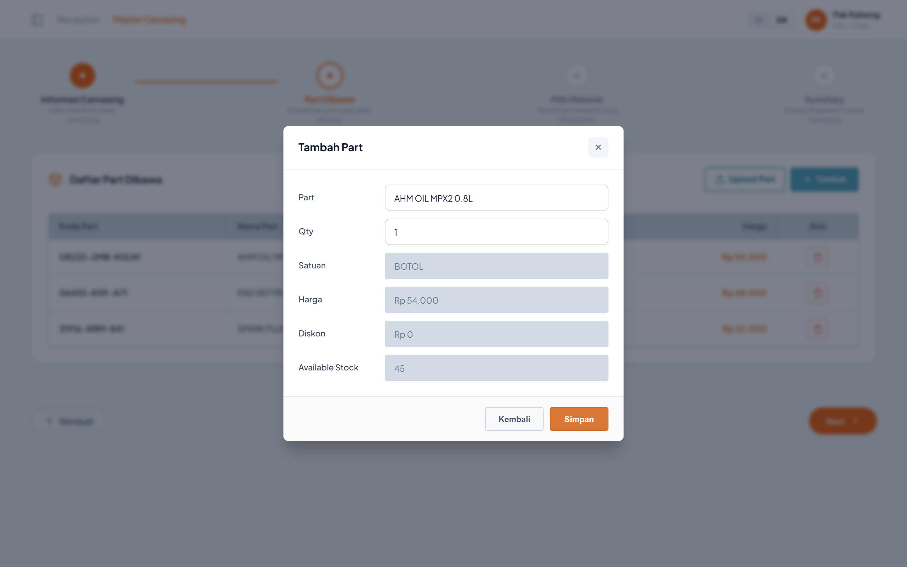
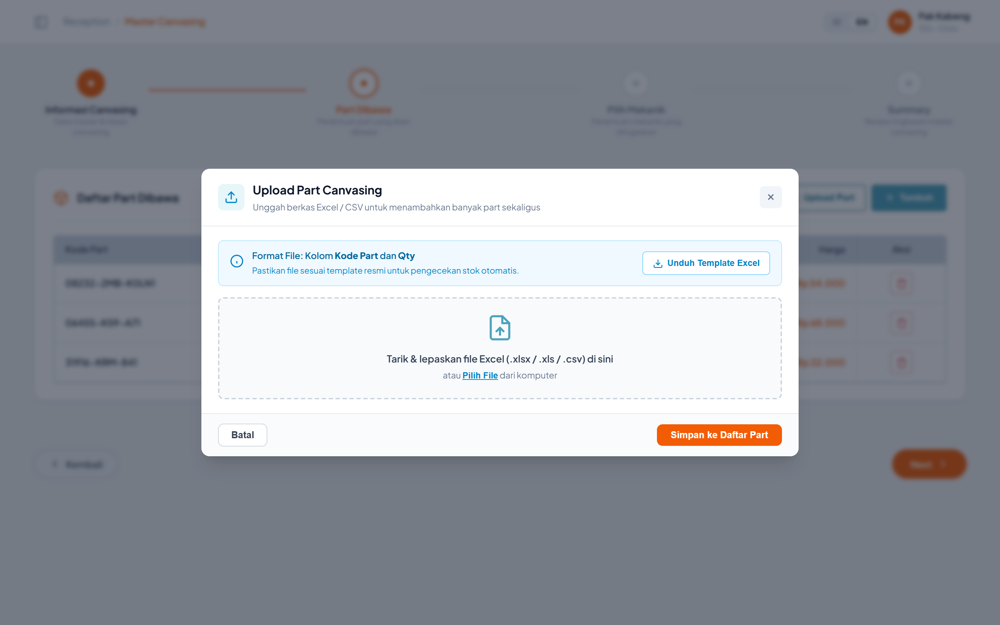
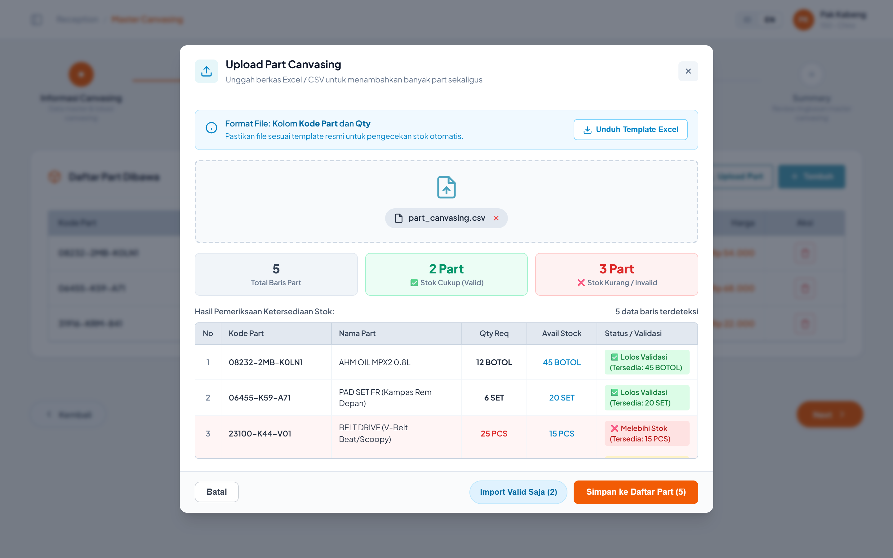
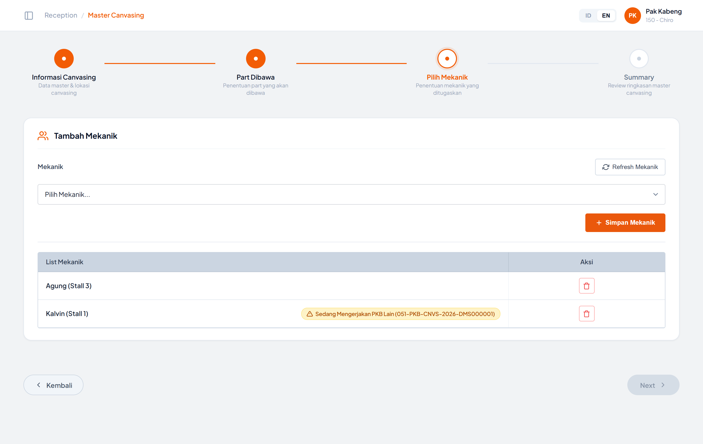
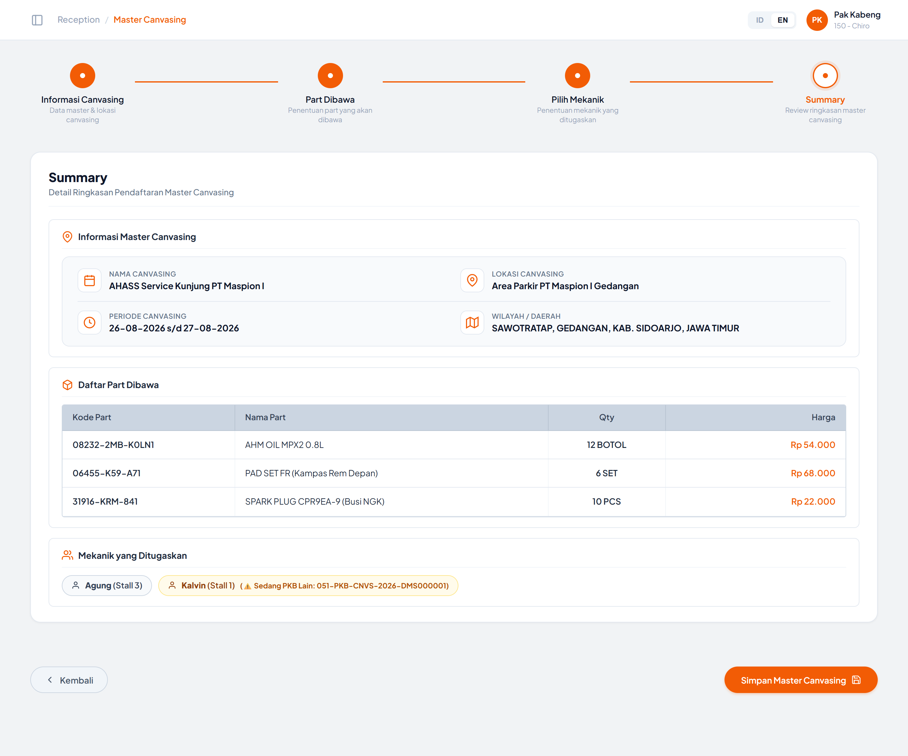

# 2️⃣ Master Canvasing

Modul **Master Canvasing** digunakan untuk mendaftarkan dan mengelola data master kegiatan canvasing (service kunjung / service keliling AHASS), meliputi informasi kegiatan & wilayah, daftar part yang dibawa, serta mekanik yang ditugaskan.

Modul ini dijalankan di dalam **iframe** pada layout shell portal (`index.html`) dengan hash navigasi `#master-canvasing` dan sumber `Master Canvasing/index.html`. Saat berjalan di dalam iframe, header standalone modul disembunyikan (class `in-iframe`) dan breadcrumb dikirim ke parent shell melalui `postMessage` bertipe `UPDATE_CRUMB`.

**Alur besar modul:**

`Tabel Master Canvasing` → `Create` → `Step 1 Informasi Canvasing` → `Step 2 Part Dibawa` → `Step 3 Pilih Mekanik` → `Step 4 Summary` → `Simpan` → kembali ke `Tabel Master Canvasing`

---

# Tampilan Awal — Tabel Master Canvasing

 

| Element Code | Component Type | Function | Behavior & Rule | Mandatory | API | Endpoint/Navigate | Method | Status QCC | Status Dev |
|--------------|----------------|----------|-----------------|-----------|-----|-------------------|--------|------------|------------|
|              |                |          |                 |           |     |                   |        |            |            |
| LABEL-Judul Halaman | LABEL | Menampilkan judul halaman "Master Canvasing" | Statis, tidak dapat diubah user | | | | | | |
| BUTTON-Create | BUTTON | Membuka wizard pendaftaran Master Canvasing baru | Saat diklik akan menyembunyikan `masterTableView` dan menampilkan `createMasterView` dalam mode **Create**  Kode Canvasing baru di-generate otomatis melalui `generateNextKodeCanvasing()`  Seluruh state wizard direset: daftar part dibawa dikosongkan, daftar mekanik dikosongkan, wizard kembali ke Step 1  Mengirim `postMessage` `UPDATE_CRUMB` dengan sub-crumb **"Create New"** ke parent shell | | | Step 1 — Informasi Canvasing | | | |
| TXTBOX-Search | TXTBOX | Input kata kunci pencarian data Master Canvasing | Pencarian dijalankan **realtime** pada event `input` (tanpa tombol cari)  Pencarian diterapkan secara dinamis ke **kolom-kolom yang dicentang** pada pop-up Filter Kolom (default: seluruh 7 kolom)  Placeholder search box menyesuaikan nama atau jumlah kolom aktif yang dipilih  Sifat pencarian: **case-insensitive** dan **partial match** (`includes`)  Hasil pencarian digabungkan (AND) dengan filter per kolom pada baris subheader | No | | | | | |
| BUTTON-Equalizer (Toggle Filter) | BUTTON | Membuka modal/pop-up Filter Kolom Pencarian | Memunculkan modal/pop-up yang memuat checklist seluruh kolom data Master Canvasing: **Kode Canvasing**, **Nama Canvasing**, **Lokasi**, **Provinsi**, **Kota**, **Kecamatan**, **Kelurahan**  Memungkinkan pengguna memilih lebih dari 1 kolom sebagai target pencarian search box  Menyediakan opsi **Pilih Semua**, counter jumlah kolom terpilih, tombol **Reset**, dan tombol **Terapkan**  Dilengkapi badge counter jumlah kolom aktif pada tombol equalizer ketika filter dikustomisasi | | | Modal / Pop-up Filter Kolom | | | |
| TABLE-Master Canvasing | TABLE | Menampilkan daftar data Master Canvasing | Kolom yang ditampilkan berurutan: **Aksi**, **Kode Canvasing**, **Nama Canvasing**, **Lokasi**, **Provinsi**, **Kota**, **Kecamatan**, **Kelurahan**  Baris tabel di-render dinamis oleh `renderTable()` dari sumber data `masterCanvasingData`  Jika hasil filter kosong, tampil empty state: **"Data Canvasing tidak ditemukan"** dengan keterangan *"Sesuaikan kata kunci pencarian atau filter kolom."* | | | | | | |
| HEADER-Kolom (Sorting) | TABLE HEADER | Mengurutkan data berdasarkan kolom yang diklik | Klik pada judul kolom (yang memiliki ikon corong) akan mengurutkan data secara **ascending**; klik kedua pada kolom yang sama membalik menjadi **descending**  Pengurutan dilakukan sebagai **string comparison** (case-insensitive)  Kolom yang mendukung sorting: Kode Canvasing, Nama Canvasing, Lokasi, Provinsi, Kota, Kecamatan, Kelurahan  Setelah sorting, filter aktif tetap diterapkan ulang | | | | | | |
| TXTBOX-Filter Kolom | TXTBOX | Filter data per kolom pada baris subheader tabel | Tersedia 1 input filter untuk setiap kolom: Kode Canvasing, Nama Canvasing, Lokasi, Provinsi, Kota, Kecamatan, Kelurahan  Filter berjalan **realtime**, **case-insensitive**, **partial match**  Beberapa filter kolom dapat aktif bersamaan dan digabungkan dengan logika **AND**, serta digabungkan pula dengan kata kunci pada Search Box | No | | | | | |
| BUTTON-Aksi (Lihat Detail) | BUTTON | Menampilkan pop-up detail data Master Canvasing pada baris terpilih | Ikon mata pada kolom Aksi. Saat diklik menjalankan `viewCanvasingDetail(id)` dan membuka **Modal Detail Master Canvasing** | | | Modal Detail Master Canvasing | | | |
| LABEL-Table Info | LABEL | Menampilkan informasi jumlah data yang tampil | Format: `Showing 1 to <jumlah hasil filter> of <jumlah hasil filter> entries`  Jika hasil filter kosong, format menjadi `Showing 0 to 0 of <total data> entries` | | | | | | |
| BUTTON-Pagination | BUTTON | Navigasi halaman tabel (Previous / Nomor Halaman / Next) | Saat ini seluruh data ditampilkan dalam satu halaman; tombol **Prev** berstatus disabled dan tombol **Prev/Next** belum memiliki aksi  **Catatan pengembangan:** perlu implementasi paging (server-side / client-side) beserta perhitungan ulang label Table Info | | | | | | |

---

# Pop-up Filter Kolom Pencarian (Checklist Kolom)

 

| Element Code | Component Type | Function | Behavior & Rule | Mandatory | API | Endpoint/Navigate | Method | Status QCC | Status Dev |
|--------------|----------------|----------|-----------------|-----------|-----|-------------------|--------|------------|------------|
|              |                |          |                 |           |     |                   |        |            |            |
| LABEL-Title Filter | LABEL | Menampilkan judul pop-up "Filter Kolom Pencarian" | Statis | | | | | | |
| BUTTON-Close (X) | BUTTON | Menutup pop-up filter kolom | Menutup pop-up tanpa mereset pilihan | | | | | | |
| CHKBOX-Pilih Semua | CHECKBOX | Mencentang / membatalkan semua checklist kolom | Saat dicentang, seluruh 7 kolom aktif dicentang. Saat dibatalkan, seluruh kolom di-uncheck. Memiliki status `indeterminate` jika sebagian kolom dicentang | | | | | | |
| LABEL-Counter Terpilih | BADGE | Menampilkan jumlah kolom yang terpilih | Format: `<jumlah>/7 dipilih` (contoh: `7/7 dipilih`, `2/7 dipilih`) | | | | | | |
| CHKBOX-Kolom | CHECKBOX | Checklist kolom target pencarian | Tersedia 7 checklist: **Kode Canvasing**, **Nama Canvasing**, **Lokasi**, **Provinsi**, **Kota**, **Kecamatan**, **Kelurahan**  Setiap perubahan checklist otomatis memperbarui counter dan pencarian realtime | | | | | | |
| BUTTON-Reset | BUTTON | Mengembalikan pilihan ke seluruh kolom tercentang | Mencentang ulang semua 7 kolom, memperbarui search box, dan menampilkan toast informasi | | | | | | |
| BUTTON-Terapkan | BUTTON | Menerapkan konfigurasi filter kolom dan menutup pop-up | Menyimpan preferensi, memperbarui pencarian di search box, menutup pop-up, dan menampilkan notifikasi toast | | | | | | |

---

# Modal Detail Master Canvasing

 

| Element Code | Component Type | Function | Behavior & Rule | Mandatory | API | Endpoint/Navigate | Method | Status QCC | Status Dev |
|--------------|----------------|----------|-----------------|-----------|-----|-------------------|--------|------------|------------|
|              |                |          |                 |           |     |                   |        |            |            |
| LABEL-Detail Master Canvasing | LABEL | Menampilkan detail data Master Canvasing pada baris yang dipilih | Field yang ditampilkan:   * **Kode Canvasing**   * **Nama Canvasing**   * **Lokasi**   * **Provinsi**   * **Kota / Kabupaten**   * **Kecamatan**   * **Kelurahan**   * **Periode Tanggal** (format `<dari> s/d <sampai>`)   * **Mekanik / Petugas** (daftar nama dipisah koma)  Seluruh field bersifat **read-only** | | | | | | |
| TABLE-Detail Part Dibawa | TABLE | Menampilkan informasi part apa saja yang sudah di-setup saat create canvasing | Kolom yang ditampilkan:   * **No**   * **Kode Part**   * **Nama Part**   * **Qty** (beserta satuan)   * **Harga Satuan**   * **Subtotal** (Qty × Harga)  Dilengkapi:   * Badge jumlah total macam part & total kuantitas item   * Baris total (Total macam part, Total Qty, dan Total estimasi nilai part)   * Empty state informatif bila belum ada part yang di-setup | | | | | | |
| BUTTON-Close (X) | BUTTON | Menutup modal detail | Modal juga tertutup saat user mengklik area backdrop di luar kartu modal | | | | | | |
| BUTTON-Tutup | BUTTON | Menutup modal detail | Sama dengan tombol Close (X) | | | | | | |

---

# Tampilan Step 1 — Informasi Canvasing

 

**Stepper Wizard** terdiri dari 4 step: **Informasi Canvasing** → **Part Dibawa** → **Pilih Mekanik** → **Summary**.

| Element Code | Component Type | Function | Behavior & Rule | Mandatory | API | Endpoint/Navigate | Method | Status QCC | Status Dev |
|--------------|----------------|----------|-----------------|-----------|-----|-------------------|--------|------------|------------|
|              |                |          |                 |           |     |                   |        |            |            |
| STEPPER-Node | STEPPER | Menampilkan posisi step aktif dan progres pengisian wizard | Node step aktif ditandai class `active`, step yang sudah dilewati ditandai `completed`, garis penghubung antar step ikut berubah status  Node step **dapat diklik langsung** untuk berpindah ke step manapun  **Pengecualian validasi:** klik node menuju **Step 4 (Summary)** ikut menjalankan validasi mekanik Step 3. Jika masih terdapat mekanik yang sedang mengerjakan PKB lain (pada dropdown maupun pada tabel List Mekanik), perpindahan dibatalkan dan muncul toast **"Tidak dapat lanjut ke Summary: Terdapat mekanik yang sedang mengerjakan PKB lain."**  **Catatan pengembangan:** perpindahan melalui klik node masih **melewati validasi Step 1** (Nama & Lokasi Canvasing) — berbeda dengan tombol Next yang memvalidasi. Perlu dikonfirmasi apakah node step harus dikunci sampai step sebelumnya valid | | | Step 1 / 2 / 3 / 4 | | | |
| TXTBOX-Kode Canvasing | TXTBOX | Menampilkan nomor Kode Canvasing | Field bersifat **readonly & disabled** (background abu-abu), tidak dapat diinput manual  Format kode: `051-CNVS-<TAHUN>-DMS<10 digit sequence>`, contoh: `051-CNVS-2026-DMS0000000021`  Nomor di-generate otomatis dari sequence tertinggi yang sudah ada (`generateNextKodeCanvasing()`)  **Catatan pengembangan:** generate nomor perlu dipindahkan ke server agar unik lintas user / lintas sesi | No (auto) | | | | | |
| TXTBOX-Nama Canvasing | TXTBOX | Input nama kegiatan canvasing | Placeholder: *"Masukkan nama canvasing"*  Wajib diisi. Jika kosong dan user menekan **Next**, muncul toast **"Harap isi nama canvasing"** dan fokus kembali ke field ini  Ditandai indikator wajib (bar merah + tanda `*`)  **Catatan pengembangan:** pada mode **Create**, field ini **tidak kosong** melainkan sudah terisi contoh data *"AHASS Service Kunjung PT Maspion I"*. Perlu dikosongkan agar placeholder & validasi wajib benar-benar teruji | Yes | | | | | |
| TXTBOX-Lokasi Canvasing | TXTBOX | Input lokasi / titik pelaksanaan canvasing | Placeholder: *"Masukkan lokasi canvasing"*  Wajib diisi. Jika kosong dan user menekan **Next**, muncul toast **"Harap isi lokasi canvasing"** dan fokus kembali ke field ini  Ditandai indikator wajib (bar merah + tanda `*`)  **Catatan pengembangan:** pada mode **Create**, field ini sudah terisi contoh data *"Area Parkir PT Maspion I Gedangan"* — sama seperti Nama Canvasing, perlu dikosongkan | Yes | | | | | |
| DATEPICKER-Dari | DATE PICKER | Input tanggal mulai periode canvasing | Format tampilan: `DD-MM-YYYY`  Terdapat tombol ikon kalender di sisi kanan field  Terisi nilai contoh `26-08-2026` saat wizard dibuka  **Catatan pengembangan:** belum ada komponen date picker yang aktif (tombol kalender belum memunculkan kalender), belum ada validasi bahwa tanggal **Dari** tidak boleh lebih besar dari tanggal **Sampai**, serta belum ada validasi mandatory di sisi script | Yes | | | | | |
| DATEPICKER-Sampai | DATE PICKER | Input tanggal selesai periode canvasing | Format tampilan: `DD-MM-YYYY`  Terdapat tombol ikon kalender di sisi kanan field  Terisi nilai contoh `27-08-2026` saat wizard dibuka  **Catatan pengembangan:** sama dengan **DATEPICKER-Dari**, perlu komponen date picker aktif, validasi rentang tanggal, dan validasi mandatory | Yes | | | | | |
| LOV-Provinsi | LIST OF VIEW | Menampilkan daftar Provinsi lokasi canvasing | Ditandai wajib (`*`) pada label  Nilai default terpilih: **JAWA TIMUR**  **Catatan pengembangan:** isi dropdown masih hardcode (JAWA TIMUR, JAWA TENGAH, JAWA BARAT, DKI JAKARTA, BALI). Perlu di-binding ke master wilayah dan belum ada validasi mandatory di sisi script | Yes | | | | | |
| LOV-Kabupaten/Kota | LIST OF VIEW | Menampilkan daftar Kabupaten/Kota lokasi canvasing | Ditandai wajib (`*`) pada label  Nilai default terpilih: **KAB. SIDOARJO**  **Catatan pengembangan:** isi dropdown masih hardcode (KAB. SIDOARJO, KOTA SURABAYA, KAB. GRESIK, KAB. MOJOKERTO, KAB. PASURUAN) dan **belum ter-cascade** dengan pilihan Provinsi. Perlu di-binding ke master wilayah dengan filter berdasarkan Provinsi terpilih | Yes | | | | | |
| LOV-Kecamatan | LIST OF VIEW | Menampilkan daftar Kecamatan lokasi canvasing | Ditandai wajib (`*`) pada label  Nilai default terpilih: **GEDANGAN**  **Catatan pengembangan:** isi dropdown masih hardcode (GEDANGAN, WARU, SEDATI, CANDI, BUDURAN, SIDOARJO) dan belum ter-cascade dengan pilihan Kabupaten/Kota | Yes | | | | | |
| LOV-Kelurahan | LIST OF VIEW | Menampilkan daftar Kelurahan lokasi canvasing | Ditandai wajib (`*`) pada label dan dilengkapi indikator bar wajib  Pilihan yang tersedia: GEDANGAN, KEBOANSIKEP, SAWAHOTOC, SAWOTRATAP, SEMAMBUNG, SRUNI, WEDGE  **Catatan pengembangan:**   1. Isi dropdown masih hardcode dan belum ter-cascade dengan pilihan Kecamatan | Yes | | | | | |
| BUTTON-Kembali ke Tabel | BUTTON | Kembali dari wizard ke tampilan tabel Master Canvasing | Pada Step 1, label tombol adalah **"Kembali ke Tabel"** dan mengembalikan tampilan ke `masterTableView`  Mengirim `postMessage` `UPDATE_CRUMB` dengan sub-crumb `null` untuk mereset breadcrumb di parent shell  **Catatan pengembangan:** belum ada konfirmasi jika terdapat data yang sudah diisi (risiko kehilangan input) | | | Tabel Master Canvasing | | | |
| BUTTON-Next | BUTTON | Lanjut ke Step 2 (Part Dibawa) | Sebelum berpindah, dijalankan validasi **Nama Canvasing**, **Lokasi Canvasing**, dan **Kelurahan** wajib terisi/terpilih  Jika validasi gagal, perpindahan step dibatalkan dan muncul toast peringatan | | | Step 2 — Part Dibawa | | | |

---

# Tampilan Step 2 — Part Dibawa

 

| Element Code | Component Type | Function | Behavior & Rule | Mandatory | API | Endpoint/Navigate | Method | Status QCC | Status Dev |
|--------------|----------------|----------|-----------------|-----------|-----|-------------------|--------|------------|------------|
|              |                |          |                 |           |     |                   |        |            |            |
| TABLE-Daftar Part Dibawa | TABLE | Menampilkan daftar part yang akan dibawa pada kegiatan canvasing | Kolom: **Kode Part**, **Nama Part**, **Qty** (ditampilkan bersama satuan), **Harga**, **Aksi**  Jika belum ada data, tampil baris **"No records found"**  Data bersifat sementara di memori (`partsDibawa`) dan **direset setiap kali wizard dibuka ulang** | | | | | | |
| BUTTON-Tambah | BUTTON | Membuka pop-up **Tambah Part** untuk menambahkan part satu per satu | Membuka modal `tambahPartModal` dengan kondisi awal: part pertama pada katalog terpilih, Qty = 1, dan field Satuan/Harga/Diskon/Available Stock terisi otomatis | | | Modal Tambah Part | | | |
| BUTTON-Upload Part | BUTTON | Membuka pop-up **Upload Part Canvasing** untuk menambahkan banyak part sekaligus dari file | Membuka modal `uploadPartModal` dan mereset seluruh state upload sebelumnya (file, ringkasan validasi, tabel preview, tombol import) | | | Modal Upload Part Canvasing | | | |
| BUTTON-Hapus Part (Ikon Trash) | BUTTON | Menghapus satu baris part dari daftar part dibawa | Saat diklik, baris dihapus dari daftar dan muncul toast **"Part `<nama part>` dihapus dari daftar bawaan"**  **Catatan pengembangan:** penghapusan langsung dieksekusi tanpa dialog konfirmasi | | | | | | |
| BUTTON-Kembali | BUTTON | Kembali ke Step 1 (Informasi Canvasing) | Label tombol pada Step 2 berubah menjadi **"Kembali"** | | | Step 1 — Informasi Canvasing | | | |
| BUTTON-Next | BUTTON | Lanjut ke Step 3 (Pilih Mekanik) | Tidak ada validasi pada Step 2 — daftar part **boleh kosong**  **Catatan pengembangan:** perlu dikonfirmasi apakah minimal 1 part wajib diisi, atau cukup ditampilkan peringatan bila kosong | No | | Step 3 — Pilih Mekanik | | | |

## Pop-up "Tambah Part"

 

| Element Code | Component Type | Function | Behavior & Rule | Mandatory | API | Endpoint/Navigate | Method | Status QCC | Status Dev |
|--------------|----------------|----------|-----------------|-----------|-----|-------------------|--------|------------|------------|
|              |                |          |                 |           |     |                   |        |            |            |
| TXTBOX-Part (Autocomplete) | TXTBOX + SUGGEST | Input pencarian part yang akan ditambahkan | Placeholder: *"Insert part name"*  Saat diketik, muncul daftar suggest hasil pencarian pada katalog part berdasarkan **Kode Part** atau **Nama Part** (case-insensitive, partial match)  Format tiap baris suggest: `<Kode Part> - <Nama Part> (Stok: <jumlah> <satuan>)`  Saat suggest dipilih, field Part terisi nama part dan field **Satuan**, **Harga**, **Diskon**, **Available Stock** terisi otomatis mengikuti part terpilih  Daftar suggest tertutup otomatis saat user klik di luar area input/suggest | Yes | | | | | |
| TXTBOX-Qty | TXTBOX (NUMBER) | Input jumlah part yang dibawa | Nilai default **1**, minimal **1**  Validasi saat Simpan:   * Jika Qty ≤ 0 → toast **"Qty harus berupa angka lebih besar dari 0"**   * Jika Qty > Available Stock → toast **"Qty (`<qty>`) melebihi stok yang tersedia (`<stok> <satuan>`)"** dan fokus kembali ke field Qty | Yes | | | | | |
| TXTBOX-Satuan | TXTBOX | Menampilkan satuan part terpilih (contoh: BOTOL, SET, PCS) | **Readonly & disabled**, terisi otomatis dari katalog part | No (auto) | | | | | |
| TXTBOX-Harga | TXTBOX | Menampilkan harga satuan part terpilih | **Readonly & disabled**, terisi otomatis dari katalog part, format `Rp <nominal>` | No (auto) | | | | | |
| TXTBOX-Diskon | TXTBOX | Menampilkan nominal diskon part terpilih | **Readonly & disabled**, terisi otomatis dari katalog part | No (auto) | | | | | |
| TXTBOX-Available Stock | TXTBOX | Menampilkan jumlah stok yang tersedia untuk part terpilih | **Readonly & disabled**, terisi otomatis dari katalog part, dipakai sebagai acuan validasi Qty | No (auto) | | | | | |
| BUTTON-Simpan | BUTTON | Menyimpan part ke tabel Daftar Part Dibawa | Urutan validasi:   1. Nama part wajib terisi → jika kosong, toast **"Harap pilih atau masukkan nama part"**   2. Qty harus > 0   3. Qty tidak boleh melebihi Available Stock  Jika **Kode Part sudah ada** di daftar, Qty **diakumulasikan** dengan baris yang ada, dan akumulasi tersebut divalidasi ulang terhadap stok: jika melebihi, muncul toast **"Total Qty (`<total>`) melebihi stok tersedia (`<stok>`)"** dan penyimpanan dibatalkan  Jika berhasil, modal tertutup dan muncul toast **"Part `<nama>` (`<qty> <satuan>`) berhasil ditambahkan"** | | | | | | |
| BUTTON-Kembali | BUTTON | Menutup pop-up Tambah Part tanpa menyimpan | Modal juga tertutup melalui tombol Close (X) atau klik pada area backdrop | | | | | | |

## Pop-up "Upload Part Canvasing"

 

 

| Element Code | Component Type | Function | Behavior & Rule | Mandatory | API | Endpoint/Navigate | Method | Status QCC | Status Dev |
|--------------|----------------|----------|-----------------|-----------|-----|-------------------|--------|------------|------------|
|              |                |          |                 |           |     |                   |        |            |            |
| LABEL-Format File | LABEL | Menampilkan informasi format file yang diterima | Menampilkan keterangan bahwa file wajib memuat kolom **Kode Part** dan **Qty**, serta imbauan menggunakan template resmi agar pengecekan stok otomatis berjalan | | | | | | |
| BUTTON-Unduh Template Excel | BUTTON | Mengunduh template file upload part | Menghasilkan file **`Template_Upload_Part_Canvasing.xlsx`** dengan kolom **Kode Part** dan **Qty** beserta contoh baris data  Jika library XLSX tidak tersedia, sistem melakukan fallback ke format **`.csv`**  Setelah berhasil muncul toast **"Template file Excel berhasil diunduh"** | | | | | | |
| DROPZONE-Upload File | FILE UPLOAD | Area untuk memilih atau men-drag file part yang akan diunggah | Mendukung **drag & drop** file maupun pemilihan file melalui tombol **Pilih File**  Ekstensi yang diterima: **`.xlsx`**, **`.xls`**, **`.csv`**  Setelah file dipilih, nama file ditampilkan dalam bentuk chip dan proses parsing + validasi langsung dijalankan  File Excel diproses menggunakan library **SheetJS (XLSX)**; jika library tidak tersedia, sistem melakukan fallback parsing CSV sederhana | Yes | | | | | |
| BUTTON-Hapus File (X) | BUTTON | Membatalkan file yang sudah dipilih | Mereset seluruh state upload: file, ringkasan validasi, tabel preview, dan menonaktifkan kembali tombol import | | | | | | |
| PROCESS-Pembacaan Kolom File | PROCESS | Mengidentifikasi kolom Kode Part dan Qty pada file yang diunggah | Baris pertama file diperlakukan sebagai **header**  Kolom **Kode Part** dideteksi dari nama header yang mengandung kata: `kode`, `part`, `item`, atau `sku`  Kolom **Qty** dideteksi dari nama header yang mengandung kata: `qty`, `jumlah`, `kuantitas`, `banyak`, atau `count`  Jika tidak terdeteksi, sistem menggunakan **kolom ke-1** sebagai Kode Part dan **kolom ke-2** sebagai Qty  Baris kosong diabaikan. Jika file tidak memiliki baris data, muncul toast **"File tidak memiliki data baris atau format kosong"** | | | | | | |
| PROCESS-Validasi Ketersediaan Stok | PROCESS | Memvalidasi setiap baris part hasil upload terhadap katalog dan stok | Pencocokan Kode Part dilakukan dengan normalisasi (mengabaikan spasi, tanda hubung, underscore) serta pencocokan terhadap Nama Part  Status hasil validasi per baris:   * **Part Tidak Terdaftar** → kode part tidak ditemukan pada katalog → ❌ *"Part Tidak Terdaftar di Sistem"*   * **Qty Tidak Valid** → Qty bukan angka atau ≤ 0 → ❌ *"Qty Tidak Valid (> 0)"*   * **Melebihi Stok** → Qty > stok tersedia → ❌ *"Melebihi Stok (Tersedia: `<stok> <satuan>`)"*   * **Valid** → ✅ *"Lolos Validasi (Tersedia: `<stok> <satuan>`)"*  Baris yang tidak valid ditandai dengan penanda baris error pada tabel preview | | | | | | |
| LABEL-Ringkasan Validasi | LABEL / STAT CARD | Menampilkan ringkasan hasil pemeriksaan file | Terdiri dari 3 kartu:   * **Total Baris Part**   * **✅ Stok Cukup (Valid)**   * **❌ Stok Kurang / Invalid** | | | | | | |
| TABLE-Preview Hasil Pemeriksaan | TABLE | Menampilkan hasil pemeriksaan ketersediaan stok per baris | Kolom: **No**, **Kode Part**, **Nama Part**, **Qty Req**, **Avail Stock**, **Status / Validasi**  Di atas tabel ditampilkan jumlah data terdeteksi: `<jumlah> data baris terdeteksi` | | | | | | |
| BUTTON-Import Valid Saja | BUTTON | Mengimpor hanya baris part yang lolos validasi | Tombol **hanya muncul** jika hasil pemeriksaan mengandung **campuran** baris valid dan baris bermasalah  Menampilkan jumlah baris valid yang akan diimpor | | | | | | |
| BUTTON-Simpan ke Daftar Part | BUTTON | Mengimpor part hasil upload ke tabel Daftar Part Dibawa | Aturan status tombol:   * Seluruh baris valid → tombol **enable**, label `Simpan ke Daftar Part (<jumlah valid>)`   * Terdapat campuran baris valid & bermasalah → tombol **disable**, label `Simpan ke Daftar Part (<total baris>)` dengan tooltip *"Perbaiki baris yang bermasalah atau pilih Import Valid Saja"*   * Tidak ada baris valid → tombol **disable**, label `Simpan ke Daftar Part (0)`  Saat import dijalankan, part dengan Kode Part yang sudah ada pada daftar akan **diakumulasikan Qty-nya**  Setelah berhasil, modal tertutup dan muncul toast **"Berhasil menambahkan `<jumlah>` part ke daftar bawaan canvasing"** | | | | | | |
| BUTTON-Batal | BUTTON | Menutup pop-up Upload Part tanpa mengimpor data | Seluruh state upload direset. Modal juga tertutup melalui tombol Close (X) atau klik pada area backdrop | | | | | | |

---

# Tampilan Step 3 — Pilih Mekanik

 

| Element Code | Component Type | Function | Behavior & Rule | Mandatory | API | Endpoint/Navigate | Method | Status QCC | Status Dev |
|--------------|----------------|----------|-----------------|-----------|-----|-------------------|--------|------------|------------|
|              |                |          |                 |           |     |                   |        |            |            |
| LOV-Mekanik | LIST OF VIEW | Menampilkan daftar mekanik beserta status penugasannya | Nilai awal: **"Pilih Mekanik..."**  Format pilihan mekanik:   * Mekanik sedang bekerja → `<Nama> (<Stall> - Sedang Mengerjakan PKB <No. PKB>)`   * Mekanik tersedia → `<Nama> (<Stall> - Available / Siap Ditugaskan)`  **Penanda warna (color coding):** pilihan mekanik yang sedang mengerjakan PKB lain dirender dengan class `option-mekanik-busy` sehingga tampil **merah (`#ef4444`) dan tebal (font-weight 600)**, sedangkan mekanik Available tampil dengan warna teks normal. Tujuannya agar status sibuk langsung terbaca sebagai peringatan saat dropdown dibuka  Jika user memilih mekanik yang sedang mengerjakan PKB lain, tombol **Next otomatis menjadi disable** (tanpa banner notifikasi tambahan di bawah dropdown maupun banner validasi terpisah).  **Catatan pengembangan:** daftar mekanik dan statusnya masih hardcode, perlu di-binding ke master mekanik dan status PKB berjalan | Yes | | | | | |
| BUTTON-Refresh Mekanik | BUTTON | Memperbarui status ketersediaan mekanik | Saat diklik, ikon berputar (animasi loading) lalu status seluruh mekanik dimuat ulang  Daftar mekanik yang sudah dipilih **direset menjadi kosong** dan status validasi tombol Next diperbarui  Setelah selesai muncul toast **"Status mekanik berhasil diperbarui. Daftar pilihan mekanik telah direset."**  **Catatan pengembangan:** saat ini status mekanik masih di-generate acak untuk kebutuhan simulasi; perlu diganti dengan pemanggilan API status mekanik. Perlu dikonfirmasi pula apakah reset daftar mekanik terpilih memang perilaku yang diinginkan | | | | | | |
| BUTTON-Simpan Mekanik | BUTTON | Menambahkan mekanik terpilih ke tabel List Mekanik | Validasi:   * Jika belum ada mekanik yang dipilih → toast **"Harap pilih mekanik terlebih dahulu"**   * Jika mekanik sudah ada di daftar → toast **"Mekanik `<nama>` sudah ada dalam daftar"** (tidak ditambahkan ganda)  Mekanik yang berstatus **sedang mengerjakan PKB lain tetap dapat ditambahkan**, namun muncul toast peringatan: **"⚠️ Peringatan: Mekanik `<nama>` sedang mengerjakan PKB (`<no. PKB>`). Tombol Next dinonaktifkan hingga mekanik yang sibuk dihapus."** dan tombol Next tetap **disable**.  Jika mekanik tersedia, muncul toast **"Mekanik `<nama>` berhasil ditambahkan ke daftar"** dan tombol Next **enable** (jika tidak ada mekanik sibuk lain dalam daftar)  Setelah tersimpan, pilihan pada LOV-Mekanik direset ke kondisi awal | | | | | | |
| TABLE-List Mekanik | TABLE | Menampilkan daftar mekanik yang ditugaskan pada kegiatan canvasing | Kolom: **List Mekanik**, **Aksi**  Format nama: `<Nama> (<Stall>)`  Mekanik yang sedang mengerjakan PKB lain diberi penanda peringatan: **"Sedang Mengerjakan PKB Lain (`<no. PKB>`)"**  Jika belum ada data, tampil baris **"No records found"** | | | | | | |
| BUTTON-Hapus Mekanik (Ikon Trash) | BUTTON | Menghapus mekanik dari daftar yang ditugaskan | Saat diklik, baris dihapus dan muncul toast **"Mekanik `<nama>` dihapus dari daftar"**. Jika sudah tidak ada mekanik yang sedang mengerjakan PKB lain di daftar, tombol **Next otomatis kembali enable**.  **Catatan pengembangan:** penghapusan langsung dieksekusi tanpa dialog konfirmasi | | | | | | |
| BUTTON-Kembali | BUTTON | Kembali ke Step 2 (Part Dibawa) | | | | Step 2 — Part Dibawa | | | |
| BUTTON-Next | BUTTON | Lanjut ke Step 4 (Summary) | **Aturan Validasi Step 3 (Pilih Mekanik):**  * **Disable**: Jika status mekanik yang dipilih pada dropdown **atau** yang ada di dalam tabel List Mekanik berstatus **"Sedang Mengerjakan PKB Lain (<no. PKB>)"**, tombol Next akan disable (tidak bisa lanjut ke Step 4) guna mencegah mekanik yang sedang mengerjakan PKB lain masuk ke list Mekanik yang Ditugaskan.  * **Enable**: Jika mekanik yang dipilih/disimpan berstatus **Available / Siap Ditugaskan** (serta tidak ada mekanik sibuk di daftar), tombol Next akan enable dan user dapat lanjut ke Step 4 (Summary).  **Tampilan saat disable:** tombol berubah menjadi abu-abu (`#cbd5e1`), teks & ikon abu (`#64748b`), tanpa shadow, dan kursor menjadi `not-allowed`  **Tooltip saat disable:** *"Tidak dapat lanjut: Terdapat mekanik yang sedang mengerjakan PKB lain."*  Status enable/disable dievaluasi ulang setiap kali: pilihan dropdown berubah, mekanik ditambahkan ke daftar, mekanik dihapus dari daftar, tombol **Refresh Mekanik** ditekan, dan saat wizard masuk/keluar Step 3 (di luar Step 3 tombol Next selalu enable) | No | | Step 4 — Summary | | | |

---

# Tampilan Step 4 — Summary

 

| Element Code | Component Type | Function | Behavior & Rule | Mandatory | API | Endpoint/Navigate | Method | Status QCC | Status Dev |
|--------------|----------------|----------|-----------------|-----------|-----|-------------------|--------|------------|------------|
|              |                |          |                 |           |     |                   |        |            |            |
| LABEL-Informasi Master Canvasing | LABEL | Menampilkan ringkasan data kegiatan canvasing hasil input Step 1 | Field yang ditampilkan:   * **Nama Canvasing** → dari `TXTBOX-Nama Canvasing`   * **Lokasi Canvasing** → dari `TXTBOX-Lokasi Canvasing`   * **Periode Canvasing** → format `<Dari> s/d <Sampai>`   * **Wilayah / Daerah** → gabungan `<Kelurahan>, <Kecamatan>, <Kabupaten/Kota>, <Provinsi>`  Data disinkronkan ulang setiap kali user masuk ke Step 4 | | | | | | |
| TABLE-Daftar Part Dibawa (Summary) | TABLE | Menampilkan ringkasan part yang akan dibawa | Kolom: **Kode Part**, **Nama Part**, **Qty**, **Harga** (tanpa kolom Aksi, bersifat **read-only**)  Jika belum ada part, tampil keterangan **"Belum ada part yang ditambahkan"** | | | | | | |
| LABEL-Mekanik yang Ditugaskan | LABEL / BADGE | Menampilkan ringkasan mekanik yang ditugaskan | Setiap mekanik ditampilkan dalam bentuk badge berisi `<Nama> (<Stall>)`  Mekanik yang sedang mengerjakan PKB lain diberi penanda **"(⚠️ Sedang PKB Lain: `<no. PKB>`)"**  Jika belum ada mekanik, tampil keterangan **"Belum ada mekanik yang dipilih"** | | | | | | |
| BUTTON-Kembali | BUTTON | Kembali ke Step 3 (Pilih Mekanik) | | | | Step 3 — Pilih Mekanik | | | |
| BUTTON-Simpan Master Canvasing | BUTTON | Menyimpan data Master Canvasing baru | Label tombol pada Step 4 berubah dari **"Next"** menjadi **"Simpan Master Canvasing"**, disertai perubahan ikon menjadi ikon simpan  Data yang disimpan: Kode Canvasing, Nama Canvasing, Lokasi, Provinsi, Kota, Kecamatan, Kelurahan, Tanggal Dari, Tanggal Sampai, dan daftar Mekanik (digabung dengan pemisah koma)  Data baru ditambahkan pada **urutan teratas** tabel Master Canvasing  Setelah tersimpan, muncul toast **"Master Canvasing baru `<kode>` berhasil disimpan!"** dan tampilan kembali ke tabel Master Canvasing  **Catatan pengembangan:** daftar **Part Dibawa** saat ini **belum ikut tersimpan** pada data Master Canvasing — perlu ditentukan struktur tabel penyimpanan detail part | | | Tabel Master Canvasing | | | |

---

# Komponen Umum & Catatan Teknis

| Element Code | Component Type | Function | Behavior & Rule | Mandatory | API | Endpoint/Navigate | Method | Status QCC | Status Dev |
|--------------|----------------|----------|-----------------|-----------|-----|-------------------|--------|------------|------------|
|              |                |          |                 |           |     |                   |        |            |            |
| TOAST-Notifikasi | TOAST | Menampilkan notifikasi hasil aksi user | Tipe notifikasi: **success**, **info**, dan **warning**  Notifikasi tampil di container toast dan hilang otomatis setelah **3 detik** dengan animasi fade-out | | | | | | |
| HEADER-Breadcrumb & User Profile | HEADER | Menampilkan breadcrumb `Reception / Master Canvasing`, pengalih bahasa (ID / EN), dan informasi user yang login | Header standalone **disembunyikan** saat modul dijalankan di dalam iframe portal (class `in-iframe`)  **Catatan pengembangan:** tombol pengalih bahasa (ID/EN) dan data user masih statis, belum terhubung ke mekanisme multi-bahasa dan sesi login | | | | | | |
| PROCESS-Sinkronisasi Breadcrumb Parent | PROCESS | Menyinkronkan sub-breadcrumb modul ke layout shell portal | Modul mengirim `postMessage` bertipe **`UPDATE_CRUMB`** ke parent window dengan nilai `subCrumb`:   * **"Create New"** saat membuka wizard pendaftaran   * **`null`** saat kembali ke tampilan tabel | | | | | | |
| MENU-Kebab Aksi Baris | CONTEXT MENU | Menu aksi baris tabel (Lihat Detail, Ubah Status → Waiting Mechanic / In Progress / Pause, Cetak Dokumen PKB) | **Catatan pengembangan:**   1. Komponen sudah tersedia pada halaman namun **belum terpasang tombol pemicunya** pada baris tabel — saat ini kolom Aksi hanya menampilkan tombol **Lihat Detail** (ikon mata), sehingga menu ini tidak pernah muncul   2. Item submenu **Ubah Status** belum memiliki handler sama sekali (belum mengubah data apa pun)   3. Item **Cetak Dokumen PKB** baru menampilkan toast *"Mencetak dokumen Canvasing..."* tanpa proses cetak   4. Perlu dikonfirmasi aksi apa saja yang akan ditampilkan pada baris tabel Master Canvasing, mengingat label item masih memakai istilah **PKB**, bukan Canvasing | | | | | | |
| MODAL-Create PKB (Legacy) | MODAL | Form modal dengan field PKB (Transaction No, Status, Customer Name, Police Number, dsb.) | **Catatan pengembangan:** modal ini merupakan sisa implementasi awal dan **sudah tidak digunakan** — proses pendaftaran Master Canvasing telah digantikan oleh **Stepper Wizard 4 langkah**. Disarankan untuk dihapus agar tidak menimbulkan kerancuan | | | | | | |
| PROCESS-Sumber Data Modul | PROCESS | Sumber data yang digunakan modul saat ini | Seluruh data modul masih berupa **data statis di sisi front-end** (in-memory), meliputi: data Master Canvasing, katalog Part beserta stok, dan katalog Mekanik  Perubahan data **tidak persisten** dan akan hilang saat halaman di-refresh  **Catatan pengembangan:** perlu penentuan endpoint API dan struktur tabel untuk: Master Canvasing (header), Detail Part Canvasing, dan Detail Mekanik Canvasing | | | | | | |
